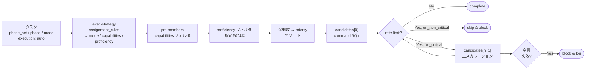

# 実行戦略ガイド

Exec Strategy Guide

SpecDojo のエージェント実行戦略（`exec-strategy-<track>.yaml`）と、エージェントメンバー定義（`pm-members.yaml`）の設定方法を説明します。

## 1. 概要

SpecDojo のタスク実行は、エージェントを **メンバー** として定義し、**実行戦略** でフェーズごとに必要な能力と品質水準を宣言します。設定は3つのファイルで分担します。

| ファイル                               | 役割                                                           | 粒度         |
| -------------------------------------- | -------------------------------------------------------------- | ------------ |
| `pm-members.yaml`                      | 誰が作業するか（identity・command・capabilities・proficiency） | プロジェクト |
| `execution/exec-strategy-<track>.yaml` | どう割り当てるか（assignment_rules・rate_limit_policy）        | トラック     |
| `.specdojo/exec-agent.yaml`            | exec run のエントリポイント（グローバル設定）                  | システム     |

`sch-strategy-<track>.yaml`（スケジュール戦略）との関係は以下の通りです。

| ファイル                     | 役割                                                            |
| ---------------------------- | --------------------------------------------------------------- |
| `sch-strategy-<track>.yaml`  | 何を・いつ・どのくらいでやるか（フェーズ定義・owner・duration） |
| `exec-strategy-<track>.yaml` | auto フェーズをどの能力・品質水準のエージェントが実行するか     |

`sch-strategy-<track>.yaml` の各フェーズには `execution: auto` または `execution: manual` が設定されており、`exec-strategy` は `auto` のフェーズのみを対象とします。

## 2. エージェントの定義（`pm-members.yaml`）

### 2.1. フィールド定義

`members` 配列に人間とエージェントを混在して定義します。`type: agent` のメンバーには `command`・`capabilities`・`proficiency`・`priority` を追加します。

```yaml
members:
  - nickname: edit-agent
    display_name: Edit Agent
    email: null
    roles: []
    type: agent
    capabilities: [web_search]
    proficiency: normal
    priority: 10
    command: 'opencode run --agent edit-agent'
    scheduler_strategy: critical-first
    note: 成果物の新規作成・文書化を担当する標準エージェント。
```

| フィールド           | 説明                                               | 値の例                           |
| -------------------- | -------------------------------------------------- | -------------------------------- |
| `nickname`           | 識別子。`exec-strategy` の参照には使わない         | `edit-agent`                     |
| `type`               | `human` または `agent`                             | `agent`                          |
| `capabilities`       | エージェントが使用できるツール                     | `[]` / `[web_search]`            |
| `proficiency`        | 作業品質水準。`low` / `normal` / `high` / `expert` | `normal`                         |
| `priority`           | 同一プロファイル内の優先順位（小さいほど先に試行） | `10`                             |
| `command`            | exec run が直接呼び出すシェルコマンド              | `opencode run --agent edit-agent` |
| `scheduler_strategy` | `critical-first` または `fifo`                     | `critical-first`                 |

### 2.2. capabilities と proficiency

`capabilities` は **使用できるツール**、`proficiency` は **どのくらい高品質にできるか** を表します。

| 次元         | フィールド     | 値                                                                                  |
| ------------ | -------------- | ----------------------------------------------------------------------------------- |
| ツール       | `capabilities` | `web_search`（外部調査）など。作業種別（edit / review）は `mode` で区別する         |
| 品質水準     | `proficiency`  | `low`（軽量・整形）、`normal`（標準）、`high`（複雑分析）、`expert`（深い技術判断） |

### 2.3. 標準エージェントの構成例

| nickname           | capabilities   | proficiency | priority | 用途                                 |
| ------------------ | -------------- | ----------- | -------- | ------------------------------------ |
| `edit-agent`       | `[]`           | `normal`    | `10`     | 成果物の新規作成・文書化（標準）     |
| `small-edit-agent` | `[]`           | `low`       | `10`     | 整合性修正・フォーマット整形（軽量） |
| `expert-agent`     | `[]`           | `expert`    | `10`     | 複雑な分析・アーキテクチャ判断       |
| `expert-web-agent` | `[web_search]` | `expert`    | `10`     | 外部調査が必要な深掘り               |
| `review-agent`     | `[]`           | `normal`    | `10`     | 多観点レビュー                       |

## 3. 実行戦略（`exec-strategy-<track>.yaml`）

`sch-strategy-<track>.yaml` の `execution: auto` フェーズに対してエージェントの要件を宣言します。`execution: manual` フェーズは記載不要です。

### 3.1. assignment_rules

`phase_set`・`phase`・`mode` に対してルールを上から順に評価し、最初のマッチを適用します。各ルールは `mode`（作業種別）・`capabilities`（必要なツール）・`proficiency`（必要な品質水準）を宣言します。

```yaml
assignment_rules:
  # research-first-pass.enrich: 外部調査が必要な補強（web_search / expert 水準）
  - phase_set: research-first-pass
    phase: enrich
    mode: edit
    capabilities: [web_search]
    proficiency: expert

  # first-pass.enrich: 標準的な補強（normal 水準）
  - phase_set: first-pass
    phase: enrich
    mode: edit
    capabilities: []
    proficiency: normal

  # finalize-pass.align: 整合性確認・修正（normal 水準）
  - phase_set: finalize-pass
    phase: align
    mode: edit
    capabilities: []
    proficiency: normal
```

| フィールド     | 必須 | 説明                                                 |
| -------------- | ---- | ---------------------------------------------------- |
| `phase_set`    | 任意 | 対象の phase set 名。省略すると全 phase set にマッチ |
| `phase`        | 任意 | 対象の phase id。省略すると全 phase にマッチ         |
| `mode`         | 任意 | `edit` または `review`。省略すると全 mode にマッチ   |
| `capabilities` | ○    | 必要なツールリスト（ツール不要の場合は `[]`）         |
| `proficiency`  | 任意 | 必要な品質水準。省略すると全水準が候補               |

`assignment_rules` のいずれにもマッチしない phase（例: `draft` や `finalize` のような `execution: manual` フェーズ）には、トップレベルの `default_mode` を適用します。省略時は `edit` です。

```yaml
default_mode: edit

assignment_rules:
  # ...
```

### 3.2. エージェント選択ルール

ルールがマッチしたら、`pm-members.yaml` から候補エージェントを次の手順で選びます。

1. `capabilities` でフィルタ：ルールの capabilities をすべて持つ agent（スーパーセット OK）
2. `proficiency` でフィルタ：ルールに指定があれば一致のみ。未指定なら全水準
3. ソート：`priority`（昇順）→ 余剰 capabilities 数（昇順、同 priority 内の tie-breaker）
4. 先頭が primary、以降は rate limit 時のフォールバック

capabilities は**制約**（必須ツールを持つかどうか）としてのみ機能します。priority が実際の選択順序を決定します。

**例**：`mode: edit, capabilities: [], proficiency: normal` の場合

| agent              | capabilities   | proficiency | priority | 順位                         |
| ------------------ | -------------- | ----------- | -------- | ---------------------------- |
| `claude-edit-agent`| `[web_search]` | `normal`    | 10       | **1位**（priority 最小）     |
| `opencode-edit-agent`| `[]`         | `normal`    | 99       | 2位                          |
| `expert-web-agent` | `[web_search]` | `expert`    | -        | 対象外（proficiency 不一致） |

rate limit 時は fallback として proficiency の高い候補（`expert`）へのエスカレーションを `rate_limit_policy` で設定できます。

### 3.3. rate_limit_policy

```yaml
rate_limit_policy:
  on_non_critical:
    action: skip # cpm.slack > 0: block イベントを記録して次のタスクへ
  on_critical:
    action: try_next # cpm.slack == 0: proficiency の高い agent へエスカレーション
    retry:
      max_attempts: 3
      initial_wait_seconds: 60
      backoff_multiplier: 3 # 60s → 180s → 540s
      max_wait_seconds: 600
    on_exhausted: block # 全候補失敗時はブロックして人間に委ねる
```

## 4. タスク実行のエージェント選択フロー



**具体例**：`phase_set: first-pass`・`phase: enrich`・`mode: edit` のタスク

1. `research-first-pass.enrich` ルール → `phase_set` がマッチしない
2. `first-pass.enrich` ルール → **マッチ**（`mode: edit, capabilities: [], proficiency: normal`）
3. pm-members から `capabilities ⊇ []` かつ `proficiency: normal` の agent を抽出
4. `edit-agent`（余剰 0、priority 10）→ `opencode run --agent edit-agent <brief>` を実行

## 5. グローバル設定（`.specdojo/exec-agent.yaml`）

exec run のエントリポイントです。rate limit 検出の条件（全トラック共通）を定義します。

```yaml
# レートリミット検出設定（全トラック共通）
rate_limit_detection:
  exit_codes: [1]
  stderr_patterns:
    - 'rate limit'
    - '429'
```

per-track の割り当てルールは `exec-strategy-<track>.yaml` に委ねます。

## 6. エージェントの追加・変更手順

### 6.1. 新しいエージェントを追加する

**手順 1: `pm-members.yaml` にエージェントを追加する**

```yaml
- nickname: claude-agent
  display_name: Claude Agent
  type: agent
  capabilities: []
  proficiency: normal
  priority: 20 # edit-agent より後に試行
  command: 'claude --print'
  scheduler_strategy: critical-first
  note: Claude をバックエンドに使うエージェント。
```

`exec-strategy` の変更は不要です。`mode: edit, capabilities: [], proficiency: normal` のルールに自動的に含まれます。

### 6.2. review 対応のエージェントを追加する

```yaml
# pm-members.yaml
- nickname: review-agent
  type: agent
  capabilities: []
  proficiency: normal
  priority: 10
  command: 'opencode run --agent review-agent'
```

```yaml
# exec-strategy-launch.yaml
assignment_rules:
  - phase: review
    mode: review
    capabilities: []
    proficiency: normal
```

sch-strategy のフェーズに `mode: review` が設定されていれば、自動的に `review-agent` が選択されます。

### 6.3. web_search 対応のエージェントを追加する

```yaml
# pm-members.yaml
- nickname: my-web-agent
  type: agent
  capabilities: [web_search]
  proficiency: expert
  priority: 5 # expert-web-agent より先に試行
  command: 'opencode run --agent my-web-agent'
```

`exec-strategy` の `capabilities: [web_search]` ルールに自動的に含まれます。

### 6.4. 新しいトラックの実行戦略を作成する

`sch-strategy-<track>.yaml` を作成したら、同じプロジェクトの `execution/exec-strategy-<track>.yaml` を作成します。`phase_sets` の `execution: auto` フェーズに対応する `capabilities`・`proficiency`・`rate_limit_policy` を定義してください。
