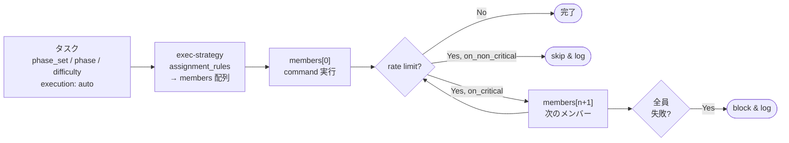

# 実行戦略ガイド

Exec Strategy Guide

SpecDojo のエージェント実行戦略（`exec-strategy-<track>.yaml`）と、エージェントメンバー定義（`pm-members.yaml`）の設定方法を説明します。

## 1. 概要

SpecDojo のタスク実行は、エージェントをプロジェクトの **メンバー** として定義し、**実行戦略** でフェーズ・難易度に応じた担当を決定します。設定は3つのファイルで分担します。

| ファイル | 役割 | 粒度 |
| --- | --- | --- |
| `pm-members.yaml` | 誰が作業するか（identity・command・capabilities） | プロジェクト |
| `execution/exec-strategy-<track>.yaml` | どう割り当てるか（assignment_rules・rate_limit_policy） | トラック |
| `.specdojo/exec-agent.yaml` | exec run のエントリポイント（グローバル設定） | システム |

`sch-strategy-<track>.yaml`（スケジュール戦略）との関係は以下の通りです。

| ファイル | 役割 |
| --- | --- |
| `sch-strategy-<track>.yaml` | 何を・いつ・誰のロールでやるか（フェーズ定義・owner） |
| `exec-strategy-<track>.yaml` | auto フェーズをどのエージェントが実行するか |

`sch-strategy-<track>.yaml` の各フェーズには `execution: auto` または `execution: manual` が設定されており、`exec-strategy` は `auto` のフェーズのみを対象とします。

## 2. エージェントの定義（`pm-members.yaml`）

### 2.1. フィールド定義

`members` 配列に人間とエージェントを混在して定義します。`type: agent` のメンバーには `command` と `capabilities` を追加します。

```yaml
members:
  - nickname: edit-agent
    display_name: Edit Agent
    email: null
    roles: []
    type: agent
    persona: task-executor
    focus:
      - task-execution
      - document-creation
    capabilities: []
    command: "opencode run --agent edit-agent"
    scheduler_strategy: critical-first
    note: 成果物の新規作成・文書化を担当する標準エージェント。
```

| フィールド | 説明 | 値の例 |
| --- | --- | --- |
| `nickname` | 識別子。`exec-strategy` の `members` 配列で参照する | `edit-agent` |
| `type` | `human` または `agent` | `agent` |
| `capabilities` | エージェントが持つ能力のリスト | `[]` / `[web_search]` |
| `command` | exec run が直接呼び出すシェルコマンド | `opencode run --agent edit-agent` |
| `persona` | エージェントの振る舞い識別子 | `task-executor` |
| `scheduler_strategy` | `critical-first`（クリティカルパス優先）または `fifo` | `critical-first` |

### 2.2. 標準エージェントの構成

| nickname | capabilities | 用途 |
| --- | --- | --- |
| `edit-agent` | `[]` | 成果物の新規作成・文書化（標準） |
| `small-edit-agent` | `[]` | 整合性修正・フォーマット整形（軽量） |
| `expert-agent` | `[]` | 複雑な分析・アーキテクチャ判断（高性能） |
| `expert-web-agent` | `[web_search]` | 外部調査が必要な補強・深掘り |
| `review-agent` | `[]` | 多観点レビュー（ファイル編集なし） |

各エージェントの `command` フィールドが実際の実行コマンドです。opencode のエージェント定義（`opencode.json`）で使用モデルを指定します。

## 3. 実行戦略（`exec-strategy-<track>.yaml`）

`sch-strategy-<track>.yaml` の `execution: auto` フェーズに対してエージェントを割り当てます。`execution: manual` フェーズは記載不要です。

`sch-strategy-launch.yaml` での auto フェーズの例：

| phase_set | phase | execution | exec-strategy での扱い |
| --- | --- | --- | --- |
| `first-pass` | `draft` | manual | 対象外（人間が実行） |
| `first-pass` | `enrich` | auto | **assignment_rules に記載** |
| `first-pass` | `review` | manual | 対象外 |
| `research-first-pass` | `enrich` | auto | **assignment_rules に記載** |
| `finalize-pass` | `align` | auto | **assignment_rules に記載** |
| `finalize-pass` | `finalize` | manual | 対象外 |

### 3.1. assignment_rules

タスクの `phase_set`・`phase`・`difficulty` に対してルールを上から順に評価し、最初のマッチを適用します。`members` 配列の先頭が primary で、以降は rate limit 発生時のフォールバック候補です。

```yaml
assignment_rules:
  # research-first-pass.enrich → 外部調査が必要（web_search 優先）
  # 難易度に関わらず web_search 可能なエージェントを優先する
  - phase_set: research-first-pass
    phase: enrich
    members:
      - expert-web-agent    # primary: web_search あり
      - expert-agent        # フォールバック
      - edit-agent

  # difficulty:expert → 高性能エージェント（phase_set 非依存）
  - difficulty: expert
    members:
      - expert-agent
      - edit-agent

  # first-pass.enrich → 標準補強
  - phase_set: first-pass
    phase: enrich
    members:
      - edit-agent
      - small-edit-agent

  # finalize-pass.align → 整合性確認・修正
  - phase_set: finalize-pass
    phase: align
    members:
      - edit-agent
      - small-edit-agent
```

### 3.2. rate_limit_policy

```yaml
rate_limit_policy:
  on_non_critical:
    action: skip            # cpm.slack > 0: block イベントを記録して次のタスクへ
  on_critical:
    action: try_next        # cpm.slack == 0: members 配列の次のメンバーへ
    retry:
      max_attempts: 3
      initial_wait_seconds: 60
      backoff_multiplier: 3  # 60s → 180s → 540s
      max_wait_seconds: 600
    on_exhausted: block      # 全メンバー失敗時はブロックして人間に委ねる
```

`cpm.slack`（クリティカルパスの余裕タスク数）で動作を切り替えます。`try_next` で `members` 配列を順に試み、すべて失敗したら `on_exhausted` に従います。

## 4. タスク実行のエージェント選択フロー



具体例：`phase_set: first-pass`・`phase: enrich`・`difficulty: high` のタスク

1. `research-first-pass.enrich` ルール → `phase_set` がマッチしない
2. `difficulty: expert` ルール → `high` なのでマッチしない
3. `first-pass.enrich` ルール → **マッチ**
4. `members[0] = edit-agent` → `opencode run --agent edit-agent <prompt>` を実行

## 5. グローバル設定（`.specdojo/exec-agent.yaml`）

exec run のエントリポイントです。rate limit 検出の条件（全トラック共通）を定義します。

```yaml
# レートリミット検出設定（全トラック共通）
rate_limit_detection:
  exit_codes: [1]
  stderr_patterns:
    - "rate limit"
    - "429"
```

per-track の割り当てルールは `exec-strategy-<track>.yaml` に委ねます。

## 6. エージェントの追加・変更手順

### 6.1. 新しいエージェントを追加する

**手順 1: `pm-members.yaml` にエージェントを追加する**

```yaml
- nickname: claude-agent
  display_name: Claude Agent
  type: agent
  capabilities: []
  command: "claude --print"
  scheduler_strategy: critical-first
  note: Claude をバックエンドに使うエージェント。
```

**手順 2: `exec-strategy-<track>.yaml` の `members` 配列に追加する**

```yaml
assignment_rules:
  - phase_set: first-pass
    phase: enrich
    members:
      - edit-agent
      - claude-agent       # フォールバック候補として追加
      - small-edit-agent
```

### 6.2. capabilities を持つエージェントを追加する

`capabilities` に能力を宣言し、`assignment_rules` の先頭に配置します。

```yaml
# pm-members.yaml
- nickname: my-web-agent
  type: agent
  capabilities:
    - web_search
  command: "opencode run --agent my-web-agent"
```

```yaml
# exec-strategy-launch.yaml
assignment_rules:
  - phase_set: research-first-pass
    phase: enrich
    members:
      - my-web-agent        # web_search あり → 先頭に
      - expert-web-agent    # フォールバック
      - edit-agent
```

### 6.3. 新しいトラックの実行戦略を作成する

`sch-strategy-<track>.yaml` を作成したら、同じプロジェクトの `execution/exec-strategy-<track>.yaml` を作成します。`phase_sets` の `execution: auto` フェーズに対応するルールと `rate_limit_policy` を定義してください。
