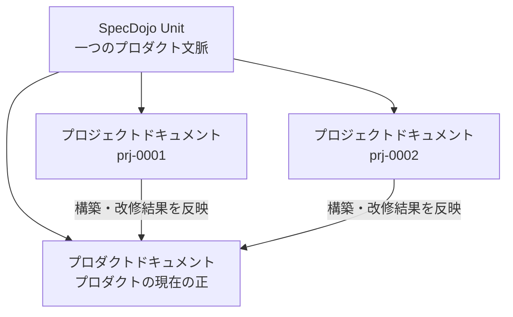
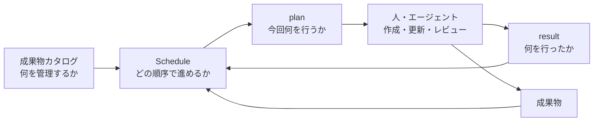

---
specdojo:
  id: specdojo-overview-guide
  type: guide
  status: draft
  based_on:
    - docs-structure-guide
    - docs-authoring-order-guide
    - specdojo-cli-overview-guide
    - document-metadata-standard
---

# SpecDojo 全体概要ガイド

SpecDojo Overview Guide

SpecDojo の目的、文書体系、プロジェクトの進め方、CLI による実行管理の関係を一つの流れとして説明します。
初めて SpecDojo に触れる利用者を対象とし、個別の成果物やコマンドの詳細は関連 guide、standard、rulebook に委ねます。

**対象読者**

- SpecDojo を初めて知る人、導入を検討する責任者、文書作成や実行管理を始める利用者

**この文書で分かること**

- SpecDojo の目的、文書体系、プロジェクトの基本的な流れ、成果物から実行管理への展開

**次に読む文書**

- 文書の配置は [ドキュメント構成ガイド](docs-structure-guide.md)、成果物の検討順は [ドキュメント作成順ガイド](docs-authoring-order-guide.md)、CLI の導入は [SpecDojo CLI概要ガイド](specdojo-cli-overview-guide.md) を参照してください。

## 1. SpecDojoとは

SpecDojo は、仕様駆動開発のためのドキュメントフレームワークです。

プロダクトの構築・改修に必要な情報を、単発の説明資料ではなく、相互に参照できる構造化された成果物として管理します。
人が内容と判断理由を理解でき、AI とツールが成果物を作成・検証・更新できる状態を目指します。

SpecDojo が提供するものは、大きく次の三つです。

| 要素         | 役割                                             |
| ------------ | ------------------------------------------------ |
| 文書体系     | プロジェクトとプロダクトに必要な成果物を整理する |
| 記述支援資料 | 成果物の書き方、具体例、雛形を提供する           |
| CLI          | 成果物の計画、実行、状態管理、機械検証を支援する |

SpecDojo は開発プロセスそのものを一律に固定するものではありません。
プロジェクトの目的や規模に応じて必要な成果物を選び、それらの根拠、依存関係、完了条件を明らかにするための枠組みです。

## 2. 基本となる考え方

SpecDojo では、文書をプロジェクトを定義・実行・検証するための成果物として扱います。
正本と派生物を分け、ID と参照関係によってトレーサビリティを確保し、人と AI・ツールが同じ情報を扱える構造にします。
この設計理由と運用上の判断基準は [SpecDojo ドキュメンテーション ポリシーガイド](specdojo-documentation-policy-guide.md) を参照してください。

本文や判断は Markdown、構造化データは YAML、ツール連携や生成物は JSON を中心に扱い、形式に応じたメタデータを持たせます。
具体的な項目、必須条件、配置、検証方法は [ドキュメントメタ情報標準](../standards/document-metadata-standard.md) と各形式のスキーマを正本とします。

## 3. SpecDojo Unitと二種類の文書

SpecDojo は、一つのプロダクト文脈を扱う `docs/` ルートを **SpecDojo Unit** として捉えます。
一つの SpecDojo Unit には、プロダクトの最新状態と、そのプロダクトを構築・改修する複数のプロジェクトを格納できます。

プロダクトドキュメントはプロダクトの現在像、プロジェクトドキュメントは個別の構築・改修における目的、変更、実行、判断を表します。
分類、ライフサイクル、命名、ディレクトリ配置は [ドキュメント構成ガイド](docs-structure-guide.md) を参照してください。

## 4. 記述支援資料の役割

SpecDojo では、成果物と、その作成を支援する資料を分けて管理します。
共通規約を扱う standard、成果物固有の規則を扱う rulebook、作り方を扱う recipe、雛形となる template、完成例となる sample、概念や操作を説明する guide が、それぞれ異なる問いに答えます。
詳細な役割分担と exec plan からの参照方法は [SpecDojo 参考資料活用ガイド](specdojo-reference-materials-guide.md) を参照してください。

## 5. プロジェクトの基本的な流れ

プロジェクトでは、最初からすべての成果物を作るのではなく、目的とスコープを明らかにし、必要な成果物を選び、実行可能な単位へ展開します。

成果物の検討順と判断点は [ドキュメント作成順ガイド](docs-authoring-order-guide.md)、個々の成果物の目的は [ドキュメント内容ガイド](docs-contents-guide.md)、成果物を確定するレビューは [SpecDojo レビューガイド](specdojo-review-guide.md) を参照してください。

## 6. 成果物から実行管理への展開

SpecDojo CLI を利用すると、管理対象の成果物を実行可能なタスクへ展開し、作業状態と結果を記録できます。

各情報の責務と詳細は、次の文書を正本とします。

- 成果物カタログから Schedule への展開: [成果物カタログからスケジュールへの展開ガイド](specdojo-deliverables-to-schedule-guide.md)
- タスク粒度、依存関係、反復、CPM: [SpecDojo Schedule設計ガイド](specdojo-schedule-design-guide.md)
- plan と result の生成、命名、保管: [SpecDojo plan/resultライフサイクルガイド](specdojo-plan-result-lifecycle-guide.md)
- CLI の導入と代表フロー: [SpecDojo CLI概要ガイド](specdojo-cli-overview-guide.md)
- タスクの実行と状態管理: [SpecDojo exec運用ガイド](specdojo-exec-operation-guide.md)

## 7. 実行を支える機能

主となる成果物作成フローのほかに、継続的なプロジェクト運営を支える機能があります。

| 機能               | 用途                                                 | 参照先                                                    |
| ------------------ | ---------------------------------------------------- | --------------------------------------------------------- |
| プロジェクト登録簿 | 課題、リスク、変更要求、意思決定などを継続管理する   | [登録簿運用](specdojo-register-operation-guide.md)        |
| review             | 成果物の妥当性、整合性、トレーサビリティを確認する   | [レビュー](specdojo-review-guide.md)                      |
| routine            | 時刻条件のある定期作業を実行する                     | [CLI概要](specdojo-cli-overview-guide.md)                 |
| branch / worktree  | プロジェクトやタスクの変更を分離して安全に統合する   | [ブランチワークフロー](specdojo-branch-workflow-guide.md) |
| exec設定           | エージェント、実行要件、権限、共通ポリシーを設定する | [実行設定](specdojo-exec-config-guide.md)                 |

これらはすべてのプロジェクトで一度に導入する必要はありません。
まず成果物と完了条件を明確にし、必要になった管理機能を段階的に利用します。

## 8. 目的別の次の読み物

目的別のguide一覧と導入順は [SpecDojo 日本語ドキュメントポータル](../../index.md) を参照してください。
最初に全機能を理解する必要はなく、「構成を理解する」「必要な成果物を選ぶ」「小さな Schedule で実行する」の順に進み、必要に応じて登録簿、レビュー、自動実行へ範囲を広げます。
