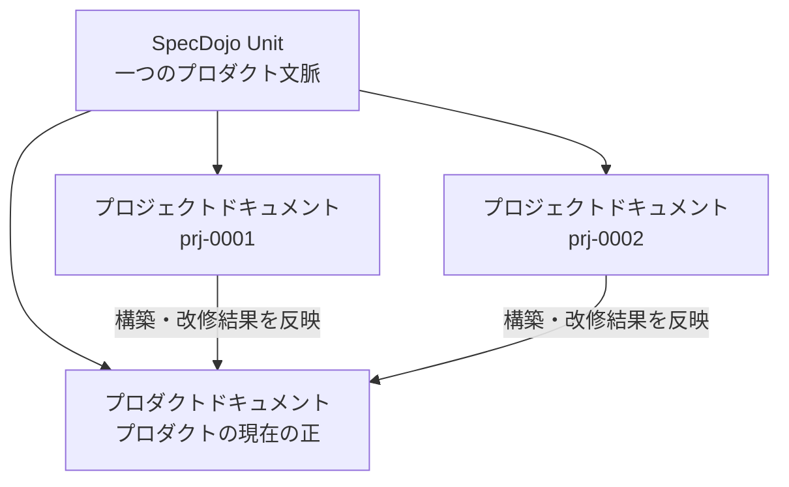

---
specdojo:
  id: specdojo:specdojo-overview-guide
  type: guide
  status: ready
  based_on:
    - specdojo:docs-structure-guide
    - specdojo:track-design-guide
    - specdojo:waza-guide
    - specdojo:document-metadata-standard
---

# 全体概要ガイド

Overview Guide

SpecDojo の目的、成果物体系、プロジェクトの進め方、遂行体系による実行管理の関係を一つの流れとして説明します。
SpecDojo に関わるすべての読者の入口となる文書であり、個別の規約や操作の詳細は関連 guide、standard、rulebook に委ねます。

**対象読者**

- SpecDojo をこれから導入する人、全体像を把握したいプロジェクト関係者、開発者、エージェント

**この文書で分かること**

- SpecDojo の目的、基本となる考え方、成果物体系、プロジェクトの進め方、成果物から実行管理への展開の関係

**次に読む文書**

- 目的から guide と reference を探す場合は、本書の `目的別の次の読み物` を参照してください。SpecDojo の guide と reference を目的別にまとめた唯一の一覧です。
- 文書の分類から把握する場合は [ドキュメント構成ガイド](docs-structure-guide.md)、CLI の操作から始める場合は [遂行の技活用ガイド](waza-guide.md) を参照してください。

## 1. SpecDojoとは

SpecDojo は、仕様駆動開発のためのドキュメントフレームワークです。

プロダクトの構築・改修に必要な情報を、単発の説明資料ではなく、相互に参照できる構造化された成果物として管理します。
人が内容と判断理由を理解でき、AI とツールが成果物を作成・検証・更新できる状態を目指します。

SpecDojo が提供するものは、大きく次の三つです。

| 要素       | 役割                                                                                    |
| ---------- | --------------------------------------------------------------------------------------- |
| 成果物体系 | プロジェクトとプロダクトに必要な成果物を整理する                                        |
| 実践体系   | 成果物を作るための方針、規約、手順、具体例、雛形を提供する                              |
| 遂行体系   | register / schedule / routine と CLI で、成果物の計画、実行、状態管理、機械検証を進める |

SpecDojo は開発プロセスそのものを一律に固定するものではありません。
プロジェクトの目的や規模に応じて必要な成果物を選び、それらの根拠、依存関係、完了条件を明らかにするための枠組みです。

## 2. 基本方針

SpecDojo では、文書をプロジェクトを定義・実行・検証するための成果物として扱います。
基本方針は次の3つです。「コードと同じ規律で管理し、型に沿って作成し、人と AI の双方が読める」ドキュメンテーションを目指します。

| 基本方針               | 概要                                                                                                     |
| ---------------------- | -------------------------------------------------------------------------------------------------------- |
| Docs as Code           | 正本を Git に置き、構造化・単一正本・生成・機械検証・ID とトレーサビリティで、コードと同じ規律で管理する |
| Kata（実践の型）       | 成果物の作り方を rulebook / recipe / sample / template として型化し、`approach` で参照度合いを切り替える |
| Human & AI Readability | 人が判断理由を理解でき、AI とツールが解析・生成・検証できる構造にする                                    |

SpecDojo の文書は、説明・判断・方針を記述する Markdown と、人が管理する構造化データを記述する YAML、ツール連携・実行記録・生成物を記述する JSON を使い分けます。
文書やデータを識別・管理できるように、形式に応じたメタデータを埋め込みます。

- Markdown はファイル先頭の YAML Frontmatter に `id`、`type`、`status` などを記述します。
- 独立した YAML データファイルは Frontmatter を持たず、ファイル先頭のトップレベル項目にメタデータを記述します。
- JSON は Frontmatter を持たず、用途別のスキーマが定めるトップレベルの構造化項目にメタデータを記述します。

具体的な項目、必須条件、配置、検証方法は
[ドキュメントメタ情報標準](../standards/document-metadata-standard.md)
と各形式のスキーマを正本とします。

これらの設計理由、規約と設定の責務分担、運用上の判断基準は
[SpecDojo の考え方](../philosophy/specdojo-philosophy.md)
を参照してください。

## 3. SpecDojo Unitと二種類の文書

SpecDojo は、一つのプロダクト文脈を扱う `docs/` ルートを **SpecDojo Unit** として捉えます。
一つの SpecDojo Unit には、プロダクトの最新状態と、そのプロダクトを構築・改修する複数のプロジェクトを格納できます。

プロダクトドキュメントはプロダクトの現在像、プロジェクトドキュメントは個別の構築・改修における目的、変更、実行、判断を表します。

| 分類                     | 表すもの                                     | ライフサイクル                         |
| ------------------------ | -------------------------------------------- | -------------------------------------- |
| プロダクトドキュメント   | 業務仕様、システム設計などプロダクトの現在像 | 改修のたびに更新し、継続して管理する   |
| プロジェクトドキュメント | 目的、スコープ、変更内容、実行・判断の記録   | プロジェクトごとに作成し、完了後に残す |

文書の分類、ライフサイクル、命名、ディレクトリ配置は
[ドキュメント構成ガイド](docs-structure-guide.md)
を参照してください。

## 4. 実践体系の役割

SpecDojo では、成果物と、それを作るための実践体系を分けて管理します。
実践体系は、成果物の作り方を支える次の8種類の文書として具体化されます。

| 種別       | 答える問い                               | 使い方                                         |
| ---------- | ---------------------------------------- | ---------------------------------------------- |
| philosophy | なぜその規約なのか、何を基準に判断するか | 規約の前提となる方針・概念を理解               |
| standard   | 共通して従う規約は何か                   | メタデータ、命名、文書種別などの共通規約を確認 |
| rulebook   | この成果物には何を書くか                 | 成果物固有の章構成、項目、記述規則を確認       |
| recipe     | どのような手順と判断で作成するか         | 作成・更新の進め方を確認                       |
| template   | どの形から書き始めるか                   | 新しい成果物の雛形として使用                   |
| sample     | 完成した記述はどのようになるか           | 具体的な記述例として参照                       |
| guide      | 全体像や操作をどう理解すればよいか       | 複数の概念や一連の操作を理解                   |
| reference  | 特定の項目・コマンド・成果物は何か       | 一覧・比較・値を参照する                       |

これらは同じ内容を再掲するものではなく、それぞれ異なる問いに答えます。
上表は概要です。各種別の役割、種別間の関係、成果物への紐付け方（rulebook フィールドや frontmatter による解決の仕組み）の正本は
[実践体系構成ガイド](practice-system-composition-guide.md)
です。

このうち exec plan が成果物の作成・レビュー時に参照するのは、rulebook / recipe / sample / template の4種です。この4種を **実践の型** と呼びます。philosophy / standard は全体に効く前提・共通規約として常に踏まえ、guide / reference は個別成果物に紐づかない横断文書として理解と参照に使います。実践の型を `approach` に応じてどこまで参照するかは
[実践の型活用ガイド](kata-guide.md)
を参照してください。

ここでいう `reference` は文書種別です。実践の型として exec plan が参照する rulebook / recipe / sample / template とは別の役割として扱います。

## 5. プロジェクトの基本的な流れ

プロジェクトでは、最初からすべての成果物を作るのではなく、未整理の課題と判断を register で記録し、目的とスコープを明らかにしてから、必要な成果物を実行可能な単位へ展開します。目的・スコープ・対象成果物がすでに合意済みの場合は、register による立ち上げ整理を省略できます。

代表的な進め方は次のとおりです。

1. 未整理の問題、確認事項、判断事項があれば register に `issue` / `question` / `decision` として記録します。
2. 調査と判断を行い、プロジェクトの背景、目的、スコープ、成功条件、対象成果物を明らかにします。
3. 決定した成果物カタログの作成を `todo` として追跡し、成果物の配置、依存関係、完了条件を `dct-<domain>.yaml` に定義します。
4. カタログ作成の `todo` を完了し、以後の計画済み作業を Schedule に展開します。
5. 人またはエージェントが成果物を作成・更新します。
6. 機械検証と内容レビューを行い、成果物を確定します。

トラックの構成と実行順序は
[トラック設計ガイド](track-design-guide.md)、
個々の成果物の目的は
[成果物リファレンス](../references/deliverables-reference.md)、
成果物を確定するレビューは
[レビューガイド](review-guide.md)
を参照してください。

## 6. 成果物から実行管理への展開

第1章で挙げた3つの体系のうち、成果物体系と実践体系で「何を・どう作るか」を定めた後、それを計画・実行・追跡・機械検証して最後まで通すのが **遂行体系** です。SpecDojo CLI は、成果物カタログの成果物をトラック・実行フェーズ（またはパス）・タスクへ展開し、plan の生成、実行、result の記録という流れで作業状態と結果を記録します。成果物カタログ・Schedule・実行管理（dct/sch/exec）の詳細な関係と図解は [ドキュメント構成ガイド](docs-structure-guide.md) の6章を参照してください。

成果物カタログと Schedule の関係、タスク設計は
[Schedule設計ガイド](schedule-design-guide.md)、
schedule実行の運用は
[Schedule実行運用ガイド](schedule-operation-guide.md)、
plan と result の管理は
[plan/resultライフサイクルガイド](plan-result-lifecycle-guide.md)
を参照してください。

CLI の導入は
[遂行の技活用ガイド](waza-guide.md)、
実行と状態管理は
[exec運用ガイド](exec-operation-guide.md)
を参照してください。

## 7. 遂行を支える機能

主となる成果物作成フローのほかに、継続的なプロジェクト運営を支える機能があります。

| 機能               | 用途                                                   | 参照先                                           |
| ------------------ | ------------------------------------------------------ | ------------------------------------------------ |
| プロジェクト登録簿 | 立ち上げ時の課題・判断と、進行中の計画外事項を管理する | [登録簿運用](register-operation-guide.md)        |
| routine            | 時刻条件のある定期作業を実行する                       | [routine運用](routine-operation-guide.md)        |
| branch / worktree  | プロジェクトやタスクの変更を分離して安全に統合する     | [ブランチワークフロー](branch-workflow-guide.md) |
| exec設定           | エージェント、実行要件、権限、共通ポリシーを設定する   | [exec設定](exec-config-guide.md)                 |

これらはすべてのプロジェクトで一度に導入する必要はありません。register は未整理事項がある立ち上げ時にも使用し、合意済みの計画作業へ移った後は、必要になった管理機能を段階的に利用します。

## 8. 目的別の次の読み物

本章は SpecDojo の philosophy、guide、reference を目的から引くための一覧です。文書が増えたときは本章を更新し、他の文書には同じ横断一覧を置きません。シナリオ（やりたいこと）から進め方の筋道を辿る場合は [ユースケース別ガイド](use-case-guide.md) を参照してください。本章はトピックから文書を引く索引、ユースケース別ガイドは状況ごとの進め方を示す筋道として役割を分けます。

### 8.1. SpecDojoの考え方を理解する

本節の philosophy 2件は、作業を始める前に通読する必要はありません。文書体系を設計・保守するときや、記述の粒度・責務の判断に迷ったときに読めば足ります。

| 目的                                           | 参照先                                                                            |
| ---------------------------------------------- | --------------------------------------------------------------------------------- |
| SpecDojoの基本方針と設計理由を知る             | [SpecDojo の考え方](../philosophy/specdojo-philosophy.md)                         |
| 要求・要件・仕様・設計・実装の違いを知る       | [要求から実装までの考え方](../philosophy/needs-to-implementation-philosophy.md)   |
| 文書の分類、ライフサイクル、配置を理解する     | [ドキュメント構成ガイド](docs-structure-guide.md)                                 |
| ファイル単位のディレクトリ配置を引く           | [ディレクトリレイアウトリファレンス](../references/directory-layout-reference.md) |
| 実践体系の種別・役割・成果物との関係を理解する | [実践体系構成ガイド](practice-system-composition-guide.md)                        |

### 8.2. 作成する成果物を決める

| 目的                                               | 参照先                                                        |
| -------------------------------------------------- | ------------------------------------------------------------- |
| 成果物の種類、目的、主な内容を調べる               | [成果物リファレンス](../references/deliverables-reference.md) |
| トラックの構成と実行順序を設計する                 | [トラック設計ガイド](track-design-guide.md)                   |
| rulebook / recipe / sample / template を使い分ける | [実践の型活用ガイド](kata-guide.md)                           |

### 8.3. 成果物の作成を計画する

| 目的                                                                                       | 参照先                                         |
| ------------------------------------------------------------------------------------------ | ---------------------------------------------- |
| 成果物カタログから Schedule への流れを理解する、フェーズ・タスク・依存関係・反復を設計する | [Schedule設計ガイド](schedule-design-guide.md) |

### 8.4. プロジェクトを実行・管理する

| 目的                                                                    | 参照先                                                            |
| ----------------------------------------------------------------------- | ----------------------------------------------------------------- |
| 最短手順で1タスクを動かしてみる                                         | [Quick Startガイド](quick-start-guide.md)                         |
| CLIの役割、初期設定、代表フローを知る                                   | [遂行の技活用ガイド](waza-guide.md)                               |
| コマンドとオプションを調べる                                            | [CLIコマンドリファレンス](../references/command-reference.md)     |
| 実行経路（schedule / register / routine）を使い分け、中断・再実行を扱う | [exec運用ガイド](exec-operation-guide.md)                         |
| scheduleタスクを自動・手動で実行する                                    | [Schedule実行運用ガイド](schedule-operation-guide.md)             |
| 定期実行する                                                            | [routine運用ガイド](routine-operation-guide.md)                   |
| 課題、リスク、変更要求、意思決定を管理する                              | [登録簿運用ガイド](register-operation-guide.md)                   |
| エージェント、権限、exec の共通設定を変更する                           | [exec設定ガイド](exec-config-guide.md)                            |
| planとresultの生成・保管・再実行を理解する                              | [plan/resultライフサイクルガイド](plan-result-lifecycle-guide.md) |
| projectとtaskのブランチを運用する                                       | [ブランチワークフローガイド](branch-workflow-guide.md)            |
| worktreeを使って手動で隔離実行する                                      | [exec worktree運用ガイド](exec-worktree-guide.md)                 |
| 対話でCLI操作を進める                                                   | [オーケストレーター運用ガイド](orchestrator-operation-guide.md)   |

### 8.5. 成果物を確定・編集する

| 目的                                               | 参照先                                          |
| -------------------------------------------------- | ----------------------------------------------- |
| 妥当性、整合性、トレーサビリティを確認して確定する | [レビューガイド](review-guide.md)               |
| Markdownの見出し番号や表を編集する                 | [ドキュメント編集ガイド](docs-editing-guide.md) |

最初に全機能を理解する必要はありません。
導入時は「構成を理解する」「必要な成果物を選ぶ」「小さな Schedule で実行する」の順に進み、必要に応じて登録簿、レビュー、自動実行へ範囲を広げます。
