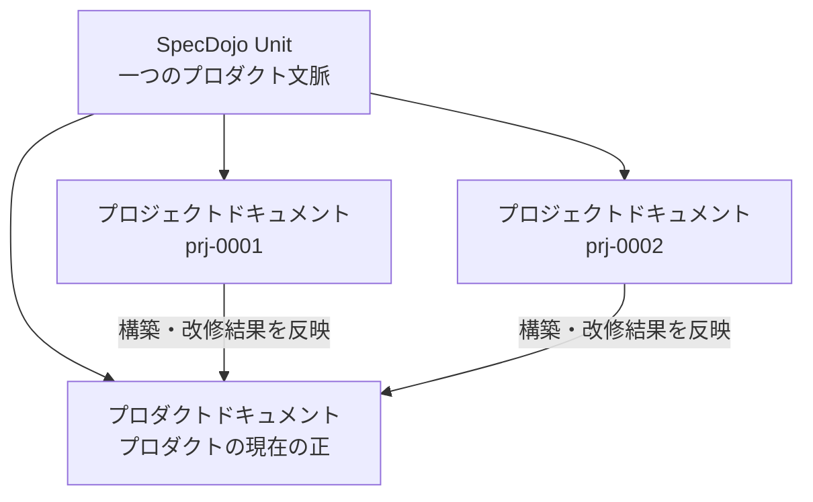
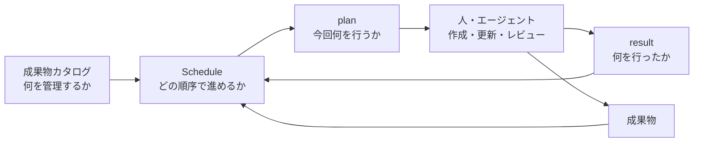

---
specdojo:
  id: specdojo-overview-guide
  type: guide
  status: draft
  based_on:
    - docs-structure-guide
    - docs-authoring-order-guide
    - specdojo-cli-overview-guide
    - document-metadata-standard
---

# 全体概要ガイド

SpecDojo Overview Guide

SpecDojo の目的、文書体系、プロジェクトの進め方、CLI による実行管理の関係を一つの流れとして説明します。
SpecDojo に関わるすべての読者の入口となる文書であり、個別の規約や操作の詳細は関連 guide、standard、rulebook に委ねます。

## 1. SpecDojoとは

SpecDojo は、仕様駆動開発のためのドキュメントフレームワークです。

プロダクトの構築・改修に必要な情報を、単発の説明資料ではなく、相互に参照できる構造化された成果物として管理します。
人が内容と判断理由を理解でき、AI とツールが成果物を作成・検証・更新できる状態を目指します。

SpecDojo が提供するものは、大きく次の三つです。

| 要素         | 役割                                             |
| ------------ | ------------------------------------------------ |
| 文書体系     | プロジェクトとプロダクトに必要な成果物を整理する |
| 記述支援資料 | 成果物の書き方、具体例、雛形を提供する           |
| CLI          | 成果物の計画、実行、状態管理、機械検証を支援する |

SpecDojo は開発プロセスそのものを一律に固定するものではありません。
プロジェクトの目的や規模に応じて必要な成果物を選び、それらの根拠、依存関係、完了条件を明らかにするための枠組みです。

## 2. 基本となる考え方

SpecDojo では、文書をプロジェクトを定義・実行・検証するための成果物として扱います。
中心となる考え方は次のとおりです。

| 考え方                                                     | 概要                                                                 |
| ---------------------------------------------------------- | -------------------------------------------------------------------- |
| ID as Identity                                             | 文書IDを形式ごとの構造化メタデータで管理する                         |
| Single Source of Truth                                     | 同じ情報の正本を一つに定め、一覧やレポートは参照または生成する       |
| Traceability                                               | 目的、要求、仕様、設計、テストなどの関係を追跡可能にする             |
| Structured Documents                                       | Markdown、YAML、JSON を役割に応じて使い分ける                        |
| Human and AI Readable                                      | 人が理解でき、AI とツールも安定して処理できる構造にする              |
| Convention as Defaults, Configuration for Explicit Context | 共通の構造と既定値は規約、プロジェクト固有の選択は設定として明示する |
| Git as Source of Truth                                     | 正本と変更履歴を Git リポジトリで管理する                            |

SpecDojo の文書は、説明・判断・方針を記述する Markdown と、人が管理する構造化データを記述する YAML、ツール連携・実行記録・生成物を記述する JSON を使い分けます。
文書やデータを識別・管理できるように、形式に応じたメタデータを埋め込みます。

- Markdown はファイル先頭の YAML Frontmatter に `id`、`type`、`status` などを記述します。
- 独立した YAML データファイルは Frontmatter を持たず、ファイル先頭のトップレベル項目にメタデータを記述します。
- JSON は Frontmatter を持たず、用途別のスキーマが定めるトップレベルの構造化項目にメタデータを記述します。

具体的な項目、必須条件、配置、検証方法は
[ドキュメントメタ情報標準](../standards/document-metadata-standard.md)
と各形式のスキーマを正本とします。

これらの設計理由、規約と設定の責務分担、運用上の判断基準は
[ドキュメンテーションポリシーガイド](specdojo-documentation-policy-guide.md)
を参照してください。

## 3. SpecDojo Unitと二種類の文書

SpecDojo は、一つのプロダクト文脈を扱う `docs/` ルートを **SpecDojo Unit** として捉えます。
一つの SpecDojo Unit には、プロダクトの最新状態と、そのプロダクトを構築・改修する複数のプロジェクトを格納できます。

プロダクトドキュメントはプロダクトの現在像、プロジェクトドキュメントは個別の構築・改修における目的、変更、実行、判断を表します。

| 分類                     | 表すもの                                     | ライフサイクル                         |
| ------------------------ | -------------------------------------------- | -------------------------------------- |
| プロダクトドキュメント   | 業務仕様、システム設計などプロダクトの現在像 | 改修のたびに更新し、継続して管理する   |
| プロジェクトドキュメント | 目的、スコープ、変更内容、実行・判断の記録   | プロジェクトごとに作成し、完了後に残す |

文書の分類、ライフサイクル、命名、ディレクトリ配置は
[ドキュメント構成ガイド](docs-structure-guide.md)
を参照してください。

## 4. 記述支援資料の役割

SpecDojo では、成果物と、その作成を支援する資料を分けて管理します。

| 種別      | 答える問い                         | 使い方                                         |
| --------- | ---------------------------------- | ---------------------------------------------- |
| standard  | 共通して従う規約は何か             | メタデータ、命名、文書種別などの共通規約を確認 |
| rulebook  | この成果物には何を書くか           | 成果物固有の章構成、項目、記述規則を確認       |
| recipe    | どのような手順と判断で作成するか   | 作成・更新の進め方を確認                       |
| template  | どの形から書き始めるか             | 新しい成果物の雛形として使用                   |
| sample    | 完成した記述はどのようになるか     | 具体的な記述例として参照                       |
| guide     | 全体像や操作をどう理解すればよいか | 複数の概念や一連の操作を理解                   |
| reference | 特定の項目・コマンド・成果物は何か | 一覧・比較・値を参照する                       |

これらは同じ内容を再掲するものではなく、異なる問いに答える資料です。
詳細な役割分担と exec plan からの参照方法は
[参考資料活用ガイド](specdojo-reference-materials-guide.md)
を参照してください。

ここでいう `reference` は文書種別です。exec plan で参照する rulebook、recipe、sample、template とは別の役割として扱います。

## 5. プロジェクトの基本的な流れ

プロジェクトでは、最初からすべての成果物を作るのではなく、目的とスコープを明らかにし、必要な成果物を選び、実行可能な単位へ展開します。

代表的な進め方は次のとおりです。

1. プロジェクトの背景、目的、スコープ、成功条件を明らかにします。
2. プロジェクトで作成・更新する成果物を選びます。
3. 成果物カタログに、成果物の配置、依存関係、完了条件を登録します。
4. 成果物を作成する順序と反復を Schedule に展開します。
5. 人またはエージェントが成果物を作成・更新します。
6. 機械検証と内容レビューを行い、成果物を確定します。

成果物の検討順と判断点は
[ドキュメント作成順ガイド](docs-authoring-order-guide.md)、
個々の成果物の目的は
[成果物リファレンス](../references/specdojo-deliverables-reference.md)、
成果物を確定するレビューは
[レビューガイド](specdojo-review-guide.md)
を参照してください。

## 6. 成果物から実行管理への展開

SpecDojo CLI を利用すると、管理対象の成果物を実行可能なタスクへ展開し、作業状態と結果を記録できます。

| 情報                 | 主な役割                                                  |
| -------------------- | --------------------------------------------------------- |
| 成果物カタログ       | 管理する成果物、配置、依存関係、完了条件を定義する        |
| Schedule             | フェーズ、タスク、順序、反復、実行要件を定義する          |
| plan                 | 一回の作業で確認・変更する対象と手順を示す                |
| result               | 実施内容、確認結果、残課題を記録する                      |
| 実行イベント・生成物 | タスクの状態、実行履歴、Ready、クリティカルパスなどを表す |

成果物カタログと Schedule の関係は
[成果物カタログからScheduleへの展開ガイド](specdojo-deliverables-to-schedule-guide.md)、
タスク設計は
[Schedule設計ガイド](specdojo-schedule-design-guide.md)、
plan と result の管理は
[plan/resultライフサイクルガイド](specdojo-plan-result-lifecycle-guide.md)
を参照してください。

CLI の導入は
[CLI概要ガイド](specdojo-cli-overview-guide.md)、
実行と状態管理は
[exec運用ガイド](specdojo-exec-operation-guide.md)
を参照してください。

## 7. 実行を支える機能

主となる成果物作成フローのほかに、継続的なプロジェクト運営を支える機能があります。

| 機能               | 用途                                                 | 参照先                                                    |
| ------------------ | ---------------------------------------------------- | --------------------------------------------------------- |
| プロジェクト登録簿 | 課題、リスク、変更要求、意思決定などを継続管理する   | [登録簿運用](specdojo-register-operation-guide.md)        |
| review             | 成果物の妥当性、整合性、トレーサビリティを確認する   | [レビュー](specdojo-review-guide.md)                      |
| routine            | 時刻条件のある定期作業を実行する                     | [exec運用](specdojo-exec-operation-guide.md)              |
| branch / worktree  | プロジェクトやタスクの変更を分離して安全に統合する   | [ブランチワークフロー](specdojo-branch-workflow-guide.md) |
| exec設定           | エージェント、実行要件、権限、共通ポリシーを設定する | [exec設定](specdojo-exec-config-guide.md)                 |

これらはすべてのプロジェクトで一度に導入する必要はありません。
まず成果物と完了条件を明確にし、必要になった管理機能を段階的に利用します。

## 8. 目的別の次の読み物

本章は SpecDojo の guide と reference を目的から引くための一覧です。文書が増えたときは本章を更新し、他の文書には同じ横断一覧を置きません。

### 8.1. SpecDojoの考え方を理解する

| 目的                                       | 参照先                                                                       |
| ------------------------------------------ | ---------------------------------------------------------------------------- |
| ドキュメンテーションの原則と設計理由を知る | [ドキュメンテーションポリシーガイド](specdojo-documentation-policy-guide.md) |
| 要求・要件・仕様・設計・実装の違いを知る   | [ドキュメントフェーズ概要ガイド](docs-phases-overview-guide.md)              |
| 文書の分類、ライフサイクル、配置を理解する | [ドキュメント構成ガイド](docs-structure-guide.md)                            |

### 8.2. 作成する成果物を決める

| 目的                                               | 参照先                                                                 |
| -------------------------------------------------- | ---------------------------------------------------------------------- |
| 成果物の種類、目的、主な内容を調べる               | [成果物リファレンス](../references/specdojo-deliverables-reference.md) |
| 成果物を検討・作成する順序を決める                 | [ドキュメント作成順ガイド](docs-authoring-order-guide.md)              |
| rulebook / recipe / sample / template を使い分ける | [参考資料活用ガイド](specdojo-reference-materials-guide.md)            |

### 8.3. 成果物の作成を計画する

| 目的                                           | 参照先                                                                                 |
| ---------------------------------------------- | -------------------------------------------------------------------------------------- |
| 成果物カタログから Schedule への流れを理解する | [成果物カタログからScheduleへの展開ガイド](specdojo-deliverables-to-schedule-guide.md) |
| フェーズ、タスク、依存関係、反復を設計する     | [Schedule設計ガイド](specdojo-schedule-design-guide.md)                                |

### 8.4. プロジェクトを実行・管理する

| 目的                                          | 参照先                                                                     |
| --------------------------------------------- | -------------------------------------------------------------------------- |
| CLIの役割、初期設定、代表フローを知る         | [CLI概要ガイド](specdojo-cli-overview-guide.md)                            |
| コマンドとオプションを調べる                  | [CLIコマンドリファレンス](../references/specdojo-command-reference.md)     |
| タスクを実行・再実行する、定期実行する        | [exec運用ガイド](specdojo-exec-operation-guide.md)                         |
| 課題、リスク、変更要求、意思決定を管理する    | [登録簿運用ガイド](specdojo-register-operation-guide.md)                   |
| エージェント、権限、exec の共通設定を変更する | [exec設定ガイド](specdojo-exec-config-guide.md)                            |
| planとresultの生成・保管・再実行を理解する    | [plan/resultライフサイクルガイド](specdojo-plan-result-lifecycle-guide.md) |
| projectとtaskのブランチを運用する             | [ブランチワークフローガイド](specdojo-branch-workflow-guide.md)            |
| worktreeを使って手動で隔離実行する            | [exec worktree運用ガイド](specdojo-exec-worktree-guide.md)                 |

### 8.5. 成果物を確定・編集する

| 目的                                               | 参照先                                          |
| -------------------------------------------------- | ----------------------------------------------- |
| 妥当性、整合性、トレーサビリティを確認して確定する | [レビューガイド](specdojo-review-guide.md)      |
| Markdownの見出し番号や表を編集する                 | [ドキュメント編集ガイド](docs-editing-guide.md) |

最初に全機能を理解する必要はありません。
導入時は「構成を理解する」「必要な成果物を選ぶ」「小さな Schedule で実行する」の順に進み、必要に応じて登録簿、レビュー、自動実行へ範囲を広げます。
