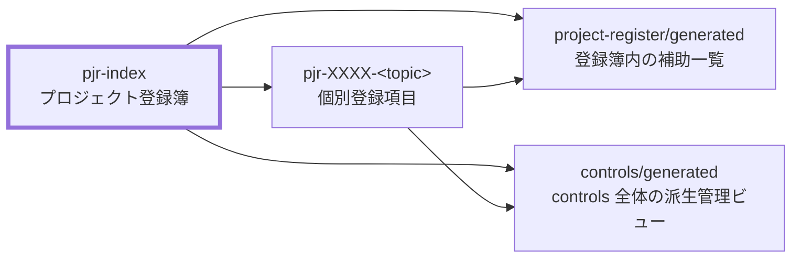

---
specdojo:
  id: specdojo-register-operation-guide
  type: guide
  status: draft
---

# SpecDojo 登録簿運用ガイド

SpecDojo Register Operation Guide

プロジェクト登録簿（`pjr-index.md`）の使い方を説明します。登録の判断、type の選び方、状態遷移、個票の分離、完了時の記録、派生ビューの扱い、agent 実行・定期実行との連携を扱います。登録簿の記述ルール（構造・列・値の定義）は [[pjr-index-rulebook]] を、コマンドの一覧は [specdojo-command-reference-guide.md](specdojo-command-reference-guide.md) を正本とします。

## 1. 登録簿の位置づけ

プロジェクト登録簿は、プロジェクト進行中に発生する TODO、要確認事項、リスク、課題、変更要求、決定事項、依存事項、備忘を一元管理する台帳です。

- 正本は `pjr-index.md` の一覧と、各個票（`pjr-XXXX-<topic>.md`）である。
- 状態別・優先度別・担当者別などの派生ビューは `generated/` 配下に生成される補助一覧であり、直接編集しない。
- 成果物カタログと依存関係に基づく計画済みの作業は schedule で管理し、登録簿には入れない。計画外に発生した単発の対応・調査・判断を登録簿で追跡する（[specdojo-exec-operation-guide.md](specdojo-exec-operation-guide.md) の `実行経路の使い分け` を参照）。

関連ドキュメントの関係は次のとおりです。



登録簿の初期生成には `register scaffold` を使います。

```bash
specdojo register scaffold --project <project-id>
```

## 2. 登録の判断基準

次のいずれかに当てはまる事項は、その場で処理せず登録簿に登録します。

- 会議、レビュー指摘、作業中の気づき、外部からの依頼のうち、後で対応・確認・判断が必要なもの
- 「誰かが覚えている」状態になっており、担当と期限を付けて追跡したいもの
- すぐに結論が出ず、経緯や判断理由を後から参照する可能性があるもの

逆に、次の事項は登録しません。

- 計画済みの成果物作成・レビュー・確定の作業（schedule のタスクとして管理する）
- その場で完了し、後から追跡する必要がないもの

登録は `register add` で行います。ID は省略すると自動採番されます。

```bash
specdojo register add --project <project-id> --type todo --title "在庫初期データの登録"
```

`--priority` は次の目安で付けます（省略時は `medium`）。

| priority | 目安                             |
| -------- | -------------------------------- |
| `high`   | 放置すると他の作業や判断が止まる |
| `medium` | 期限までに対応が必要             |
| `low`    | 影響が限定的で、後回しにできる   |

## 3. type の選び方

値の一覧と列定義は [[pjr-index-rulebook]] と `pjr-index.schema.yaml` を正本とします。各 type の意味と、迷ったときの判断基準は次のとおりです。

| type             | 意味                                 | 迷ったとき                                                     |
| ---------------- | ------------------------------------ | -------------------------------------------------------------- |
| `todo`           | 実施が決まっている作業               | 変更判断を伴うなら `change-request`、外部待ちなら `dependency` |
| `question`       | 回答・確認が必要な事項               | 共有だけでよいなら `note`、選択肢を決める判断なら `decision`   |
| `risk`           | まだ顕在化していない懸念             | すでに発生している問題なら `issue`                             |
| `issue`          | 顕在化している問題                   | 未発生の懸念なら `risk`                                        |
| `change-request` | 成果物・仕様・計画に対する変更の要望 | 実施が確定済みの作業なら `todo`                                |
| `decision`       | 記録・追跡する意思決定               | 判断材料が足りず確認が先なら `question`                        |
| `dependency`     | 外部の対応・提供物への依存           | 自分たちが実施する作業なら `todo`                              |
| `note`           | 共有・備忘のための記録               | 回答や結論が必要なら `question`                                |

type は派生ビューの生成と `exec run --register` の挙動（`agent実行・定期実行との連携` を参照）に影響するため、内容が変質した場合は `register update` で見直します。

## 4. 状態遷移とコマンド

登録項目の状態はコマンドで遷移させます。手で status セルを書き換えるより、遷移ガードの効くコマンドを優先します。

| 場面                     | コマンド          | 遷移後の状態                                   |
| ------------------------ | ----------------- | ---------------------------------------------- |
| 登録する                 | `register add`    | `open`                                         |
| 着手する                 | `register start`  | `in-progress`                                  |
| 他者・外部の対応を待つ   | `register wait`   | `waiting`                                      |
| 確認・レビューに回す     | `register review` | `review`                                       |
| 完了する                 | `register close`  | `done`（`decision` / `question` は `decided`） |
| 対応しないと判断する     | `register reject` | `rejected`                                     |
| 延期する                 | `register defer`  | `deferred`                                     |
| 終了済み項目を再開する   | `register reopen` | `open`                                         |
| 担当・期限などを変更する | `register update` | （状態は変えずフィールドを更新）               |

- 担当や期限が未定のまま登録する場合は、空欄ではなく _TODO_ のままにしておき、決まり次第 `register update` で埋めます。
- 動いていない `open` や期限切れの項目は放置せず、期限の更新、優先度の見直し、`defer` / `reject` のいずれかへ整理します。

## 5. 個票の分離

一覧の 1 行（説明 1〜2 文）で管理できる項目は個票を作りません。次の場合に個票（`pjr-XXXX-<topic>.md`）へ分離します。

- 経緯、判断理由、選択肢の比較、根拠資料へのリンクを残す必要がある
- 説明が 1〜2 文に収まらない、または複数回の追記が見込まれる
- レビューや合意の記録を項目単位で追跡したい

個票は `register add` に `--ticket` を付けると、type 別のテンプレート（`pjr-todo-template.md` など `pjr-<type>-template.md`）から生成されます。

```bash
specdojo register add \
  --project <project-id> \
  --type risk \
  --title "タブレット故障時の営業継続" \
  --ticket --topic tablet-failure-fallback
```

個票を作成した後も、一覧の行は要約に留め、詳細は個票側へ書きます。

## 6. 完了時の記録

`close` / `reject` / `defer` するときは、完了日と結論を残します。結論は「何をどう判断したか」が 1 文で分かる形にします。

```bash
specdojo register close \
  --project <project-id> \
  --id PJR-0005 \
  --conclusion "取消処理で在庫数を戻すよう修正"
```

- `done` / `decided`: 対応内容または決定内容を書く。
- `rejected`: 却下の理由を書く。
- `deferred`: 再開の条件または再評価のタイミングを書く。

結論が残っていない終了項目は、後から経緯を追えなくなるため、close 前に埋めます。

## 7. 派生ビューの扱い

派生ビューは `register build` で生成します。

```bash
specdojo register build --project <project-id>
```

- `project-register/generated/` には登録簿内の補助一覧（状態別・優先度別・担当者別）が生成される。
- `controls/generated/` には controls 全体の type 別管理ビュー（リスク登録簿、課題ログ、変更要求ログ、決定記録）が生成される。
- 派生ビューの内容を直したい場合は、生成ファイルではなく `pjr-index.md` または個票を修正して再生成する。

## 8. agent実行・定期実行との連携

登録項目は `exec run --register` で agent に実行させられます。

```bash
specdojo exec run --project <project-id> --register PJR-0012
```

- type が `todo` / `issue` / `change-request` の項目は成果物・実装を変更する対応、`question` / `risk` の項目は調査して結論案を result に記録する対応になる。`decision` / `dependency` / `note` は実行対象外。
- 状態は register の遷移（`in-progress` / `review` / `waiting`）で追跡され、agent は項目を終端化しない。成功後は人が内容を確認して `register close` する。
- open な項目の定期スイープなど、時刻条件で繰り返す場合は routine（`rtn-*.yaml`）を使う。

実行フローの詳細は [specdojo-exec-operation-guide.md](specdojo-exec-operation-guide.md) を参照します。
