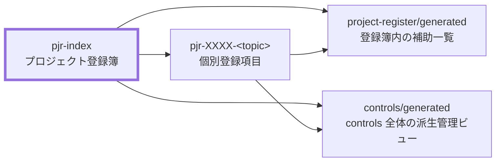

---
specdojo:
  id: specdojo-register-operation-guide
  type: guide
  status: draft
---

# SpecDojo 登録簿運用ガイド

SpecDojo Register Operation Guide

プロジェクト登録簿（`pjr-index.md`）の使い方を説明します。登録の判断、type の選び方、状態遷移、個票の分離、完了時の記録、派生ビューの扱い、agent 実行・定期実行との連携を扱います。登録簿の記述ルール（構造・列・値の定義）は [[pjr-rulebook]] を、コマンドの一覧は [specdojo-command-reference.md](../references/specdojo-command-reference.md) を正本とします。

**対象読者**

- プロジェクトの課題、リスク、変更要求、意思決定などを登録・更新・実行するプロジェクト管理者、担当者

**この文書で分かること**

- 登録簿へ記録する判断基準、type と状態遷移、個票・派生ビュー、agent・routine との連携

**次に読む文書**

- 登録項目の実行経路は [SpecDojo exec運用ガイド](specdojo-exec-operation-guide.md)、コマンド詳細は [SpecDojoコマンドリファレンス](../references/specdojo-command-reference.md) を参照してください。

## 1. 登録簿の位置づけ

プロジェクト登録簿は、プロジェクト進行中に発生する TODO、要確認事項、リスク、課題、変更要求、決定事項、依存事項、備忘を一元管理する台帳です。

- 正本は `pjr-index.md` の一覧と、各個票（`pjr-XXXX-<topic>.md`）である。
- 状態別・優先度別・担当者別などの派生ビューは `generated/` 配下に生成される補助一覧であり、直接編集しない。
- 成果物カタログと依存関係に基づく計画済みの作業は schedule で管理し、登録簿には入れない。計画外に発生した単発の対応・調査・判断を登録簿で追跡する（[specdojo-exec-operation-guide.md](specdojo-exec-operation-guide.md) の `実行経路の使い分け` を参照）。

関連ドキュメントの関係は次のとおりです。


```mermaid
flowchart LR
  PJR_IDX["pjr-index<br>プロジェクト登録簿"]
  PJR_ITEM["pjr-XXXX-&lt;topic&gt;<br>個別登録項目"]
  PJR_GEN["project-register/generated<br>登録簿内の補助一覧"]
  PM_GEN["controls/generated<br>controls 全体の派生管理ビュー"]

  PJR_IDX --> PJR_ITEM
  PJR_IDX --> PJR_GEN
  PJR_IDX --> PM_GEN
  PJR_ITEM --> PJR_GEN
  PJR_ITEM --> PM_GEN

  classDef target stroke-width:4px
  class PJR_IDX target
```

登録簿の初期生成には `register scaffold` を使います。

```bash
specdojo register scaffold --project <project-id>
```

## 2. 登録の判断基準

次のいずれかに当てはまる事項は、その場で処理せず登録簿に登録します。

- 会議、レビュー指摘、作業中の気づき、外部からの依頼のうち、後で対応・確認・判断が必要なもの
- 「誰かが覚えている」状態になっており、担当と期限を付けて追跡したいもの
- すぐに結論が出ず、経緯や判断理由を後から参照する可能性があるもの

逆に、次の事項は登録しません。

- 計画済みの成果物作成・レビュー・確定の作業（schedule のタスクとして管理する）
- その場で完了し、後から追跡する必要がないもの

登録は `register add` で行います。ID は省略すると自動採番されます。

```bash
specdojo register add --project <project-id> --type todo --title "在庫初期データの登録"
```

`--priority` は次の目安で付けます（省略時は `medium`）。

| priority | 目安                             |
| -------- | -------------------------------- |
| `high`   | 放置すると他の作業や判断が止まる |
| `medium` | 期限までに対応が必要             |
| `low`    | 影響が限定的で、後回しにできる   |

## 3. type の選び方

値の一覧と列定義は [[pjr-rulebook]] と `pjr-index.schema.yaml` を正本とします。各 type の意味と、迷ったときの判断基準は次のとおりです。

| type             | 意味                                 | 迷ったとき                                                     |
| ---------------- | ------------------------------------ | -------------------------------------------------------------- |
| `todo`           | 実施が決まっている作業               | 変更判断を伴うなら `change-request`、外部待ちなら `dependency` |
| `question`       | 回答・確認が必要な事項               | 共有だけでよいなら `note`、選択肢を決める判断なら `decision`   |
| `risk`           | まだ顕在化していない懸念             | すでに発生している問題なら `issue`                             |
| `issue`          | 顕在化している問題                   | 未発生の懸念なら `risk`                                        |
| `change-request` | 成果物・仕様・計画に対する変更の要望 | 実施が確定済みの作業なら `todo`                                |
| `decision`       | 記録・追跡する意思決定               | 判断材料が足りず確認が先なら `question`                        |
| `dependency`     | 外部の対応・提供物への依存           | 自分たちが実施する作業なら `todo`                              |
| `note`           | 共有・備忘のための記録               | 回答や結論が必要なら `question`                                |

type は派生ビューの生成と `exec run --register` の挙動（`agent実行・定期実行との連携` を参照）に影響するため、内容が変質した場合は `register update` で見直します。

## 4. 状態遷移とコマンド

登録項目の状態はコマンドで遷移させます。手で status セルを書き換えるより、遷移ガードの効くコマンドを優先します。

| 場面                     | コマンド          | 遷移後の状態                                   |
| ------------------------ | ----------------- | ---------------------------------------------- |
| 登録する                 | `register add`    | `open`                                         |
| 着手する                 | `register start`  | `in-progress`                                  |
| 他者・外部の対応を待つ   | `register wait`   | `waiting`                                      |
| 確認・レビューに回す     | `register review` | `review`                                       |
| 完了する                 | `register close`  | `done`（`decision` / `question` は `decided`） |
| 対応しないと判断する     | `register reject` | `rejected`                                     |
| 延期する                 | `register defer`  | `deferred`                                     |
| 終了済み項目を再開する   | `register reopen` | `open`                                         |
| 担当・期限などを変更する | `register update` | （状態は変えずフィールドを更新）               |

- 担当や期限が未定のまま登録する場合は、空欄ではなく _TODO_ のままにしておき、決まり次第 `register update` で埋めます。
- 動いていない `open` や期限切れの項目は放置せず、期限の更新、優先度の見直し、`defer` / `reject` のいずれかへ整理します。

個票（`pjr-XXXX-<topic>.md`）を持つ項目では、`close` / `reject` が処理状態の遷移とあわせて個票 Frontmatter の `status`（文書成熟度）も更新します。処理状態とは別の状態軸であり、遷移基準は [[pjr-rulebook]] の `個票 status の遷移基準` を正本とします。

| コマンド          | 個票 `status` の遷移 | 条件                                                                       |
| ----------------- | -------------------- | -------------------------------------------------------------------------- |
| `register close`  | `draft` → `ready`    | 必須節に `_TODO_` が残っていないこと（残る場合は昇格せず警告して据え置く） |
| `register reject` | → `deprecated`       | 条件なし                                                                   |

- 個票を持たない項目（個票列が `-`）は成熟度を追う対象がないため、処理状態のみ更新されます。
- 変更前に確認したい場合は `--dry-run` を付けると、一覧行の変更に加えて個票の `status` 変更予定も表示されます。

## 5. 個票の分離

一覧の 1 行（説明 1〜2 文）で管理できる項目は個票を作りません。次の場合に個票（`pjr-XXXX-<topic>.md`）へ分離します。

- 経緯、判断理由、選択肢の比較、根拠資料へのリンクを残す必要がある
- 説明が 1〜2 文に収まらない、または複数回の追記が見込まれる
- レビューや合意の記録を項目単位で追跡したい

個票は `register add` に `--ticket` を付けると、type 別のテンプレート（`pjr-todo-template.md` など `pjr-<type>-template.md`）から生成されます。

```bash
specdojo register add \
  --project <project-id> \
  --type risk \
  --title "タブレット故障時の営業継続" \
  --ticket --topic tablet-failure-fallback
```

個票を作成した後も、一覧の行は要約に留め、詳細は個票側へ書きます。

## 6. 完了時の記録

`close` / `reject` / `defer` するときは、完了日と結論を残します。結論は「何をどう判断したか」が 1 文で分かる形にします。

```bash
specdojo register close \
  --project <project-id> \
  --id PJR-0005 \
  --conclusion "取消処理で在庫数を戻すよう修正"
```

- `done` / `decided`: 対応内容または決定内容を書く。
- `rejected`: 却下の理由を書く。
- `deferred`: 再開の条件または再評価のタイミングを書く。

結論が残っていない終了項目は、後から経緯を追えなくなるため、close 前に埋めます。

## 7. 派生ビューの扱い

派生ビューは `register build` で生成します。

```bash
specdojo register build --project <project-id>
```

- `project-register/generated/` には登録簿内の補助一覧（状態別・優先度別・担当者別）が生成される。
- `controls/generated/` には controls 全体の type 別管理ビュー（リスク登録簿、課題ログ、変更要求ログ、決定記録）が生成される。
- 派生ビューの内容を直したい場合は、生成ファイルではなく `pjr-index.md` または個票を修正して再生成する。

派生ビューのテーブルのタイトル行（列名の行）は、コードや派生ビューの雛形ではなく `pjr-index.md` のタイトル行をそのまま継承します。列名を変更したい場合は、生成ファイルを直接編集せず、次を修正してから `register build` で再生成します。

- 既存プロジェクトの実値: 当該 `pjr-index.md` の「登録項目一覧」テーブルのタイトル行
- 新規プロジェクトの初期値: `pjr-index-template.md` のタイトル行
- 列の追加・削除・改名を伴う規範変更: [[pjr-rulebook]] の「登録項目一覧の標準列」

派生ビューの見出し（`台帳ビュー`、`リスク登録簿` など）や再生成注記は、各派生ビューの雛形（`pjr-views-template.md`、`pm-<name>-template.md`）が持つため、そちらを修正して再生成します。

## 8. agent実行・定期実行との連携

登録項目は `exec run --register` で agent に実行させられます。

```bash
specdojo exec run --project <project-id> --register PJR-0012

# 複数項目を指定順に直列実行する（成功IDごとにcommit、途中失敗でも継続）
specdojo exec run --project <project-id> --register PJR-0012 PJR-0013 --register-commit --on-failure continue
```

- type が `todo` / `issue` / `change-request` の項目は成果物・実装を変更する対応、`question` / `risk` の項目は調査して結論案を result に記録する対応になる。`decision` / `dependency` / `note` は実行対象外。
- 状態は register の遷移（`in-progress` / `review` / `waiting`）で追跡され、agent は項目を終端化しない。成功後は人が内容を確認して `register close` する。
- `--register` には複数の PJR-ID を空白区切り・カンマ区切りで渡せる。指定順に1件ずつ実行し、各IDの状態遷移まで完結してから次へ進む。全ID処理後にID別の成否・状態遷移・commit 結果を一覧表示する。
- `--register-commit` を付けると成功IDごとに、その実行で生じた変更だけをcommitする（実行前から作業ツリーにある利用者の変更は含めない）。`--on-failure`（`stop` 既定 / `continue`）で途中失敗時に停止するか継続するかを選ぶ。
- register 実行は in-place の直列実行であり、`--worktree` と `--parallel` はサポートしない。
- open な項目の定期スイープなど、時刻条件で繰り返す場合は routine（`rtn-*.yaml`）を使う。

実行フローの詳細は [specdojo-exec-operation-guide.md](specdojo-exec-operation-guide.md) を参照します。

## 9. PJR-ID 重複の検知と復旧

`register add` の PJR-ID は `pjr-index.md` の最大値 +1 で採番されるため、複数の作業者や worktree が並行して起票すると同じ ID が別 branch で発生します。表末尾への追記は通常 merge conflict になりますが、rebase や cherry-pick を経ると重複が検知されずに混入することがあります。

重複は検証で必ず落ちます。次の検証は VSCode のリアルタイム検証と CI の両方で機能します。

```bash
npm run validate:schema:pjr-index
```

- 登録項目一覧に同じ PJR-ID が 2 行以上ある場合、重複した ID と該当行位置を示してエラーになる。
- 表の PJR-ID と個票ファイル名 `pjr-XXXX-<topic>.md` の対応が取れていない場合もエラーになる。

重複や衝突を検出したら、`register renumber` で片方の項目を未使用の PJR-ID へ移します。

```bash
# まず変更対象を確認する
specdojo register renumber --project <project-id> --id PJR-0137 --to PJR-0140 --dry-run

# 問題なければ適用する
specdojo register renumber --project <project-id> --id PJR-0137 --to PJR-0140
```

- `pjr-index.md` の該当行・個票ファイル名・個票 frontmatter の `id`・他文書からの参照リンク・exec plan / result の `targets` を同時に付け替える。
- 移動先 ID が既に使われている場合は何も書き換えずにエラー終了するため、部分適用は残らない。
- 付け替え後は派生ビューも再生成される。移動先 ID は登録簿の最大値 +1 以降の未使用 ID を選ぶと、以後の自動採番と衝突しにくい。

## 10. PO 留保事項の PR 承認運用

プロジェクト憲章の権限委譲章で PO の承認を要する事項（PO 留保事項）は、decision 個票の起票だけでなく pull request のレビュー承認を併用します。個票のセル文字列だけでは作成者と承認者が分離されず自己承認になりうるため、承認者・承認日時・承認対象差分を platform 側で担保します。

- decision 個票は決定内容の SSOT（背景・選択肢・決定・理由）として、リポジトリ内に恒久保持する。
- pull request は承認イベント（誰がいつ何を承認したか）の担保に用いる。
- 相互リンク: 個票の承認章に PR URL と merge SHA を本文テキストで記録し、PR 説明には対象 decision 個票の `id` を記載する。PR URL と merge SHA を本文へ転記することで、platform に依存せずリポジトリ内だけで承認事実を追跡できる。

承認フローは次の順で行います。

1. 決定内容を decision 個票へ記録する。
2. 承認対象の差分を pull request として作成し、PR 説明に対象個票の `id` を書く。
3. PO が PR をレビューして approve する。作成者自身の承認は職務分離のため承認としてカウントしない。
4. merge 後、個票または憲章の承認章へ承認日・承認者・承認対象・証跡リンク（PR URL・merge SHA）を書き戻す。

PR 承認が必要な決定範囲（憲章の PO 留保事項）、branch 保護 / CODEOWNERS 方針の詳細は、当該プロジェクトの登録項目（例: `pjr-0126-pr-based-po-approval`）で定義します。schedule 上の計画済みタスクによる通常の成果物更新や日常の agent コミットは、PR 承認の対象外です。

## 11. 統合ブランチへの予約起票

作業 worktree（`exec/*` branch など）で作業中に PJR-ID だけを先に確保したい場合は、`register add --reserve` を使います。通常の `register add` は現在の branch の `pjr-index.md` を書き換えますが、`--reserve` を付けると統合ブランチの worktree へ登録行だけを追記・commit して ID を予約します。作業 worktree 側では `pjr-index.md` を変更しないため、表末尾への追記競合が構造的に発生しません。

```bash
# 予約する ID と変更対象を事前に確認する
specdojo register add --project <project-id> --type todo --title "在庫初期データの登録" --reserve --dry-run

# 問題なければ予約する（割り当てられた PJR-ID が標準出力の最終行に返る）
specdojo register add --project <project-id> --type todo --title "在庫初期データの登録" --reserve
```

- 統合ブランチは `--integration-branch <name>` で指定でき、省略時は config の `run.register_integration_branch`、それも無ければ既定値 `main` を使う。worktree を branch ではなくパスで直接指定する場合は `--integration-worktree <path>` を使う。
- 予約時に統合ブランチの worktree へ書き込むのは `pjr-index.md` の登録行だけで、個票は作成しない。`--reserve` と `--ticket` は併用できない。
- 予約 commit は `pjr-index.md` の追記だけを対象とし、統合ブランチ側の他の未 commit 変更は巻き込まない。commit メッセージは `--commit-message <text>` で上書きできる。
- 次のいずれかに当てはまる場合は書き込みを行わずにエラー終了する: 統合ブランチの worktree が存在しない、`pjr-index.md` に未 commit の変更がある、指定した ID が既存 ID と競合する。
- 割り当てられた PJR-ID は標準出力の最終行に返るので、後続の個票作成・実作業に利用する。個票と実作業は従来どおり作業 branch 側で行い、状態遷移（`start` / `review` / `close` など）も従来どおり運用する。
- 従来どおり作業 branch 上で完結して起票する場合は `--reserve` を付けない。既定の挙動は変わらない。
