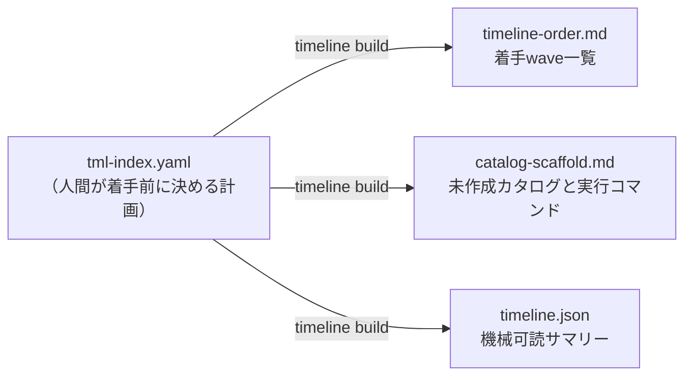
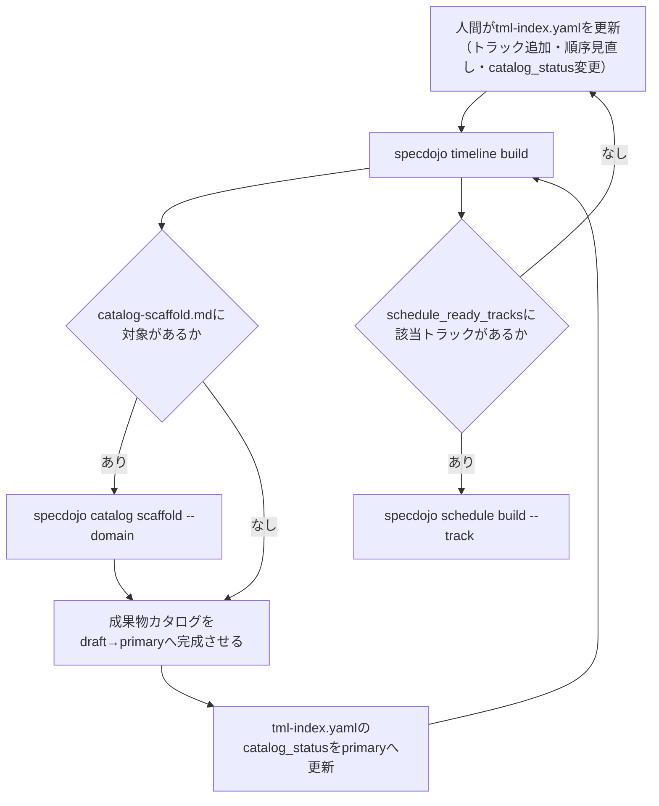

---
specdojo:
  id: specdojo:timeline-design-guide
  type: guide
  status: draft
---

# Timeline設計ガイド

Timeline Design Guide

Timeline（`tml-index.yaml`）の役割、`specdojo timeline build` の生成フロー、成果物カタログ作成から Schedule への展開までの運用タイミングを説明します。記述規範は [タイムライン作成ルール](../rulebooks/tml-rulebook.md) を、トラックの標準構成と実行順序の考え方は [トラック設計ガイド](track-design-guide.md) を参照します。

**対象読者**

- 複数トラックの着手順序・並行可否を計画し、成果物カタログ作成から Schedule 展開までの進め方を判断するプロジェクト計画担当者

**この文書で分かること**

- Timeline の役割、`timeline build` が行う wave 算出・カタログ scaffold 対象判定・整合性検証、運用タイミング、既存資産（track-design-guide、Schedule、成果物カタログ）との関係

**次に読む文書**

- `tml-index.yaml` の記述規範は [タイムライン作成ルール](../rulebooks/tml-rulebook.md)、成果物カタログから Schedule への展開は [Schedule設計ガイド](schedule-design-guide.md) を参照してください。

## 1. Timelineの役割

Timeline は「どのトラックを、どの順で、いつ着手するか」というトラック粒度のマクロな順序を、着手前に人間が決めて記録する計画層です。プロジェクトに `tml-index.yaml` を 1 ファイルだけ置き、成果物カタログ作成（`dct-<domain>.yaml`）から Schedule 展開（`sch-strategy-<track>.yaml` / `sch-track-<track>.yaml`）までの見通しを 1 箇所にまとめます。

| 定義する内容                     | 担当ファイル                   |
| -------------------------------- | ------------------------------ |
| トラックの着手順序・並行可否     | Timeline（`tml-index.yaml`）   |
| 成果物の論理定義・完了単位       | 成果物カタログ（`dct-*.yaml`） |
| タスク粒度の日付・依存関係・担当 | Schedule（`sch-*.yaml`）       |

成果物カタログ・Schedule との責務分担の詳細は [Schedule設計ガイド](schedule-design-guide.md) の `成果物カタログとの責務分担` を、Timeline と Schedule 双方が扱う「節目」の役割分担（`tml-index.yaml` と `sch-milestones.yaml`）は [タイムライン作成ルール](../rulebooks/tml-rulebook.md) の `sch-milestones.yamlとの役割分担` を参照してください。

## 2. `timeline build` の生成フロー

`specdojo timeline build` は `tml-index.yaml` を入力に、後続コマンド（`catalog scaffold` / `schedule build`）への入力情報を `timeline/generated/` へ出力する一方通行の生成コマンドです。生成物から `tml-index.yaml` を逆生成しません。

### 2.1. 整合性検証

`timeline build` は生成前に `tracks[]` の整合性を検証し、次のいずれかを検出するとエラーで停止します（`--dry-run` でも同様に検証されます）。

| 検出する不整合            | 内容                                                                  |
| ------------------------- | --------------------------------------------------------------------- |
| track id の重複           | 同じ `track` 値が `tracks[]` に複数存在する                           |
| `depends_on` の未定義参照 | `depends_on` に挙げた track id が `tracks[]` に定義されていない       |
| `order` との矛盾          | `depends_on` に挙げたトラックの `order` が、自分の `order` 以上である |
| 循環参照                  | `depends_on` を辿ると自分自身に戻る                                   |

次の状態は警告（生成は継続）として扱われます。

| 検出する警告                                                                          | 内容                                         |
| ------------------------------------------------------------------------------------- | -------------------------------------------- |
| `catalog_status: primary` なのに前提トラックが `primary` 未到達                       | 依存先の準備が整う前に着手可能と宣言している |
| `catalog_status: not_started` なのに対象ドメインの `dct-<domain>.yaml` が既に存在     | Timeline側の状態更新が遅れている             |
| `catalog_status` が `draft` 以上なのに対象ドメインの `dct-<domain>.yaml` が存在しない | Timeline側の状態更新が実態より先行している   |

### 2.2. wave算出

`timeline build` は `order` を主キーにトラックを畳み込み、同じ `order` を持つトラックを 1 つの wave（着手単位）にまとめます。wave 内のトラックは並行して着手できる候補です。`parallel_group` は同じ wave 内でどのトラック同士が実際に並行してよいかを示すラベルであり、wave 算出そのものには使いません。

### 2.3. カタログ scaffold 対象の判定

トラックが対象とする各ドメインについて、既存の `dct-<domain>.yaml`（`dct-<domain>-<part>.yaml` の物理分割を含む）をファイル名ではなく各カタログの `domain` 値で突き合わせます。該当ドメインの成果物カタログが存在しない場合、`catalog-scaffold.md` へ生成先パスと `specdojo catalog scaffold --domain <domain>` の実行コマンドを列挙します。

### 2.4. Schedule着手可能トラックの判定

`catalog_status: primary` のトラックを `schedule_ready_tracks` として `timeline.json` へ列挙します。これは Schedule 展開（`schedule build --track <track>`）を開始してよいトラックの一覧です。

## 3. 運用タイミング

`timeline build` は一度だけ実行するコマンドではなく、`tml-index.yaml` を更新するたびに再実行する運用コマンドです。

代表的な更新契機は次のとおりです。

| 更新契機                                                          | 実施すること                                                                     |
| ----------------------------------------------------------------- | -------------------------------------------------------------------------------- |
| 新しいトラックを追加する                                          | `tml-index.yaml` にトラックを追加し `timeline build` を再実行する                |
| 成果物カタログの `draft` → `primary` 完成に伴い着手順序を確定する | `tml-index.yaml` の `catalog_status` を更新し `timeline build` を再実行する      |
| 着手順の見直し（並行化・順序入れ替え）が必要になる                | `order` / `parallel_group` / `depends_on` を更新し `timeline build` を再実行する |
| トラックの Schedule 展開前の最終確認                              | `timeline build` を実行し `schedule_ready_tracks` に対象が含まれることを確認する |

### 3.1. 既にSchedule展開済みのトラックの扱い

`tml-index.yaml` の導入前から `sch-strategy-<track>.yaml` が存在し実行が始まっているトラックは、`catalog_status: primary` と `depends_on` をその実績に合わせて追認的に記載します。Timeline は実行結果を書き戻す文書ではないため（[タイムライン作成ルール](../rulebooks/tml-rulebook.md) の禁止事項を参照）、進捗率や実際の着手日は書かず、順序判断の根拠は `note` に残します。この場合、`timeline build` を実行しても当該トラックの `catalog-scaffold.md` 対象は 0 件になりますが、まだ着手していない後続トラックの wave 算出・整合性検証には引き続き意味があります。

## 4. `track-design-guide.md` との関係

[トラック設計ガイド](track-design-guide.md) の `トラックの標準的な実行順序` は、進め方（アジャイル／ウォーターフォール）別の標準的な着手順序をプローズ（文章・表）で示します。`tml-index.yaml` は、プロジェクト固有の事情（並行化の可否、優先順位の入れ替え、対象外ドメインの除外）を踏まえてこのプローズを機械可読な `order` / `parallel_group` / `depends_on` へ落とし込んだものです。標準順序をそのまま採用する場合も、`tml-index.yaml` への記載は省略せず、`note` に「標準順序どおり」である旨を残します。

## 5. アンチパターン

| アンチパターン                                                    | 問題                                                                             | 対策                                                                                                                                                        |
| ----------------------------------------------------------------- | -------------------------------------------------------------------------------- | ----------------------------------------------------------------------------------------------------------------------------------------------------------- |
| `catalog_status` を更新しないまま成果物カタログを完成させる       | `timeline build` の `schedule_ready_tracks` が実態とずれ、着手可能判定に使えない | 成果物カタログを `primary` にした時点で `tml-index.yaml` も同時に更新する                                                                                   |
| `parallel_group` を安易に共通ラベルへ寄せる                       | 実際には並行させてはいけないトラックまで並行候補に見えてしまう                   | 並行させてよい理由が同じトラックだけを同じ `parallel_group` にする（[タイムライン作成ルール](../rulebooks/tml-rulebook.md) の `order` と `parallel_group`） |
| Timeline に実行実績（完了日・進捗率）を書き戻す                   | 計画と実績の区別がつかなくなり、`sch-milestones.yaml` と情報が二重化する         | 実績は `sch-milestones.yaml` と `generated/` に任せ、Timeline は計画のみを保持する                                                                          |
| `timeline build` の生成物（`timeline-order.md` 等）を直接編集する | 次回 `timeline build` 実行時に上書きされ、編集内容が失われる                     | 変更したい内容は `tml-index.yaml` に反映してから `timeline build` を再実行する                                                                              |
