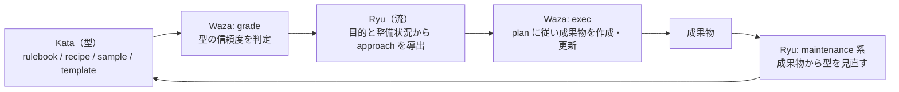

---
specdojo:
  id: specdojo:specdojo-philosophy
  type: philosophy
  status: draft
  supersedes:
    - documentation-philosophy
---

# SpecDojo の考え方

SpecDojo Philosophy

SpecDojo の基本方針（Docs as Code / Kata・Waza・Ryu / Human & AI Readability）と、道場のメタファーである Kata・Waza・Ryu の関係、それらを構造化ドキュメントへ適用する設計・運用の原則、運用上の判断基準を示します。実行・エージェント固有の方針は各 guide を正本とします。
本書は規範（must）ではなく、規約の設計理由と判断原則を扱います。判定可能な規約は各 standard を正本とします。

**対象読者**

- SpecDojo の文書体系を設計・保守する利用者、standard・rulebook・guide の作成者

**この文書で分かること**

- 基本方針（Docs as Code / Kata・Waza・Ryu / Human & AI Readability）と、Kata・Waza・Ryu を分けて結び付ける理由、正本・構造化・メタデータ・規約と設定・トレーサビリティに関する設計理由と判断基準

**次に読む文書**

- 文書の分類と配置は [ドキュメント構成ガイド](../guides/docs-structure-guide.md)、メタデータの規定は [ドキュメントメタ情報標準](../standards/document-metadata-standard.md) を参照してください。
- Kata・Waza・Ryu それぞれの使い方は [実践の型活用ガイド](../guides/kata-guide.md)、[遂行の技活用ガイド](../guides/waza-guide.md)、[実践の進め方ガイド](../guides/ryu-guide.md) を参照してください。

## 1. 基本方針

SpecDojo の基本方針は次の3つです。「コードと同じ規律で管理し、型に沿って作成し、人と AI の双方が読める」ドキュメンテーションを目指します。

- **Docs as Code**: 正本を Git に置き、構造化・単一正本・生成・機械検証で、コードと同じ規律で管理する。
- **Kata・Waza・Ryu（型・技・流）**: 成果物の作り方を Kata（実践の型: rulebook / recipe / sample / template）として整え、Waza（遂行の技: `specdojo` CLI）で計画・実行・検証し、Ryu（流: `approach`）で型の整備状況と目的に応じた進め方を選ぶ。
- **Human & AI Readability**: 人が判断理由を理解でき、AI とツールが解析・生成・検証できる構造にする。

各方針を構造化ドキュメントへ適用する原則と判断基準は `ドキュメントの設計と運用の原則` にまとめます。Kata・Waza・Ryu の三つを分けて結び付ける理由は `道場のメタファー: Kata・Waza・Ryu` で示し、それぞれの詳細は各 guide を正本とします。

## 2. 道場のメタファー: Kata・Waza・Ryu

SpecDojo は、道場で技能を身につける構造になぞらえて、成果物の作り方に関わる三つの概念を分けて扱います。型を学び（Kata）、技で遂行し（Waza）、流派として進め方を選ぶ（Ryu）という関係です。三つの名称は説明のための愛称・分類であり、CLI のコマンド名、`approach` の値、frontmatter のフィールド名を変えるものではありません。

SpecDojo の特色は、この三つを別々の正本として保守しながら、機械的に結び付けている点にあります。内容の基準（Kata）、遂行の手段（Waza）、基準をどこまで使うかの判断（Ryu）を混ぜないことで、型が未整備でも作業を止めず、型が育てば同じ仕組みのまま作業の質が上がります。

### 2.1. 三つの概念と役割

| 概念 | 読み | 答える問い                                                 | SpecDojo 上の実体                                                                                           | 正本                                                                                                                |
| ---- | ---- | ---------------------------------------------------------- | ----------------------------------------------------------------------------------------------------------- | ------------------------------------------------------------------------------------------------------------------- |
| Kata | 型   | この成果物には何を書き、どう作り、完成形はどうなるか       | 実践の型: rulebook / recipe / sample / template                                                             | [実践体系構成ガイド](../guides/practice-system-composition-guide.md)、[実践の型活用ガイド](../guides/kata-guide.md) |
| Waza | 技   | 計画・実行・状態管理・機械検証をどう遂行するか             | `specdojo` CLI: catalog / schedule / exec / register / routine / grade など                                 | [遂行の技活用ガイド](../guides/waza-guide.md)、[CLIコマンドリファレンス](../references/command-reference.md)        |
| Ryu  | 流   | 型の整備状況と目的に応じて、型をどこまで基準にして進めるか | `approach`: fully-guided / recipe-guided / freeform と、retrofit / bootstrap / maintenance 系 / finalize 系 | [実践の進め方ガイド](../guides/ryu-guide.md)、[Schedule設計ガイド](../guides/schedule-design-guide.md)              |

Kata は「何を・どう書くか」の基準を文書として持ちます。Waza は基準そのものを定義せず、成果物カタログから Schedule・タスク・plan・result へ展開して遂行し、結果を記録・検証します。Ryu は両者の間に立ち、今回のタスクで Kata をどこまで基準にするかを決めます。

### 2.2. 三つの関係

三つは一方向の階層ではなく、遂行の中で循環します。

- Waza の `grade` が Kata の内容を評価し、作成・更新の基準として信頼できるかを判定します。
- Ryu は、タスクの目的（strategy の `approach_rules`）と Kata の判定結果から `approach` を導きます。必要な型が揃い信頼できれば型を全面的に基準にし、recipe だけなら recipe を基準にし、頼れる型が無ければ型に縛られずに進めます。
- Waza の `exec` は、導かれた `approach` を plan に記録し、plan に従って成果物を作成・更新し、result と evidence を残します。
- 成果物が溜まると、maintenance 系の Ryu が成果物の実態から Kata を見直します。型は固定の規範ではなく、成果物との往復で育てる対象です。

この循環により、型の整備状況が変わっても手順を入れ替える必要はありません。同じ Waza のまま、Ryu の判断と Kata の内容だけが変わります。

### 2.3. 三つを分ける理由と判断基準

| 分ける組み合わせ | 分ける理由                                                                                       | 分けない場合に起きること                                                                            |
| ---------------- | ------------------------------------------------------------------------------------------------ | --------------------------------------------------------------------------------------------------- |
| Kata と Ryu      | 型の有無や成熟度と、型をどこまで使うかの判断を独立させ、型が未整備でも作業を進められるようにする | 型に従うことを一律に求めると、未熟な型の誤りを成果物へ広げるか、型が揃うまで作業が止まる            |
| Kata と Waza     | 内容の基準を文書として保守し、CLI の実装や版に依存させない                                       | 基準がコードや設定に埋もれ、ツールの変更が内容規約の変更になる。基準の理由を人が読めなくなる        |
| Ryu と Waza      | 進め方の判断を `approach` として明示し、plan に記録して再現・比較できるようにする                | 参照度合いが実行者ごとの暗黙判断になり、人と AI、前回と今回で進め方が揃わず、結果の差を説明できない |

判断に迷った場合は、次を基準にします。

- 内容の正しさに関わる判断は Kata 側へ置きます。CLI に「何を書くべきか」を埋め込みません。
- 型をどこまで使うかの判断は Ryu の `approach` として表し、plan に残します。実行者が独自に参照範囲を広げたり狭めたりしません。
- 型が不足していると感じた場合は、型を強制するのでも無視するのでもなく、`approach` を見直すか、maintenance 系の Ryu で型そのものを育てます。

### 2.4. 典型的な誤り

| 誤り                                                         | 起きること                                                                             | 判断の基準                                                                                |
| ------------------------------------------------------------ | -------------------------------------------------------------------------------------- | ----------------------------------------------------------------------------------------- |
| Kata を規範（must）と取り違える                              | 型の誤りがそのまま成果物へ広がる。型が無い成果物を作れなくなる                         | 型の信頼度は `grade` が判定し、どこまで従うかは Ryu が決める。規範は standard と rulebook |
| template だけを Kata と思う                                  | 雛形を埋めるだけで、章構成の根拠（rulebook）や手順（recipe）、完成像（sample）が抜ける | Kata は4種で一組。それぞれが別の問いに答える                                              |
| `approach` を固定値として扱う                                | 型が無い成果物に fully-guided を指定して実行が破綻する。型が育っても freeform のまま   | `approach` は目的と整備状況から導く。strategy の生成結果に従う                            |
| 型が1件でも欠けることを理由に bootstrap を選ぶ               | 不要な型まで一括で作られ、保守対象が膨らむ                                             | 必要な型を作成条件に照らして決め、不要な型は `not-needed` と宣言する                      |
| Waza の生成物（generated、plan、result）を正本として編集する | 再生成で消える。正本と派生物の関係が崩れる                                             | 正本は成果物と Kata。生成物は Waza が作り直す                                             |
| Kata・Waza・Ryu を識別子と混同する                           | 存在しないコマンド名やフィールド名を探す                                               | 三つは愛称・分類。実体は CLI のコマンド、`approach` の値、文書種別                        |

## 3. ドキュメントの設計と運用の原則

SpecDojo のドキュメントは、単なる文章ではなく、プロジェクトを定義・管理・実行・検証するための構造化された情報資産として設計します。以下の 3.1 以降は、`基本方針` を実務へ落とすための設計判断と、判断に迷った場合に従う運用基準を一体で示した原則です。各原則がどの基本方針に対応するかは次のとおりです（括弧内は対応する広く知られた原則名）。

| 設計・運用の原則                                                                   | 対応する基本方針                     |
| ---------------------------------------------------------------------------------- | ------------------------------------ |
| 3.1. 正本を一つに定め、他は参照・生成に寄せる（Single Source of Truth / DRY）      | Docs as Code                         |
| 3.2. 人間とAIの両方が読める構造にする（Structured Documentation / AI Readability） | Docs as Code・Human & AI Readability |
| 3.3. ドキュメントを成果物として扱い、責務ごとに分ける                              | 横断（全方針）                       |
| 3.4. ファイル配置とIDで文書を識別できるようにする（ID as Identity / Traceability） | Docs as Code                         |
| 3.5. 規約と設定の責務を分ける（Convention as Defaults, Configuration）             | Docs as Code                         |
| 3.6. 簡潔さと文章量を責務に合わせる（Concise but Complete）                        | Human & AI Readability               |
| 3.7. 小さく始めて、必要に応じて拡張する                                            | 横断（全方針）                       |
| 3.8. 変更理由を残す（Git as Source of Truth）                                      | Docs as Code                         |
| 3.9. 例外は明示的に扱う                                                            | 横断（全方針）                       |

`3.3`・`3.7`・`3.9` は特定の基本方針というより、複数の方針を実務で適用するときに繰り返し必要になる横断的な判断基準です。Kata・Waza・Ryu は成果物の作り方と遂行に関する方針のため、本章の設計・運用原則ではなく `道場のメタファー: Kata・Waza・Ryu` で扱います。

### 3.1. 正本を一つに定め、他は参照・生成に寄せる

同じ情報を複数の場所で正として管理しません。情報ごとに正本となるドキュメントを一つ定め、そこから参照・要約・生成される派生ドキュメントを明確に分離します。

- 正本は、判断・承認・変更管理の対象とします。派生物は、一覧、ビュー、レポート、生成物として扱い、正本と異なる内容を直接記述しません。
- 一覧、集計、進捗ビュー、依存関係ビューなど、正本から機械的に導出できる情報は、可能な限り生成物として扱います。自動生成された文書は `generated` として区別し、直接編集する運用は避けます。
- 同じ情報が複数の場所に存在する場合は、どのドキュメントを正本とするかを先に決めます。既存の正本がある場合はそこを更新し、他の文書では参照・要約・抜粋にとどめます。要約は正本と矛盾しないようにし、古くなりやすい場合は要約ではなく参照に寄せます。
- 複数の文書を手作業で同期し続ける必要がある構成は避けます。生成できない場合でも正本と派生情報の関係を明記し、手作業で更新する場合は更新タイミングと責任を明確にします。

### 3.2. 人間とAIの両方が読める構造にする

ドキュメントは、人間が理解しやすく、AIやツールが解析しやすい構造で記述します。機械処理しやすさだけを優先して人間が読みにくい文書にせず、自由記述だけに依存してAIやツールが解析できない文書にもしません。

- 判断理由、背景、意図は Markdown の本文に記述し、状態、分類、参照、依存関係は構造化項目として記述します。
- 章構成は文書種別ごとの規約に従い、重要な属性は Frontmatter またはスキーマ所定の構造化項目として記述します。
- 表にした方が比較しやすい情報は表で記述し、長い表や一覧は必要に応じて YAML や生成物に分離します。
- 曖昧な表現だけでなく判定可能な記述を心がけ、AIが処理しやすいように同じ意味の項目名や表現は統一します。

形式ごとの役割とメタデータの持ち方は次のように分けます。

| 形式     | 主な役割                                 | メタデータの持ち方                               |
| -------- | ---------------------------------------- | ------------------------------------------------ |
| Markdown | 説明、判断、方針、合意内容               | ファイル先頭の YAML Frontmatter                  |
| YAML     | 人が作成・更新する管理データ、定義データ | ファイル先頭のトップレベル項目                   |
| JSON     | ツール連携、実行記録、機械生成データ     | 用途別のスキーマが定めるトップレベルの構造化項目 |

メタデータを本文から分離して構造化することで、本文を解析しなくても文書の識別、分類、状態判定、参照解決、スキーマ検証を行えます。また、人が読む説明と、AI・ツールが使用する管理情報の責務を分け、表現の変更が識別や処理へ与える影響を抑えられます。

具体的な項目、必須条件、形式は
[ドキュメントメタ情報標準](../standards/document-metadata-standard.md)
を正本とします。

### 3.3. ドキュメントを成果物として扱い、責務ごとに分ける

ドキュメントは、作業の補助資料ではなく、プロジェクトの成果物として扱います。そのため、各ドキュメントには目的、責務、正本性、参照関係を明確に定め、一つのドキュメントに多くの責務を持たせすぎないようにします。

- 何を決定・説明・管理する文書かを明確にし、他の文書と責務が重複しないようにします。更新対象となる情報と、参照のみ行う情報を区別します。
- 成果物として管理すべき文書には、形式に応じたメタデータとして `id`、`type`、`status` などを付与します。
- 1文書には原則として1つの主目的を持たせ、大きくなりすぎる文書は索引文書と個別文書に分割します。分割した文書間では正本の所在と参照関係を明確にしますが、過度な分割により読者の理解を妨げないようにします。
- 構成や分割に迷った場合は、最終的な利用者が理解しやすい形を優先します。初めて読む人が文書の目的を理解できるか、関係者が必要な情報にたどり着けるかを確認し、参照が多すぎる場合は要約や索引を追加し、詳細が多すぎる場合は個別文書へ分割します。

### 3.4. ファイル配置とIDで文書を識別できるようにする

ドキュメントの同一性は、ファイル名ではなく、形式ごとに規定されたメタデータの `id` で判断します。ファイル名やディレクトリは、文書の正本識別子ではなく、可読性・分類・探索性を高めるための補助情報として扱います。

- ディレクトリは文書の責務やライフサイクルに基づいて分け、ファイル名は文書種別や対象を推測しやすい名前にします。入口となる文書には `*-index.md` を用い、個別文書には対象を表す語を含めます。
- 論理的な参照には `id` を用います。人間向けの本文リンクでは、必要に応じて相対パスを併用します。
- ファイル名や配置が変更されても、同じ文書であれば `id` は維持します。文書の意味や責務が大きく変わる場合は新しい `id` を付与し、旧文書との関係は `supersedes` などで明示します。
- 根拠文書は `based_on` などの構造化項目で明示し、参照関係の検証では原則として `id` を用います。

### 3.5. 規約と設定の責務を分ける

設定を減らすこと自体を目的にせず、共通の規約とプロジェクト固有の設定がそれぞれ一つの責務を持つようにします。

| 情報                                           | 管理方法                 |
| ---------------------------------------------- | ------------------------ |
| ファイル命名、文書種別、メタデータ構造         | standard、rulebook       |
| 標準パス、標準ステータス、設定省略時の既定動作 | 規約と既定値             |
| 対象プロジェクト、実際のパス、有効にする機能   | プロジェクト設定         |
| 使用するエージェント、権限、実行ポリシー       | exec設定                 |
| Schedule、メンバー、プロジェクト固有の選択     | 構造化された設定・成果物 |

- 複数のプロジェクトで共通かつ不変の構造は、規約または既定値として定義します。プロジェクト、環境、実行ごとに変わる選択は、設定として明示します。
- AI とツールは、設定が存在する場合は設定を正本として参照し、文書配置や周辺情報から推測して上書きしません。設定を省略できる項目には、規約で一意な既定値と解決順序を定めます。
- 設定はスキーマで検証し、許可する項目、型、列挙値を機械的に判定できるようにします。
- 規約の既定値を変更せず再記述するだけの設定や、同じ設定値を複数箇所で管理する構成は避けます。例外設定が必要な場合は、その理由、適用範囲、既定動作との差分を明示します。

### 3.6. 簡潔さと文章量を責務に合わせる

簡潔性は、必要な論点と判断根拠を維持し、重複と判断に不要な記述を除くことを指します。文字数や行数を減らすこと自体は目的にせず、文や項目の量は成果物種別、読者、リスク、説明責任に応じて判断します。

- 一文では一つの主張を扱い、条件、理由、結論が複数の主張に分かれる場合は文を分けます。
- 一段落では一つの論点を扱い、論点が変わる場合は段落または小見出しを分けます。
- 箇条書きでは一項目につき一つの判断、条件、または作業を示し、並列でない内容を同じ階層へ混在させません。
- 比較、対応、状態など、同じ項目で見比べる情報は表に置き、本文では表の全セルを言い換えず、表から読み取れない背景や判断理由だけを補います。
- 背景、判断理由、例外、制約、トレーサビリティ、`done_criteria` の充足に必要な内容は、短文化のために削除しません。

次の数値は見直しを始めるための推奨目安であり、一律の合格条件ではありません。

| 対象     | 推奨目安                      | 目安を超えた場合の確認                                                   |
| -------- | ----------------------------- | ------------------------------------------------------------------------ |
| 文       | 一文一主張                    | 条件、理由、結論を分けても意味と因果関係が保てるか確認する               |
| 段落     | 一論点、2〜4文程度            | 論点の混在、同じ主張の反復、小見出しへ分けられる内容がないか確認する     |
| 箇条書き | 一項目一論点、1群3〜7項目程度 | 項目の分類、優先順位、表への変換、別節への分離が理解を助けるか確認する   |
| 表       | 一行一対象または一判断        | 同じ対象の分散、セル内の複数論点、本文による表全体の再掲がないか確認する |

形式ごとの適用方法は次を推奨します。

| 形式                | 簡潔にする方法                                                                                                         | 保持する内容                                                   |
| ------------------- | ---------------------------------------------------------------------------------------------------------------------- | -------------------------------------------------------------- |
| 文章中心の Markdown | 見出しごとに論点を分け、結論、理由、必要な補足を近接させる。詳細が別の正本にある場合は、必要最小限の要約と参照にする   | 判断の背景、理由、例外、制約、読者が参照先を選ぶための文脈     |
| 表中心の Markdown   | 一行の責務を統一し、本文では表の全内容を再掲しない。表全体に共通する前提や判断理由だけを本文へ置く                     | 行単位の識別、判定に必要な列、表だけでは表現しにくい共通の前提 |
| YAML / JSON         | スキーマで許可されたフィールド、ID、参照で表現し、説明のためだけに項目を追加しない。詳細説明は責務を持つ文書へ委譲する | 必須フィールド、検証に必要な値、参照関係、スキーマ上の制約     |

文字数、行数、文数、項目数だけを理由に内容を削除したり、合否を判定したりしません。目安を超えていても、背景、判断理由、例外、制約、トレーサビリティ、`done_criteria` の充足に必要であれば保持し、必要に応じて文書分割や正本参照で読みやすさを改善します。

### 3.7. 小さく始めて、必要に応じて拡張する

ドキュメント体系は、最初からすべての文書種別、項目、ビューを揃えることを目的にせず、プロジェクトの規模、リスク、関係者数、変更頻度に応じて必要な文書を追加します。

- 必須項目は、識別、責務、状態、根拠、参照に関わるものを優先し、任意項目は必要になった段階で追加します。
- 小規模プロジェクトでは、同じ規約を保ったまま最小構成で開始します。複雑性が増した場合に文書や項目を分割・追加し、大規模プロジェクトでも同じ規約のまま拡張できるようにします。
- 使われていない文書や項目は見直し、追加した規約は既存文書との整合性を確認します。

### 3.8. 変更理由を残す

ドキュメントはGitで管理し、変更履歴を追跡可能にします。重要な変更では、何を変えたかだけでなく、なぜ変えたかが分かるようにします。

- 変更理由は、コミットメッセージ、Pull Request、または関連文書に残します。
- 意思決定に関わる変更は、根拠文書や判断記録と関連付けます。
- 仕様、スコープ、成果物、スケジュールに影響する変更は、影響範囲を確認します。
- 一時的な議論やメモは、必要に応じて正式な文書へ反映します。

### 3.9. 例外は明示的に扱う

規約から外れる場合は、暗黙的に処理せず、例外として明示します。

- なぜ規約に従わないのかを記録し、例外の適用範囲を限定します。
- 一時的な例外か、恒久的な例外かを区別します。
- 同じ例外が繰り返される場合は、規約自体の見直しを検討します。
