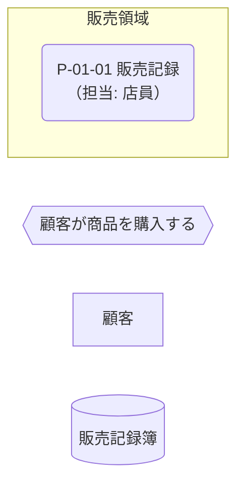
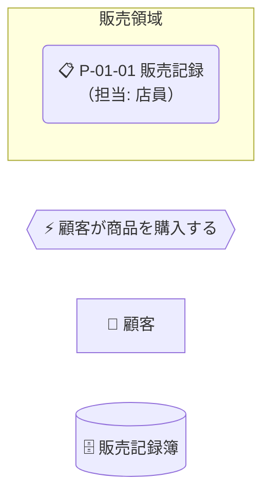
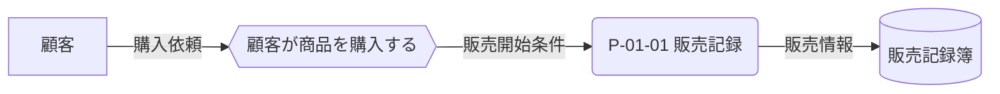

---
specdojo:
  id: specdojo:cdfd-mermaid-rulebook
  type: rulebook
  status: draft
  target_format: markdown
  recipe: not-needed
  sample: not-needed
  template: not-needed
  based_on:
    - specdojo:rulebook-authoring-standard
  grade:
    rubric: grade-rubric-v1
    target: kata
    verdict: needs-work
    score: 78
    graded_at: "2026-09-14T15:34:50.669Z"
    graded_by: codex-expert-executor
    content_hash: b70cbc3c85399cbed136c6a439bc40a6a6838b2cfc7c4433cccd846b1954d051
    categories:
      consistency: { score: 63 }
      usability: { score: 75 }
      architecture: { score: 100 }
      quality: { score: 75 }
    viewpoints:
      vp-arc-cross-document-consistency: { level: 2, score: 50 }
      vp-arc-conciseness: { level: 4, score: 100 }
      vp-arc-single-responsibility: { level: 4, score: 100 }
      vp-qe-verifiability: { level: 4, score: 100 }
      vp-qe-omissions-consistency: { level: 3, score: 75 }
      vp-qe-kata-conformance: { level: 2, score: 50 }
      vp-ux-readability: { level: 3, score: 75 }
      vp-ux-language-consistency: { level: 2, score: 50 }
      vp-arc-document-structure: { level: 4, score: 100 }
    findings: { blocker: 0, major: 3, minor: 6, note: 0 }
---

# Mermaid を用いた概念データフロー図 作成ルール

Conceptual Data Flow Diagram Notation Rulebook for Mermaid

Mermaid の `flowchart` 構文で CDFD のプロセス、イベント、データストア、外部主体、情報・物の流れを一貫して表すための記法ルールです。主 CDFD rulebook から `includes` される共通部品として適用します。

## 1. 全体方針

- Mermaid の `flowchart` を使用し、方向は全体概要・詳細 CDFD を問わず `LR` を基本とします。CDFD の矢印は情報・物・実行要求の受け渡しを表し、ユースケース別など包含元が明示した場合だけ業務上の順序も表します。`TB` は、対象が階層構造（組織・分類など）を表す場合にだけ使用します。

- 図が読みにくくなる原因は方向ではなく規模です。ノード数が多く一画面で関係を追いにくい場合は、方向を変えるのではなく、「凡例と可読性」の分割方針に従って図を分けます。分割の観点（全体概要はデータストアの区分、プロセスグループ別 CDFD は業務の性質が近いプロセス）とノード数の目安は包含元の rulebook が定めます。
- 全体概要とユースケース別 CDFD では、一つのプロセスグループを一つの代表ノードで表し、グループ内の領域や処理へ展開しません。プロセスグループ別 CDFD では、一つのプロセスを一つのプロセスノードで表します。
- 一つの記号へ一つの意味を割り当て、ノード形状だけでプロセス、イベント、データストア、外部主体を区別できるようにします。

- 情報の流れと物の流れは線種で区別し、すべてのエッジへ内容を表す名詞形のラベルを付けます。
- 図の目的は業務上の合意であり、装飾や実装構造の再現ではありません。ノード形状で意味を区別することを基本とし、色は形状だけでは判別しにくい場合の視認性向上に、プロセス／イベント／データストア／外部主体という概念の大分類単位で付けます。業務上の区別が必要な場合は、大分類内を同系統色の濃淡・彩度で分けられます。物理名、詳細な操作は使用しません。

| 概念                 | Mermaid 表現                                                                         | 表示例                                           |
| -------------------- | ------------------------------------------------------------------------------------ | ------------------------------------------------ |
| プロセス             | 角丸長方形 `("...")`                                                                 | `販売記録("P-01-01 販売記録<br>（担当: 店員）")` |
| プロセスグループ     | 角丸長方形 `("...")`（全体概要・ユースケース別 CDFD の代表ノード）                   | `販売("販売<br>P-01〜P-02")`                     |
| サブグラフ           | `subgraph ... end`（関連プロセスを囲む視覚上のまとまり。グループの表現には使わない） | `subgraph 販売領域["販売領域"]`                  |
| データストア         | 円柱 `[(...)]`                                                                       | `販売記録簿[("販売記録簿")]`                     |
| 物理保管             | スタジアム形 `(["..."])`（現物の保管先。データストアと同系統色を使う）               | `売場棚(["売場棚"])`                             |
| 外部主体             | 四角 `[...]`                                                                         | `顧客["顧客"]`                                   |
| イベント             | 六角形 `{{...}}`                                                                     | `購入要求{{"顧客が商品を購入する"}}`             |
| 情報・実行要求の流れ | ラベル付き `-->\|"..."\|`                                                            | `販売記録 -->\|"販売情報"\| 販売記録簿`          |
| 物の流れ             | ラベル付き `==>\|"..."\|`                                                            | `売場棚 ==>\|"商品"\| 販売記録`                  |

## 2. 位置づけと用語定義

| 用語         | 定義                                                                       |
| ------------ | -------------------------------------------------------------------------- |
| ノード ID    | Mermaid コード内で要素を参照する識別子。短い日本語または英数字を使う       |
| 表示ラベル   | 図上で読み手に見せる名称。業務用語と領域 ID を必要に応じて併記する         |
| エッジラベル | 移動する情報・物、またはイベントから伝わる起動条件の名称                   |
| サブグラフ   | 関連するプロセスを囲む視覚上のまとまり。プロセスグループの表現には使わない |

- ノード ID と表示ラベルは同じ名称を基本とし、空白、記号、補足を含む表示が必要な場合だけ分けます。
- 担当を表示する場合は、プロセスの表示ラベル末尾へ `<br>（担当: ロール）` を付けます。
- イベントは「〜された」「〜が到来した」「〜を要求した」など、発生を判断できる短い文にします。

## 3. ファイル命名・ID規則

- 本 rulebook は独立した成果物を生成せず、`cdfd-*.md` 内の Mermaid コードブロックへ適用します。
- Mermaid コードブロックに独立した文書 ID は付けず、包含する CDFD の ID とプロセス ID で追跡します。
- ノード ID は一つのコードブロック内で一意にし、同じ対象には表と図で同じ領域 ID または名称を使用します。
- 複数図に分ける場合は、包含する CDFD 本文の見出しで図の観点を識別します。

## 4. 推奨 Frontmatter 項目

- 本 rulebook は主 CDFD rulebook の `includes` から適用されるため、成果物 Frontmatter に記法 rulebook を重複記載しません。
- 成果物の `rulebook` は、構造を定義する主 CDFD rulebook を指定します。
- 記法だけを別ファイルで適用する運用は行わず、主 CDFD rulebook と組み合わせます。

## 5. 本文構成（標準テンプレ）

Mermaid コードブロック内は、次の順序を基本とします。必須の判定は図種別で異なります。全体概要ではプロセスグループの代表ノード、データストア、情報の流れ、凡例の参照を必須とし、イベントはプロセス領域の表に記載して図に描きません。プロセスグループ別 CDFD では個別プロセス、イベント、データストア、情報・物の流れ、凡例を必須とします。ユースケース別 CDFD ではプロセスグループの代表ノード、開始・引き渡し・終了のイベント、情報・物の流れ、凡例を必須とし、データストアは引き渡し条件の判定に必要な場合だけ置きます。外部主体と物理保管はいずれの図種別でも存在する場合だけ置きます。

| 順序 | 区分           | 必須     | 内容                                                                                             |
| ---- | -------------- | -------- | ------------------------------------------------------------------------------------------------ |
| 1    | flowchart 宣言 | ○        | `flowchart LR` または `flowchart TB`                                                             |
| 2    | プロセスノード | ○        | 全体概要・ユースケース別はグループ代表ノード、プロセスグループ別は個々のプロセス                 |
| 3    | イベント       | 条件付き | プロセスグループ別では開始契機、ユースケース別では開始・引き渡し・終了条件。全体概要では描かない |
| 4    | 外部主体       | 任意     | 対象範囲外の入力元・出力先                                                                       |
| 5    | データストア   | 条件付き | 読み書きする主要な情報の保管先。ユースケース別では引き渡し条件の判定に必要なものだけ置く         |
| 6    | 情報・物の流れ | ○        | ラベル付きエッジ                                                                                 |
| 7    | 図直後の注記   | ○        | 共通凡例への参照、使用した線種、省略事項、別図と共有するノード                                   |

## 6. 記述ガイド

### 6.1. ノード

- プロセスは角丸長方形、外部主体は四角、イベントは六角形、データストアは円柱で表します。
- プロセス名は「販売記録」「計画展開」のように、何を扱う処理か分かる短い名詞句にします。
- 全体概要では一プロセスグループを一つの代表ノードとして表し、表示ラベルにグループ名と含む領域 ID の範囲を記載します。グループ内の領域や処理を別ノードとして追加しません。
- プロセスグループ別 CDFD ではグループ内の主要プロセスを個別ノードにし、全体概要の代表ノードをプロセスとして重複配置しません。
- ユースケース別 CDFD では参加する各プロセスグループを一つの代表ノードにし、正常系の通過順に配置します。内部プロセスは描かず、引き渡し条件をイベントノードで示します。
- `subgraph` はプロセスグループ別 CDFD で関連プロセスを視覚的にまとめる場合にだけ使用できます。プロセスグループの表現や代表ノードの代替には使いません。



### 6.2. 絵文字アイコン（任意）

絵文字は人間の視認性向上には有効ですが、表示差や幅崩れが起きる環境もあるため、次のルールで運用します。

- 絵文字は任意です（なくても成立します）。
- 絵文字は表示ラベルのみに付け、ノード ID には付けません。
- 1ノードにつき1個までとし、表示ラベルの先頭に付けます。
- 絵文字だけに頼らず、必ずプロセス名・データストア名などのテキストも併記します。



禁止例（絵文字がノード ID に付いている、または表示ラベルに無い）:

```text
flowchart LR
📋販売記録("販売記録")
```

### 6.3. エッジ

- 情報は `-->`、物は `==>` を使用します。イベントからプロセスへのエッジも `-->|"起動条件"|` のようにラベルを付けます。
- エッジラベルは「販売情報」「在庫数量」「実行結果」のような名詞形にし、「処理する」など動作だけの語を使用しません。
- 一つのエッジに異なる責務の情報を詰め込まず、受け手が別ならエッジを分けます。



### 6.4. 凡例と可読性

- 各図の直後に、包含元が指定する本プロダクト共通の凡例を参照し、図で使用した線種、図から省略した入出力と理由、別図と共有するノードを記述します。
- ノード形状、色、絵文字の意味は共通凡例を正本とし、図ごとに再掲しません。共通凡例にない形状や色は使用しません。
- 物の流れを使わない場合は「`-->` は情報・実行要求の流れ。本図は物の流れを対象外とする」と記述します。

- 図を分ける観点とノード数の目安は包含元の rulebook に従います（全体概要はトランザクションデータの図とマスタ・構成データの図、プロセスグループ別 CDFD は業務の性質が近いプロセス単位、ユースケース別 CDFD は連続する引き渡し単位）。分けた図の間で同じプロセス ID・名称または引き渡し ID を維持します。
- ノードの表示ラベルは1行あたり全角20字（半角40字）程度を目安にし、超える場合は `<br>` で改行して2行程度に収めます。LR ではラベルの行の長さがそのままノード幅となり横方向の占有幅に直結するため、特にイベント・データストアで長い説明文になりやすい箇所に注意します。エッジラベルは改行に頼らず短い名詞句に収めます。

### 6.5. 見栄えを整える最小限スタイル（任意）

- ノード形状による意味区別を優先し、色は形状だけでは見分けにくい場合の補助として使います。
- 色を付ける場合は `classDef` のみを使用し、`style` によるノード単位の個別指定はしません。

- 色は必ずプロセス／イベント／データストア／外部主体という概念の大分類単位で色相（Hue）を統一し、異なる大分類の間で色相を混同しません。
- 大分類の中に業務上意味のあるサブ分類がある場合（例: データストアにおけるマスタ・構成データとトランザクションデータの違い）は、大分類の色相を保ったまま、濃淡・彩度を変えた同系統色でサブ分類を塗り分けられます。サブ分類の色分けを行う場合は、本プロダクト共通の凡例にサブ分類の名称と対応する色を定義し、「凡例と可読性」の方針で参照します。
- サブ分類の色分けは、業務上の判断（変更頻度、更新契機、参照される側か更新される側かなど）で区別できる場合にだけ使います。区別基準を説明できないサブ分類の塗り分けはしません。
- 色を使わなくても意味が読み取れる図では、無理に色を付けません。


大分類「データストア」の中でマスタ・構成データとトランザクションデータを同系統色（緑系の濃淡）で塗り分ける例:


凡例には「円柱（濃い緑）はマスタ・構成データ、円柱（薄い緑）はトランザクションデータ」のように、大分類の形状の意味に加えてサブ分類の色の意味を明記します。

## 7. 禁止事項

- ラベルのないエッジ、同じ線種へ情報と物の両方の意味を持たせたエッジを記載しません。
- プロセスとデータストア、イベントと外部主体など、異なる概念へ同じノード形状を使用しません。
- 全体概要にプロセスグループ内の領域や処理を複数ノードで展開したり、プロセスグループを `subgraph` で表したり、プロセスグループ別 CDFD に他グループの内部処理を作り込んだりしません。
- 物理テーブル、物理カラム、実装クラス、関数、詳細 API、コマンドオプションをノードやエッジへ記載しません。
- 独自形状の追加、根拠のないノード単位の色付け、`style` による個別指定は行いません。色は概念の大分類単位、または大分類内の同系統色によるサブ分類単位の `classDef` としてのみ使用します。
- 大分類間で色相を混同する、または区別基準を説明できないままサブ分類の色を増やすことはしません。
- 起点も到達先も説明できないノード、自己ループだけで完結するプロセス、読み手が解釈できない略語を残しません。
