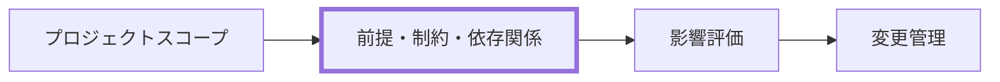

---
specdojo:
  id: prj-assumptions-constraints-dependencies-rulebook
  type: rulebook
  status: ready
  target_format: markdown
  recipe: prj-assumptions-constraints-dependencies-recipe
  sample: prj-assumptions-constraints-dependencies-sample
  template: prj-assumptions-constraints-dependencies-template
  based_on:
    - rulebook-authoring-standard
  supersedes: []
---

# 前提・制約・依存関係 作成ルール

Assumptions, Constraints and Dependencies Documentation Rulebook

本書は、プロジェクトの成立条件、守るべき境界、外部または先行成果物への依存を、変更時に判断できる形で整理する規約である。構造・必須項目・禁止事項は本書を正とし、作り方は recipe、粒度は sample、記入の骨組みは template を参照する。

## 1. 全体方針

- 対象は、プロジェクトの前提条件、制約事項、依存関係、およびそれらの変化に対する影響評価と変更管理である。
- 各項目は、条件だけで終わらせず、影響、確認方法、変化または逸脱のトリガー、所有者、対応方針を一組で記載する。
- 前提は「成立するものとして置く条件」、制約は「守るべき限界」、依存関係は「他者・外部サービス・先行成果物などから受ける条件」として分離する。
- 文書は計画・設計・実装の詳細やリスク登録簿を代替しない。必要な詳細はそれぞれの成果物に委譲する。
- AI Agent は作成・確認を支援できるが、承認、公開可否、エスカレーションなどの最終判断を委ねない。

## 2. 位置づけと用語定義

### 2.1. 位置づけ

本書はスコープで定めた境界を受け、実行上の成立条件と変更時の判断材料を明示する。前提・制約・依存が変化した結果としてリスク、変更要求、計画へ影響を伝える。

### 2.2. 用語定義

| 用語     | 定義                                                                                         |
| -------- | -------------------------------------------------------------------------------------------- |
| 前提条件 | プロジェクトの計画または進行が成立するものとして置く条件。崩れた場合の影響と確認方法を伴う。 |
| 制約事項 | 予算、期限、公開範囲、技術選択、責務境界など、逸脱してはならない限界。                       |
| 依存関係 | 外部組織、サービス、先行成果物、意思決定などが提供または確定することを必要とする関係。       |
| トリガー | 前提の崩壊、制約の逸脱、依存先の変化を検知して見直しを始める条件。                           |
| 所有者   | 項目の状態確認と一次対応を担うロールまたは責任者。最終判断者とは区別する。                   |

## 3. ファイル命名・ID規則

### 3.1. 配置

- 成果物は `docs/ja/projects/<project-id>/020-project-definition/prj-assumptions-constraints-dependencies.md` に配置する。
- rulebook は `docs/ja/specdojo/rulebooks/prj-assumptions-constraints-dependencies-rulebook.md` に配置する。
- recipe、sample、template は、それぞれ `docs/ja/specdojo/recipes/`、`samples/`、`templates/` の同じ prefix を持つファイルに配置する。

### 3.2. ドキュメント ID

- 成果物 ID: `<project-id>:prj-assumptions-constraints-dependencies`
- rulebook ID: `prj-assumptions-constraints-dependencies-rulebook`
- 参考資料 ID: `prj-assumptions-constraints-dependencies-recipe`、`prj-assumptions-constraints-dependencies-sample`、`prj-assumptions-constraints-dependencies-template`

### 3.3. ファイル名

- 成果物: `prj-assumptions-constraints-dependencies.md`
- 参考資料: `prj-assumptions-constraints-dependencies-{rulebook,recipe,sample,template}.md`
- 日本語の表示名を使う場合も、ID とファイル名は一意で検索可能な英小文字・ハイフン区切りを維持する。

## 4. 推奨 Frontmatter 項目

### 4.1. 設定内容

| 項目       | 説明                                                    | 必須 |
| ---------- | ------------------------------------------------------- | ---- |
| id         | `<project-id>:prj-assumptions-constraints-dependencies` | ○    |
| type       | `project`                                               | ○    |
| status     | `draft` / `ready` / `deprecated`                        | ○    |
| rulebook   | `prj-assumptions-constraints-dependencies-rulebook`     | ○    |
| based_on   | 直接参照した上位成果物の ID 配列                        | 任意 |
| supersedes | 置き換える旧成果物の ID 配列                            | 任意 |

### 4.2. 推奨ルール

- `based_on` には、内容の根拠として直接参照した文書だけを記載する。
- 未確定事項は `_TODO_:`、意思決定待ちは `_UNDECIDED_:`、仮置きの前提は `_ASSUMPTION_:` で明示する。
- H1 には成果物の表示名を置き、frontmatter に `title` を重複して持たせない。

## 5. 本文構成（標準テンプレ）

本文は以下の見出しを順序どおりに置く。

| 番号 | 見出し             | 必須 | 内容                                       |
| ---- | ------------------ | ---- | ------------------------------------------ |
| 1    | 前提条件           | ○    | 成立条件、根拠、影響、監視、変化時の対応   |
| 2    | 制約事項           | ○    | 守るべき限界、適用範囲、逸脱の検知、対応   |
| 3    | 依存関係           | ○    | 依存先、必要な理由、成立条件、変化時の対応 |
| 4    | 影響評価と対応方針 | ○    | 前提・制約・依存の変化に共通する評価と対応 |
| 5    | 監視・変更管理     | ○    | 見直す契機、記録する情報、判断責任の扱い   |

## 6. 記述ガイド

### 6.1. 前提条件

- 前提には、なぜその条件を置くかを示す根拠と、崩れた場合の影響を記載する。
- 確認方法は「誰が何を見れば変化を検知できるか」が分かる表現にする。
- 根拠が不足する場合は事実として断定せず、`_ASSUMPTION_:` または `_TODO_:` として確認先を残す。

推奨表:

| ID  | 内容 | 根拠 | 影響 | 監視・確認方法 | 変化のトリガー | 所有者 | 対応方針 |
| --- | ---- | ---- | ---- | -------------- | -------------- | ------ | -------- |

### 6.2. 制約事項

- 制約には、適用範囲と、逸脱したと判断する条件を記載する。
- 技術制約は、特定製品名の列挙ではなく、選択の自由度、互換性、公開適性、運用上の限界として書く。
- 公開情報の制約は、個人情報・機密情報・非公開情報を扱わない方針と、検知時の除去または判断手順を併記する。

推奨表:

| ID  | 内容 | 適用範囲 | 影響 | 監視・確認方法 | 逸脱のトリガー | 所有者 | 対応方針 |
| --- | ---- | -------- | ---- | -------------- | -------------- | ------ | -------- |

### 6.3. 依存関係

- 依存先は、外部サービスだけでなく、先行成果物、承認、意思決定、提供物も含めて明示する。
- 依存が満たされた状態を、受領物、確認条件、期限または判断イベントで書く。
- 依存先の詳細な契約条件や実装方式は、必要な管理・設計成果物へ委譲する。

推奨表:

| ID  | 内容または依存先 | 影響・必要な理由 | 確認方法または成立条件 | トリガー | 所有者 | 対応方針 |
| --- | ---------------- | ---------------- | ---------------------- | -------- | ------ | -------- |

### 6.4. 影響評価と対応方針

- 影響は、スコープ、期日、費用、品質、公開適性、運用責任など、該当する領域を具体的に示す。
- 対応方針には、除去、軽減、受容、再判断のいずれを行うかと、次に判断する人を記載する。
- 一次対応を担うロールと最終判断者を区別し、人間の判断が必要な範囲を明示する。

推奨表:

| 変化の種別 | 主な影響領域 | 最初に確認すること | 一次対応・判断 | 対応方針 |
| ---------- | ------------ | ------------------ | -------------- | -------- |

### 6.5. 監視・変更管理

- 「定期的に確認する」ではなく、スコープまたは参考資料一式が変わったときなど、具体的な見直しの契機を記載する。
- 変更記録には、項目 ID、変化内容、影響範囲、判断者、対応状況を残す。記録先が未定なら `_TODO_:` とする。
- 文書構造・配置・命名・技術制約・参照資料の整合確認を担うロールと、公開可否やスコープ変更などの最終判断を行う人間の責任者を区別して明示する。

## 7. 禁止事項

| 禁止事項                                   | 理由                                     |
| ------------------------------------------ | ---------------------------------------- |
| 前提・制約・依存を種別なしに混在させる     | 条件の性質と対応方法を区別できない。     |
| 影響、トリガー、所有者、対応方針のない登録 | 変化時に判断・対応へ使えない。           |
| 根拠のない確定値や外部環境の断定           | 誤った前提を固定し、更新漏れを招く。     |
| Agent に最終判断、承認、公開可否を委ねる   | 人間の判断責任を代替してしまう。         |
| API、DB、契約書全文などの詳細を記載する    | 本書の責務を越え、詳細成果物と重複する。 |
| 個人情報、非公開情報、機密情報を記載する   | 公開・再利用の前提を損なう。             |

## 8. サンプル

- 参照先: [[prj-assumptions-constraints-dependencies-sample]]

## 9. 作成レシピ

- 参照: [[prj-assumptions-constraints-dependencies-recipe]]

## 10. テンプレート

- 参照: [[prj-assumptions-constraints-dependencies-template]]
