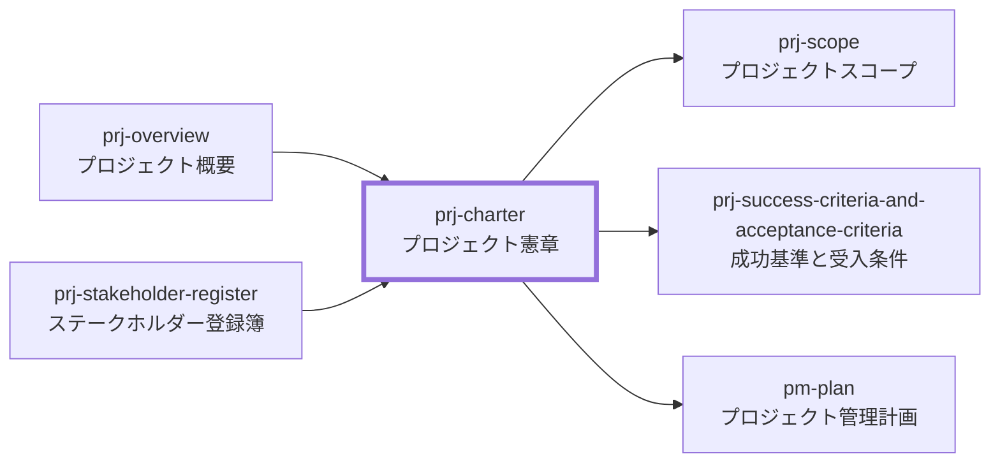

---
specdojo:
  id: prj-charter-rulebook
  type: rulebook
  status: ready
  target_format: markdown
  recipe: prj-charter-recipe
  sample: prj-charter-sample
  template: prj-charter-template
---

# プロジェクト憲章 作成ルール

Project Charter Documentation Rulebook

本書は、プロジェクトの立ち上げ認可、権限委譲、後続判断条件を一貫して記録するための規約である。関係者が「誰が、何を、どの範囲まで承認したか」を監査可能な粒度で確認できる状態にする。

## 1. 全体方針

- 対象は、プロジェクトの存在を正式に認可し、詳細計画の策定と初期準備へ進む権限を委譲するプロジェクト憲章である。
- 目的は、プロジェクトの目的、認可対象、権限範囲、主要前提、予算枠、承認事項を、PO またはスポンサーが判断できる形で明示することである。
- 憲章の承認は、本格実行開始、外部公開、主要投資、主要スコープ変更を自動的に承認するものではない。これらは後続の GO / Not GO 判断または変更判断で扱う。
- 背景、目的、期待効果はプロジェクト概要を根拠に要約し、詳細本文を二重管理しない。
- 関係者、期待、懸念、必要な合意はステークホルダー登録簿を根拠に要約し、個人情報や非公開情報を持ち込まない。
- 詳細なスコープ、成功基準、前提・制約、体制、スケジュール、リスク、コミュニケーションは後続文書へ委譲する。

## 2. 位置づけと用語定義

### 2.1. 位置づけ

プロジェクト憲章は、プロジェクト概要とステークホルダー登録簿を根拠として、立ち上げ認可と権限委譲を記録する文書である。後続のプロジェクト定義文書とプロジェクト管理文書は、本書の認可対象、権限範囲、未決事項を入力として詳細化する。

### 2.2. 用語定義

| 用語             | 定義                                                                             |
| ---------------- | -------------------------------------------------------------------------------- |
| プロジェクト憲章 | プロジェクトの立ち上げを正式に認可し、詳細計画策定と初期準備の権限を委譲する文書 |
| 立ち上げ認可     | プロジェクトとして扱い、後続の定義・計画・準備へ進むことを認める判断             |
| 権限委譲         | PO またはスポンサーが、PM などの実行責任者に付与する意思決定・実行の範囲         |
| 本格実行開始     | 承認された計画に基づき、主要成果物作成や公開準備を本格的に進める段階             |
| GO / Not GO 判断 | 本格実行、公開、継続、再計画、中止のいずれへ進むかを判定する判断                 |
| 予算枠           | プロジェクトに許容する費用、外部支出、運用負担、または追加支出を行わない制約     |
| 証跡             | 承認、判定、変更理由を追跡できる記録。議事録、Issue、Pull Request、決定記録など  |

## 3. ファイル命名・ID規則

### 3.1. 配置（推奨）

- `docs/ja/projects/<project-id>/020-project-definition/prj-charter.md` に配置する。
- 承認議事録、決定記録、変更記録は、実際に管理する文書またはツールへ残し、本文から参照できる状態にする。
- 公開前提のリポジトリでは、個人名、連絡先、非公開組織情報、秘密情報を本文に含めない。

### 3.2. ドキュメントID（推奨）

- 推奨: `<project-id>:prj-charter`
- 例: `prj-0001:prj-charter`
- ID はプロジェクト内で一意にし、チケット ID と混同しない。

### 3.3. ファイル名（推奨）

- 推奨: `prj-charter.md`
- 日本語ファイル名を使う場合も、Frontmatter の `id` は推奨形式で一意にする。

## 4. 推奨 Frontmatter 項目

### 4.1. 設定内容

| 項目       | 説明                                                         | 必須 |
| ---------- | ------------------------------------------------------------ | ---- |
| id         | `<project-id>:prj-charter` 形式の文書 ID                     | ○    |
| type       | `project`                                                    | ○    |
| status     | `draft` / `ready` / `deprecated`                             | ○    |
| rulebook   | `prj-charter-rulebook`                                       | ○    |
| based_on   | 立ち上げ認可の直接根拠にした概要、ステークホルダー登録簿など | 任意 |
| supersedes | 置き換えた旧文書 ID                                          | 任意 |

### 4.2. 推奨ルール

- `based_on` は、認可対象、目的、関係者、権限委譲を判断する直接根拠だけを列挙する。
- 初版では、原則として `prj-overview` と `prj-stakeholder-register` を中心にする。
- `pm-plan`、`pm-organization`、詳細スコープ、成功基準などは、憲章承認後に作成または詳細化する文書であり、初版憲章の直接根拠として扱う場合は理由を明記する。
- 改訂時は `supersedes` に旧文書 ID を設定し、差し替え関係を追跡可能にする。
- H1 にはプロジェクト名を含め、Frontmatter にはタイトルを重複管理しない。

## 5. 本文構成（標準テンプレ）

プロジェクト憲章は次の順序で構成する。

| 番号 | 見出し                          | 必須 | 内容（要点）                                                           |
| ---- | ------------------------------- | ---- | ---------------------------------------------------------------------- |
| 1    | 認可対象                        | ○    | プロジェクト名、ID、認可対象、認可しない範囲、直接根拠、承認責任       |
| 2    | プロジェクトの目的              | ○    | プロジェクト概要に基づく目的と期待効果の要約、成功基準文書への委譲     |
| 3    | ハイレベルスコープ              | ○    | 認可する対象範囲、対象外、未確定事項。成果物群は成果物カタログへ委譲   |
| 4    | 初期ステークホルダー            | ○    | 初期関係者、関与区分、Role code、認可判断上の責任                      |
| 5    | 権限委譲                        | ○    | 委譲する権限、PO 承認が必要な事項、証跡                                |
| 6    | 主要前提・制約                  | ○    | 認可判断に直結する前提、制約、予算枠。全量は前提・制約・依存文書へ委譲 |
| 7    | 本格実行開始の GO / Not GO 判断 | ○    | 本格実行前に確認する観点と記録先                                       |
| 8    | 承認                            | ○    | 承認日、承認者、承認対象、証跡リンク                                   |
| 9    | 未決事項                        | 任意 | 今後の意思決定が必要な論点、期限、担当、対応方針                       |

立ち上げ認可文書であること、委譲する範囲、本格実行開始を承認しないことは、専用の章を設けず H1 直下の冒頭文に書く。

## 6. 記述ガイド

### 6.1. 共通

- H1 直下の冒頭文に、立ち上げ認可と権限委譲の文書であること、承認責任者、本格実行開始・外部公開を承認しないことを 2〜3 文で書く。
- 立ち上げ認可と権限委譲に集中し、詳細計画や設計の本文を先取りしない。後続文書は根拠として先取りせず、詳細化先として参照する。
- 後続文書への参照（`詳細化先` 列や記録先）は、参照先が未作成の間は ID をバッククォートで仮置きし（例: `prj-scope`）、作成後に `[[<project-id>:prj-scope|プロジェクトスコープ]]` のような wikilink へ更新する。
- 事実、判断、未決事項を分ける。未確定は `_TODO_:`、`_UNDECIDED_:`、`_ASSUMPTION_:` を用いる。
- 認可しない範囲を明記し、憲章承認と本格実行開始を混同しない。
- 公開文書では、公開してよい情報だけを記載し、最終判断と説明責任を人間の PO が担う前提を崩さない。

### 6.2. 認可対象

- プロジェクト名、プロジェクト ID、認可対象、認可しない範囲、直接根拠、承認責任を表で示す。
- 認可対象は、原則として立ち上げ、詳細計画策定、初期準備に限定する。
- 本格実行や公開まで認可する場合は、計画、体制、予算枠、品質条件が確認済みであることを明記する。
- 承認に条件が付く場合は、`認可条件` を補足として 1 行追加してよい。ただし、承認章の代替にはせず、承認日・承認者・証跡リンクの管理は別途必要とする。

推奨表:

| 項目            | 内容 |
| --------------- | ---- |
| プロジェクト名  |      |
| プロジェクト ID |      |
| 認可対象        |      |
| 認可しない範囲  |      |
| 直接根拠        |      |
| 承認責任        |      |

### 6.3. プロジェクトの目的

- 冒頭は 1〜2 文の要約に留め、背景、必要性、目的の詳細はプロジェクト概要を正として参照する。
- 期待効果は、PO が承認または保留を判断できる観点に分解し、`観点` と `期待効果` の表で示す。
- 数値目標、測定方法、中長期指標はプロジェクト概要の期待効果を正とし、憲章では再掲しない。
- 成功判定の観点と受入条件は成功基準文書を正とし、専用の章を設けず本章から参照する。

推奨表:

| 観点 | 認可判断で確認する期待効果 |
| ---- | -------------------------- |

### 6.4. ハイレベルスコープ

- 立ち上げ時点で認可する大まかな対象範囲だけを示す。
- 対象外と未確定を同じ表で明示し、後続のスコープ詳細化へ渡す。
- AI Agent の支援範囲、人間の判断責任、公開情報の範囲など、責任境界に関わる事項を含める。
- 成果物群の一覧・配置・派生関係と、憲章承認後に作成する文書の一覧は成果物カタログを正とし、専用の章を設けず本章から参照する。

推奨表:

| 区分   | 内容 | 詳細化先    |
| ------ | ---- | ----------- |
| 対象   |      | `prj-scope` |
| 対象外 |      | `prj-scope` |
| 未確定 |      | 未決事項    |

### 6.5. 初期ステークホルダー

- ステークホルダー登録簿のうち、認可判断と権限委譲に関係する主要関係者だけを要約する。
- 個人名や連絡先ではなく、役割名、集団名、Role code で識別する。
- AI Agent は支援者として扱い、承認者または説明責任者として扱わない。

### 6.6. 権限委譲

- 決裁者、実行責任者、協議先、証跡を表で示す。
- 委譲する権限と、PO 承認が必要な事項を分けて書く。
- 予算枠、公開可否、ライセンス、主要スコープ変更、GO / Not GO 判断は、PO 承認事項として明示する。

推奨表:

| 項目         | 決裁者 | 実行責任者 | 協議先 | 証跡 |
| ------------ | ------ | ---------- | ------ | ---- |
| 立ち上げ認可 |        |            |        |      |
| 詳細計画策定 |        |            |        |      |
| 本格実行開始 |        |            |        |      |

### 6.7. 主要前提・制約

- 前提・制約の全量は前提・制約・依存関係文書を正とし、認可判断に直結する事項（予算枠、公開適性、人間の判断責任）だけを載せる。
- 予算枠が未確定の場合は、未確定であること、追加支出を認めるかどうか、確定タイミングを明記する。
- 公開文書では秘密情報を含めない制約を明示する。

### 6.8. 本格実行開始の GO / Not GO 判断

- 本格実行開始、外部公開、主要投資へ進む前に確認する観点を定義する。
- 判断観点には、目的整合、公開適性、予算枠、体制、品質を含める。
- 判断結果の記録先を明記し、口頭合意だけで完了扱いにしない。

### 6.9. 承認と未決事項

- 承認履歴は、承認日、承認者、承認対象、証跡リンクを必須とする。版番号は管理せず、承認対象の文書状態は証跡リンクで特定する（文書の状態は frontmatter の `status` と Git の履歴が正本）。
- 証跡リンクには、承認の意思表示と承認対象の文書状態の両方を特定できる記録（決定記録、Pull Request、Issue、議事録など）を記載する。
- PO 承認事項（目的、主要スコープ、権限委譲範囲、予算枠など）に触れる改訂を反映した場合は、承認履歴へ行を追加して再承認を受ける。軽微な修正は Git の履歴に委ね、再承認を要しない。
- 承認者または証跡が未確定の場合は、正式認可済みと書かない。
- 未決事項には、論点、期限、担当、対応方針を記載し、GO / Not GO 判断までに解消が必要なものを識別できるようにする。

## 7. 禁止事項

| 項目                                                 | 理由                                         |
| ---------------------------------------------------- | -------------------------------------------- |
| 憲章承認を本格実行開始や外部公開の承認と混同する     | 立ち上げ認可と後続判断の責任境界が崩れるため |
| 認可対象または認可しない範囲を記載しない             | PO が承認範囲を判断できないため              |
| 予算枠または追加支出の扱いを記載しない               | 承認判断に必要なコスト境界が不明になるため   |
| 承認者、承認日、証跡が未確定なのに正式認可済みと書く | 説明責任と監査可能性が失われるため           |
| 詳細スコープ、受入条件、設計詳細を憲章に過剰記載する | 後続文書との二重管理を招くため               |
| AI Agent を最終判断者または承認者として扱う          | 人間の説明責任と公開判断の前提に反するため   |
| 個人情報、秘密情報、非公開組織情報を記載する         | 公開時の情報管理リスクを高めるため           |
| 曖昧語だけで成功基準や GO / Not GO 条件を書く        | 判断可能性と再現性が下がるため               |
