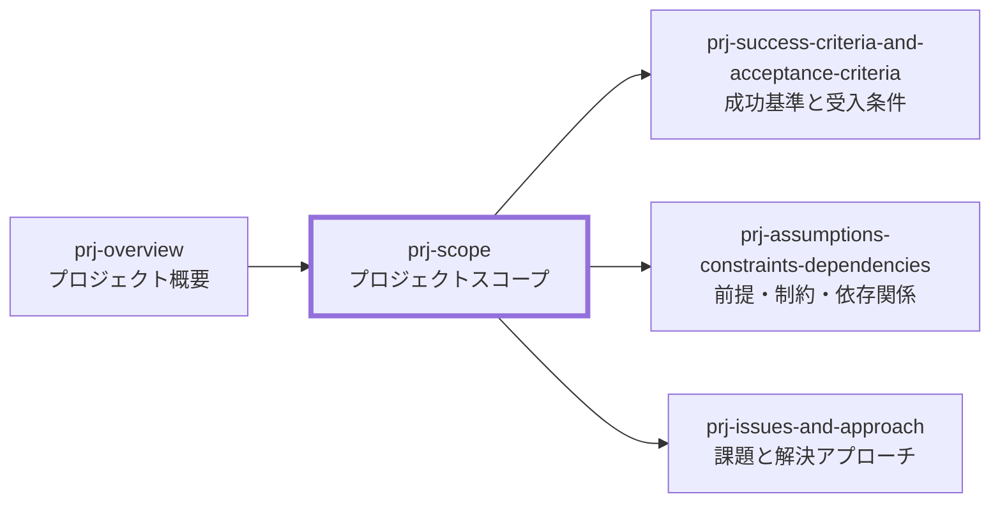

# プロジェクトスコープ 作成ルール

Project Scope Documentation Rulebook

本ドキュメントは、**プロジェクトスコープ（Project Scope）** を統一形式で記述するためのルールです。
関係者が「今回やること、やらないこと、境界変更時の判断方法」を短時間で合意できる粒度に整えます。

## 1. 全体方針

- 本ルールの対象は **プロジェクトスコープ**（対象範囲、対象外、境界判断、変更方針）です。
- 目的は、対象範囲と除外範囲を利用者視点で確認できる状態にし、後続の成功基準、前提・制約、課題整理、計画作成の前提を揃えることです。
- スコープは “やること” だけでなく “やらないこと” を明示します。スコープ外の未記載は禁止します。
- スコープは設計詳細ではなく、業務価値、利用者影響、合意対象、責務境界を確認するための境界定義です。
- 詳細な成功判定や受入条件は `prj-success-criteria-and-acceptance-criteria`、前提・制約・依存は `prj-assumptions-constraints-dependencies`、課題と解決方針は `prj-issues-and-approach` へ委譲します。
- 曖昧表現（例:「適切に」「可能な限り」「十分に」）は避け、含める・含めないを判断できる表現にします。

## 2. 位置づけと用語定義

### 2.1. 位置づけ

プロジェクトスコープは、プロジェクト概要で示した背景・必要性・期待効果を受け、対象範囲と対象外を定義する文書です。後続文書は、本書の境界を前提に詳細化します。

### 2.2. 用語定義

| 用語             | 定義                                                                        |
| ---------------- | --------------------------------------------------------------------------- |
| スコープ内       | 今回やること、成果物に含めること、または対象にする活動領域                  |
| 対象業務         | 対象とする業務、活動、プロセス、利用場面                                     |
| 対象システム     | 対象とするシステム、成果物、文書体系、基盤、補助ツール、外部連携             |
| 対象期間         | 本スコープを適用する期間。日付が未確定の場合はイベント基準で定義してよい     |
| スコープ外       | 意図的にやらないこと。理由、補足、後続で扱う条件を添える                     |
| 境界の判断基準   | 含める・含めないで迷ったときの判断順序、優先原則、SSOT                       |
| スコープ変更方針 | スコープを追加・削除・変更するときの入口、確認観点、承認者、記録方法         |

## 3. ファイル命名・ID規則

### 3.1. 配置（推奨）

- `docs/ja/projects/<project-id>/020-project-definition/prj-scope.md` へ配置します。
- プロジェクト配下の章構成は [[docs-structure-guide]] に従います。
- 参考図表や補足資料を別ファイルにする場合は、スコープ本文から参照リンクで紐付けます。

### 3.2. ドキュメントID（推奨）

- 推奨: `<project-id>:prj-scope`
  - 例: `prj-0001:prj-scope`
- YAML Frontmatter では、必要に応じてコロンを含む ID をクォートします。

### 3.3. ファイル名（推奨）

- 推奨: `prj-scope.md`
- 日本語ファイル名を使う場合も、Frontmatter の `id` は推奨形式で一意にします。

## 4. 推奨 Frontmatter 項目

### 4.1. 設定内容

Frontmatter は共通スキーマに従います。

- 参照スキーマ: [deliverable-frontmatter.schema.yaml](/docs/specdojo/schemas/v1/deliverable-frontmatter.schema.yaml)
- メタ情報標準: [[document-metadata-standard]]

| 項目       | 説明                                 | 必須 |
| ---------- | ------------------------------------ | ---- |
| id         | `<project-id>:prj-scope`             | ○    |
| type       | `project` 固定                       | ○    |
| status     | `draft` / `ready` / `deprecated`     | ○    |
| rulebook   | `prj-scope-rulebook`                 | ○    |
| based_on   | `prj-overview`、上位方針、憲章など   | 任意 |
| supersedes | 置き換え対象の旧文書 ID              | 任意 |

### 4.2. 推奨ルール

- `based_on` は、根拠として直接参照するものがある場合のみ列挙します。
- `prj-overview` が存在する場合は、背景、必要性、期待効果とスコープが対応するように `based_on` へ含めます。
- ドキュメント名は Frontmatter ではなく本文 H1 に記述します（例: `# プロジェクトスコープ: <プロジェクト名>`）。

## 5. 本文構成（標準テンプレ）

プロジェクトスコープは以下の見出し構成を基本とし、順序固定で配置します。

### 5.1. プロジェクトスコープ（Project Scope）

| 番号 | 見出し           | 必須 | 内容（要点）                                             |
| ---- | ---------------- | ---- | -------------------------------------------------------- |
| 1    | 対象業務         | ○    | 対象とする業務、活動領域、利用場面、利用者影響           |
| 2    | 対象システム     | ○    | 対象となるシステム、成果物、文書体系、基盤、外部連携範囲 |
| 3    | 対象期間         | ○    | 初期対象期間、判断イベント、継続改善との切り分け         |
| 4    | スコープ外       | ○    | 明示的にやらないこと、理由、後続で扱う条件               |
| 5    | 境界の判断基準   | 任意 | 迷ったときの判断原則、優先順位、SSOT                     |
| 6    | スコープ変更方針 | 任意 | 変更入口、影響評価、承認者、記録方法                     |

## 6. 記述ガイド

### 6.1. 共通

- 見出し配下は「箇条書き + 必要最小限の表」を基本とします。
- 対象範囲、対象外、利用者影響、合意対象が読み取れる粒度で記述します。
- “事実/決定済み” と “推測/仮説/未決” を混ぜないでください。未確定は `_TODO_:` / `_UNDECIDED_:` / `_ASSUMPTION_:` で明示します。
- UI、API、DB、テストケース、運用手順などの詳細は、対象となる後続文書へ委譲します。

### 6.2. 対象業務

- “業務” は機能名ではなく、現場で行う作業、判断、活動領域の単位で書きます。
- 推奨: 対象者、利用場面、利用者に生じる影響を添えます。
- 文書体系、ルール整備、公開準備などを目的とするプロジェクトでは、対象業務を「対象とする活動領域」として記述してよいです。
- 対象業務には、何を作るかだけでなく、何を運用・管理できる状態にするかを含めます。

### 6.3. 対象システム

- 対象機能、対象成果物、対象基盤は粒度を揃えます。
- 業務アプリケーションを作らないプロジェクトでは、対象となる文書体系、管理台帳、サンプル、補助ツール、公開基盤などを表で示してよいです。
- 外部連携、公開基盤、補助ツールを含める場合は、含める範囲と含めない範囲を分けて記述します。
- UI/画面遷移、API一覧、DB 定義、個別テンプレートの詳細は、本ドキュメントでは書きません。

推奨表:

| 対象 | 内容 |
| ---- | ---- |

### 6.4. 対象期間

- 日付が確定していない場合は、イベント基準で書いてよいです。
- 初期リリース、初回公開、運用開始、継続改善など、どの期間までを本スコープに含めるかを明示します。
- マイルストーンやスケジュール定義がある場合は、期間判断の根拠として参照リンクを付けます。
- 未確定なら未確定と明記し、決めるための条件または意思決定ポイントを添えます。

### 6.5. スコープ外

- スコープ外は “やらない宣言” です。曖昧にしないでください。
- 推奨: スコープ外にした理由（コスト、効果、責務境界、公開適性、後続フェーズ等）を添えます。
- 利用者影響が大きい対象外項目は、後続で扱う条件や再検討タイミングも示します。

推奨表:

| 対象（Out） | 理由 | 補足 |
| ----------- | ---- | ---- |

### 6.6. 境界の判断基準

- 迷ったときに参照できる SSOT（判断原則）を書きます。
- 判断順序が重要な場合は、優先順位付きの箇条書きにします。
- 業務価値、利用者影響、公開適性、保守容易性、AI 利用可能性など、プロジェクトの性質に合う判断軸を選びます。

### 6.7. スコープ変更方針

- 変更の入口（誰が、どこへ提案するか）
- 影響評価の観点（業務価値、利用者影響、工数、費用、期日、運用、リスク）
- 承認者
- 影響を受ける成果物（成果物カタログ、スケジュール、RACI、管理計画など）
- 判断理由の記録先（DEC、課題一覧、Issue、PR、変更要求ログなど）

推奨表:

| 項目     | 内容 |
| -------- | ---- |
| 変更入口 |      |
| 影響評価 |      |
| 承認者   |      |
| 記録先   |      |

## 7. 禁止事項

| 項目                                | 理由                                      |
| ----------------------------------- | ----------------------------------------- |
| 設計詳細（DB設計、API設計等）       | プロダクト仕様/設計ドキュメントへ委譲する |
| “だいたい/適切に” 等の曖昧表現      | 合意・検証ができない                      |
| スコープ外の未記載                  | 境界が曖昧になり手戻りの原因になる        |
| 対象業務と対象システムの粒度不一致  | 見積、優先度、責務境界の認識が崩れる      |
| 受入条件や GO / Not GO 判定の詳細化 | 成功基準と受入条件との責務重複を防ぐ      |
| 個人名・連絡先等の公開不適切情報    | 公開リポジトリでの利用を想定するため      |

## 8. サンプル

- 参照先: [prj-scope-sample](../samples/prj-scope-sample.md)

## 9. 作成レシピ

- 参照: [[prj-scope-recipe]]

## 10. テンプレート

- 参照: [[prj-scope-template]]
