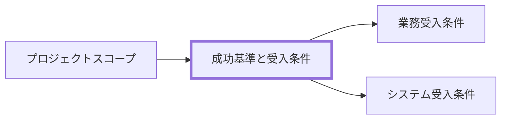

# 成功基準と受入条件 作成ルール

Success Criteria and Acceptance Criteria Documentation Rulebook

本ドキュメントは、プロジェクト成功判定と受入可否判定を定義するためのルールです。
判定基準、責任者、証跡を揃え、完了判断のぶれを防ぎます。

## 1. 全体方針

- 本ルールの対象は、プロジェクトの成功基準と受入条件です。
- 目的は、業務価値に対して何を確認し、誰が、いつ、どの証跡で合否を判断するかを固定することです。
- 成功基準は「対応する業務価値」「条件」「判定基準」「測定方法」「判定時期」「確認者」を 1 セットで定義します。
- 受入条件は、業務価値、合格基準、証跡、確認者、承認者を対応付けます。
- 実装詳細、個別テスト手順、設計判断は扱わず、判定に必要な要求レベルの条件のみを扱います。

## 2. 位置づけと用語定義

### 2.1. 位置づけ（他ドキュメントとの関係）

### 2.2. 用語定義（本ルール内）

| 用語     | 定義                                               |
| -------- | -------------------------------------------------- |
| 成功基準 | プロジェクトの成果が達成されたことを示す判定条件   |
| 受入条件 | 成果物を利用側が受け入れ可能と判断する条件         |
| 業務価値 | 利用者・業務にとって実現したい効果または状態       |
| 完了定義 | 完了とみなすために満たすべき必須条件               |
| 証跡     | 判定結果を確認できる記録（報告書、ログ、議事録等） |
| 確認者   | 条件の充足と証跡を確認する役割                     |
| 承認者   | 判定結果に対して最終責任を持つ役割                 |

## 3. ファイル命名・ID規則

### 3.1. 配置（推奨）

- `docs/ja/projects/<project-id>/020-プロジェクトスコープ/` 配下への配置を推奨します。
- 判定結果の証跡（評価表、受入記録）は参照可能な場所に配置します。

### 3.2. ドキュメントID（推奨）

- 推奨: `<project-id>:prj-success-criteria-and-acceptance-criteria`
  - 例: `prj-0001:prj-success-criteria-and-acceptance-criteria`

### 3.3. ファイル名（推奨）

- 推奨: `prj-success-criteria-and-acceptance-criteria.md`
- 日本語ファイル名の場合: `成功基準と受入条件.md`

## 4. 推奨 Frontmatter 項目

### 4.1. 設定内容

- 参照スキーマ: [docs/specdojo/schemas/v1/deliverable-frontmatter.schema.yaml](../../../specdojo/schemas/v1/deliverable-frontmatter.schema.yaml)
- メタ情報標準: [document-metadata-standard.md](../standards/document-metadata-standard.md)

| 項目       | 説明                                                                                | 必須 |
| ---------- | ----------------------------------------------------------------------------------- | ---- |
| id         | `<project-id>:prj-success-criteria-and-acceptance-criteria`                         | ○    |
| type       | `project` 固定                                                                      | ○    |
| status     | `draft` / `ready` / `deprecated`                                                    | ○    |
| rulebook   | `prj-success-criteria-and-acceptance-criteria-rulebook`                             | ○    |
| based_on   | `prj-scope` など、直接の根拠となる文書を含む配列                                      | 任意 |
| supersedes | 置き換え対象の旧文書 ID                                                             | 任意 |

### 4.2. 推奨ルール

- 成功基準と受入条件は混在させず、別表で管理します。
- 各成功基準・受入条件には、少なくとも一つの業務価値を対応付けます。
- 閾値が未確定の場合は `_UNDECIDED_:` を使い、確定期限と担当を記載します。

## 5. 本文構成（標準テンプレ）

### 5.1. 成功基準と受入条件（Success Criteria and Acceptance Criteria）

| 番号 | 見出し               | 必須 | 内容（要点）                   |
| ---- | -------------------- | ---- | ------------------------------ |
| 1    | 判定対象と適用範囲   | ○    | 何を判定するか、対象外は何か   |
| 2    | 成功基準             | ○    | 業務価値、指標、目標値、判定方法、確認者 |
| 3    | 受入条件             | ○    | 業務価値、受入項目、合否基準、証跡、承認者 |
| 4    | 判定手順と証跡       | ○    | 判定タイミング、証跡、承認経路 |
| 5    | 例外条件と未解決事項 | 任意 | 保留条件、暫定対応、解決期限   |

## 6. 記述ガイド

### 6.1. 共通

- 各条件は測定可能で再現可能な表現にします。
- 業務価値は、対象利用者、利用場面、期待効果のいずれかを読み取れる表現にします。
- 章参照は章番号ではなく章タイトルで記述します。
- 条件追加/変更時は、変更理由と影響範囲を追記します。

### 6.2. 成功基準

- KPI のような定量指標だけでなく、運用定着や利用者受容など定性条件も明示する。
- 各条件に対応する業務価値、判定タイミング、確認ロールを必ず設定する。
- 閾値を置く場合は、測定対象、単位、母数または比較対象を明記する。

推奨表（成功基準）:

| ID | 対応する業務価値 | 条件 | 判定基準 | 測定方法 | 判定時期 | 確認者 |
| -- | ---------------- | ---- | -------- | -------- | -------- | ------ |

### 6.3. 受入条件

- `種別` 列で受入観点（利用者視点、文書体系、参考資料、技術的受入、品質、公開適性など）を分類する。
- 各条件に業務価値、合格基準、証跡（参照先ファイル、ログ、記録等）、確認者、承認者を明記する。
- 否決時の是正内容、再確認する受入条件、再判定時期を例外条件または是正プロセスで定義する。
- 技術的な確認条件は、業務価値の受入条件と混在させず、種別と確認者を明示する。

推奨表（受入条件）:

| ID | 対応する業務価値 | 種別 | 条件 | 合格基準 | 証跡 | 確認者 | 承認者 |
| -- | ---------------- | ---- | ---- | -------- | ---- | ------ | ------ |

## 7. 禁止事項

| 項目                                                           | 理由                               |
| -------------------------------------------------------------- | ---------------------------------- |
| 「十分に」「問題ない」等のみで基準記載                         | 合否判定ができないため             |
| 業務価値と対応しない成功基準または受入条件                     | 何のための判定か追跡できないため   |
| 測定方法なしの閾値記載                                         | 再現性が担保できないため           |
| 確認者または承認者不在の受入判定                               | 確認責任または最終責任が不明確になるため |
| 証跡なしの合格宣言                                             | 監査と追跡ができないため           |
| Agent に最終判断・GO 判定を委ねる                              | 人間の判断責任を代替してしまうため |
| 公開リポジトリに個人名・個人連絡先・非公開の組織情報を記載する | 公開範囲とプライバシーに反するため |

## 8. サンプル

- 参照先: [prj-success-criteria-and-acceptance-criteria-sample](../samples/prj-success-criteria-and-acceptance-criteria-sample.md)

## 9. 作成レシピ

- 参照: [[prj-success-criteria-and-acceptance-criteria-recipe]]

## 10. テンプレート

- 参照: [[prj-success-criteria-and-acceptance-criteria-template]]
