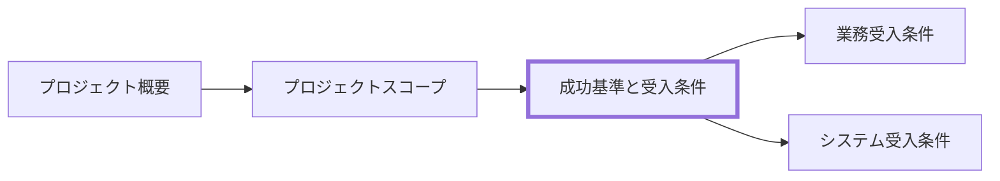

---
specdojo:
  id: specdojo:prj-success-criteria-and-acceptance-criteria-rulebook
  type: rulebook
  status: ready
  target_format: markdown
  recipe: specdojo:prj-success-criteria-and-acceptance-criteria-recipe
  sample: specdojo:prj-success-criteria-and-acceptance-criteria-sample
  template: specdojo:prj-success-criteria-and-acceptance-criteria-template
---

# 成功基準と受入条件 作成ルール

Success Criteria and Acceptance Criteria Documentation Rulebook

本ドキュメントは、プロジェクト成功判定と受入可否判定を定義するためのルールです。
判定基準、責任者、証跡を揃え、完了判断のぶれを防ぎます。

## 1. 全体方針

- 本ルールの対象は、プロジェクトの成功基準と受入条件です。
- 目的は、業務価値に対して何を確認し、誰が、いつ、どの証跡で合否を判断するかを固定することです。
- 成功基準は「対応する業務価値」「条件」「判定基準」「測定方法」「判定時期」「確認者」を 1 セットで定義します。
- 受入条件は、業務価値、合格基準、証跡、確認者、承認者を対応付けます。
- 成功基準は、初期公開・初期リリース、公開・運用開始後の短期、中長期の事業・社会的成果に分けます。後続時期の基準は初期受入の合否から分離します。
- 受入条件は、対象成果物やリリースが利用者価値の提供を開始できるかを判定する条件であり、中長期の成功そのものとは区別します。
- 実装詳細、個別テスト手順、設計判断は扱わず、判定に必要な要求レベルの条件のみを扱います。

## 2. 位置づけと用語定義

### 2.1. 位置づけ（他ドキュメントとの関係）

```mermaid
flowchart LR
  POV["プロジェクト概要"]
  PSC["プロジェクトスコープ"]
  SAC["成功基準と受入条件"]
  BAC["業務受入条件"]
  SYS["システム受入条件"]

  POV --> PSC --> SAC --> BAC
  SAC --> SYS

  classDef target stroke-width:4px
  class SAC target
```

### 2.2. 用語定義（本ルール内）

| 用語     | 定義                                                               |
| -------- | ------------------------------------------------------------------ |
| 成功基準 | 利用者、業務、事業または社会に期待する成果が達成されたかを示す条件 |
| 受入条件 | 成果物やリリースを利用側が受け入れ可能と判断する条件               |
| 業務価値 | 利用者・業務にとって実現したい効果または状態                       |
| 判定段階 | 初期公開・初期リリース、短期、中長期など、条件を評価する時間区分   |
| 完了定義 | 完了とみなすために満たすべき必須条件                               |
| 証跡     | 判定結果を確認できる記録（報告書、ログ、議事録等）                 |
| 確認者   | 条件の充足と証跡を確認する役割                                     |
| 承認者   | 判定結果に対して最終責任を持つ役割                                 |

## 3. ファイル命名・ID規則

### 3.1. 配置（推奨）

- `docs/ja/projects/<project-id>/020-project-definition/prj-success-criteria-and-acceptance-criteria.md` へ配置します。
- 判定結果の証跡（評価表、受入記録）は参照可能な場所に配置します。

### 3.2. ドキュメントID（推奨）

- 推奨: `<project-id>:prj-success-criteria-and-acceptance-criteria`
  - 例: `prj-0001:prj-success-criteria-and-acceptance-criteria`

### 3.3. ファイル名（推奨）

- 推奨: `prj-success-criteria-and-acceptance-criteria.md`
- 日本語ファイル名の場合: `成功基準と受入条件.md`

## 4. 推奨 Frontmatter 項目

### 4.1. 設定内容

- 参照スキーマ: [docs/specdojo/schemas/v1/deliverable-frontmatter.schema.yaml](../../../specdojo/schemas/v1/deliverable-frontmatter.schema.yaml)
- メタ情報標準: [document-metadata-standard.md](../standards/document-metadata-standard.md)

| 項目       | 説明                                                             | 必須 |
| ---------- | ---------------------------------------------------------------- | ---- |
| id         | `<project-id>:prj-success-criteria-and-acceptance-criteria`      | ○    |
| type       | `project` 固定                                                   | ○    |
| status     | `draft` / `ready` / `deprecated`                                 | ○    |
| rulebook   | `specdojo:prj-success-criteria-and-acceptance-criteria-rulebook` | ○    |
| based_on   | `prj-scope` など、直接の根拠となる文書を含む配列                 | 任意 |
| supersedes | 置き換え対象の旧文書 ID                                          | 任意 |

### 4.2. 推奨ルール

- 成功基準と受入条件は混在させず、別表で管理します。
- 各成功基準・受入条件には、少なくとも一つの業務価値を対応付けます。技術的受入条件は、支援する業務価値と技術条件を区別します。
- `based_on` には、根拠となる `prj-scope` に加え、期待効果を定義した `prj-overview` がある場合は含めます。
- 閾値が未確定の場合は _UNDECIDED_: を使い、確定期限と担当を記載します。

## 5. 本文構成（標準テンプレ）

### 5.1. 成功基準と受入条件（Success Criteria and Acceptance Criteria）

| 番号 | 見出し               | 必須 | 内容（要点）                               |
| ---- | -------------------- | ---- | ------------------------------------------ |
| 1    | 判定対象と適用範囲   | ○    | 判定段階、初期受入の必須条件、対象外       |
| 2    | 成功基準             | ○    | 業務価値、判定段階、指標、判定方法、確認者 |
| 3    | 受入条件             | ○    | 業務価値、受入項目、合否基準、証跡、承認者 |
| 4    | 判定手順と証跡       | ○    | 判定タイミング、証跡、承認経路             |
| 5    | 例外条件と未解決事項 | 任意 | 保留条件、暫定対応、解決期限               |

## 6. 記述ガイド

### 6.1. 共通

- 各条件は測定可能で再現可能な表現にします。
- 業務価値は、対象利用者、利用場面、期待効果のいずれかを読み取れる表現にします。
- 成果物の存在、機能数、文書数、lint 合格などは業務価値ではなく、必要に応じて受入条件へ置きます。
- 章参照は章番号ではなく章タイトルで記述します。
- 条件追加/変更時は、変更理由と影響範囲を追記します。

### 6.2. 成功基準

- 初期公開・初期リリースでは代表利用者による作業完遂、短期では利用・定着・直接的改善、中長期では事業・社会的成果への寄与を扱います。
- 公開後にしか測定できない成功基準も、判定時期と測定責任を定めて本文に置き、初期受入の合否から分離します。
- KPI のような定量指標だけでなく、運用定着や利用者受容など定性条件も明示します。
- 各条件に対応する業務価値、判定タイミング、確認ロールを必ず設定する。
- 閾値を置く場合は、測定対象、単位、母数または比較対象を明記する。
- 外部要因を受ける成果は、当該プロジェクトだけの因果と断定せず、利用前後の変化と寄与を確認します。
- 低コスト、費用負担の軽減、無償提供などを業務価値に置く場合は、少なくとも追加の現金支出、人の作業時間、継続的な運用負荷を分けて測定します。既存資産、寄付、無償枠を使う場合は評価上の扱いを定め、人の無償労働への負荷転嫁を成功とみなしません。

推奨表（成功基準）:

| ID  | 対応する業務価値 | 条件 | 判定基準 | 測定方法 | 判定時期 | 確認者 |
| --- | ---------------- | ---- | -------- | -------- | -------- | ------ |

### 6.3. 受入条件

- `種別` 列で受入観点（利用者視点、文書体系、実践の型、技術的受入、品質、公開適性など）を分類する。
- 各条件に業務価値、合格基準、証跡（参照先ファイル、ログ、記録等）、確認者、承認者を明記する。
- 初期公開・初期リリースの受入条件は、価値提供を開始できる状態を判定します。公開後の利用件数や中長期成果を、初期受入の必須条件にしません。
- 否決時の是正内容、再確認する受入条件、再判定時期を例外条件または是正プロセスで定義する。
- 技術的な確認条件は、業務価値の受入条件と混在させず、種別と確認者を明示する。

推奨表（受入条件）:

| ID  | 対応する業務価値 | 種別 | 条件 | 合格基準 | 証跡 | 確認者 | 承認者 |
| --- | ---------------- | ---- | ---- | -------- | ---- | ------ | ------ |

## 7. 禁止事項

| 項目                                                           | 理由                                       |
| -------------------------------------------------------------- | ------------------------------------------ |
| 「十分に」「問題ない」等のみで基準記載                         | 合否判定ができないため                     |
| 業務価値と対応しない成功基準または受入条件                     | 何のための判定か追跡できないため           |
| 成果物数、機能数、作業完了率だけを業務価値として扱う           | 利用者や事業に生じる変化を判定できないため |
| 公開後の成功基準を未解決事項へ移し、測定責任を定めない         | 成功の判定が初期受入だけで終わるため       |
| 中長期の事業・社会的成果を短期の利用件数だけで置き換える       | プロジェクトの最終目的を矮小化するため     |
| 測定方法なしの閾値記載                                         | 再現性が担保できないため                   |
| 現金支出の削減だけで低コストと判定し、作業・運用負荷を除外する | 人への負荷転嫁を成功と誤認するため         |
| 確認者または承認者不在の受入判定                               | 確認責任または最終責任が不明確になるため   |
| 証跡なしの合格宣言                                             | 監査と追跡ができないため                   |
| Agent に最終判断・GO 判定を委ねる                              | 人間の判断責任を代替してしまうため         |
| 公開リポジトリに個人名・個人連絡先・非公開の組織情報を記載する | 公開範囲とプライバシーに反するため         |
