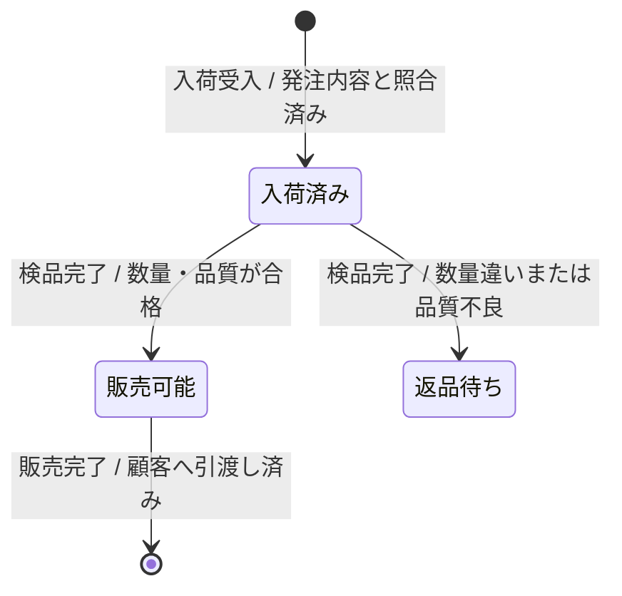
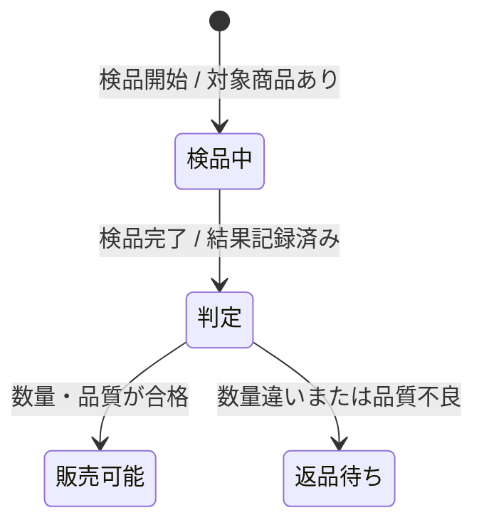
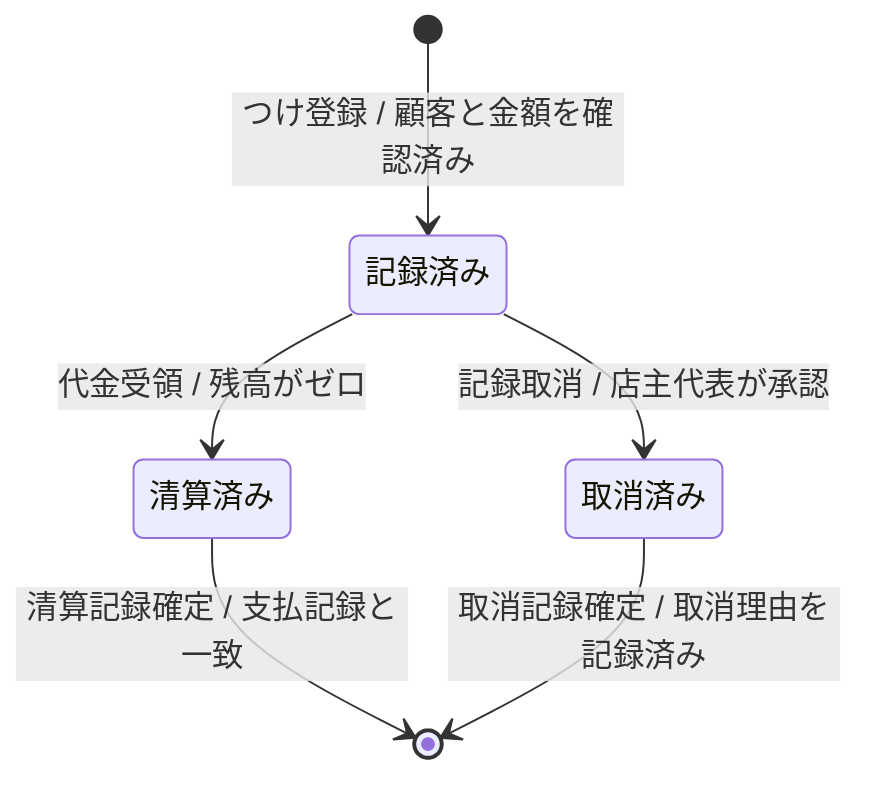

---
specdojo:
  id: specdojo:stsd-mermaid-rulebook
  type: rulebook
  status: draft
  target_format: markdown
  recipe: not-needed
  sample: specdojo:stsd-sample
  template: not-needed
  based_on:
    - specdojo:rulebook-authoring-standard
  grade:
    rubric: grade-rubric-v1
    target: kata
    verdict: needs-work
    score: 71
    graded_at: "2026-09-17T10:35:20.122Z"
    graded_by: codex-expert-executor
    content_hash: 1250979498e1b8d70fb9851fe383e7d8e0a8d2899458632762225a5f95bbd352
    categories:
      consistency: { score: 50 }
      usability: { score: 75 }
      architecture: { score: 100 }
      quality: { score: 63 }
    viewpoints:
      vp-arc-cross-document-consistency: { level: 2, score: 50 }
      vp-arc-conciseness: { level: 4, score: 100 }
      vp-arc-single-responsibility: { level: 4, score: 100 }
      vp-qe-verifiability: { level: 3, score: 75 }
      vp-qe-omissions-consistency: { level: 2, score: 50 }
      vp-qe-kata-conformance: { level: 2, score: 50 }
      vp-ux-readability: { level: 2, score: 50 }
      vp-ux-language-consistency: { level: 3, score: 75 }
      vp-arc-document-structure: { level: 4, score: 100 }
    findings: { blocker: 0, major: 4, minor: 3, note: 0 }
---

# STSD の状態遷移図を Mermaid で記述するルール

Mermaid State Diagram Rulebook for Status Definitions

STSD の「状態遷移図」を Mermaid の `stateDiagram-v2` で一貫して記述するための記法ルールです。状態の意味と成立条件は同じ STSD の「状態一覧」、各遷移の詳細は「遷移の説明」を正本とします。

## 1. 全体方針

- 一つの図は一つの業務対象の状態遷移だけを扱います。
- 状態ラベルは STSD の状態一覧にある状態名と完全一致させます。
- 遷移ラベルは業務イベントと条件を示し、実装フラグ、関数、画面ページを使いません。
- 図は遷移の全体像を示し、状態の意味や条件の長い説明は図中へ埋め込みません。

## 2. 位置づけと用語定義

| 用語     | 定義                                                               |
| -------- | ------------------------------------------------------------------ |
| 状態     | STSD の状態一覧に定義された業務状態                                |
| 初期点   | ライフサイクルの開始を示す `[*]`                                   |
| 終了点   | ライフサイクルの終了を示す `[*]`                                   |
| 遷移     | `遷移元 --> 遷移先 : イベント / 条件` で示す状態変化               |
| 複合状態 | 同じ親状態の内部に複数の下位状態を持つ Mermaid の `state` ブロック |

## 3. ファイル命名・ID規則

- 本 rulebook 単独の成果物は作成せず、`stsd-<term>.md` の「状態遷移図」に適用します。
- 状態名は日本語の名詞句にし、STSD の状態一覧と同じ表記を使います。
- イベント名は短い業務用語、条件は業務上判定可能な事実で記述します。
- Mermaid 内部で別名が必要な場合は `state "表示名" as state_id` を使い、表示名を状態一覧へ一致させます。

## 4. 推奨 Frontmatter 項目

この記法ルールは STSD の一章へ包含されるため、独自の Frontmatter 項目を追加しません。STSD の `rulebook`、`status`、`based_on` などをそのまま使用します。

## 5. 本文要件

| 要素       | 必須     | 記述                                                                 |
| ---------- | -------- | -------------------------------------------------------------------- |
| 宣言       | ○        | コードブロックの先頭を `stateDiagram-v2` とする                      |
| 業務状態   | ○        | 状態一覧にある状態名だけを使用する                                   |
| 遷移ラベル | ○        | `イベント / 条件` を記載する                                         |
| 初期点     | 原則必須 | `[*] --> 初期状態 : イベント / 条件` で示す                          |
| 終了点     | 任意     | 業務上の終了がある場合に `終了状態 --> [*] : イベント / 条件` で示す |

初期点または終了点を省略する場合は、STSD の「概要」で継続的な状態管理である理由を説明します。

## 6. 記述ガイド

### 6.1. 基本構文

- 行頭は半角スペース 2 個でそろえます。
- コロンの左に遷移元と遷移先、右にイベントと条件を記載します。
- 条件が常に成立する遷移は `イベント / イベント発生時` とし、ラベルを省略しません。

### 6.2. 分岐と自己遷移

<!-- specdojo:finding id=F001 severity=major rule=vp-arc-cross-document-consistency line=66 `＜＜choice＞＞` の疑似状態と前後の矢印は、上位 `stsd-rulebook` が定める「遷移元・遷移先は状態一覧の状態名または開始・終了」という表形式へ対応できないため、表への記載方法を上位規則と整合する形で定義するか、choice を使用しない構文へ変更する必要がある。 -->
<!-- specdojo:finding id=F004 severity=major rule=vp-qe-omissions-consistency line=66 `＜＜choice＞＞` を許可しながら、choice 出力遷移におけるイベントの扱いと「遷移の説明」への対応方法が欠落しており、行74〜75の条件のみのラベルが本文要件および完成判定と矛盾するため、choice 専用の例外規則と表への対応規則を追加するか例を通常遷移へ修正する必要がある。 -->
<!-- specdojo:finding id=F007 severity=minor rule=vp-ux-language-consistency line=66 `＜＜choice＞＞` と例中の「判定」が、状態一覧へ載せる業務状態とは異なる疑似状態であることを定義していないため、「状態一覧にある状態名だけを使用する」という用語上の境界との関係を明記する必要がある。 -->
- 同じ状態・イベントから分岐する条件は、読み手が重複なく判定できる表現にします。
- 分岐の判断自体を強調する必要がある場合だけ `<<choice>>` を使用します。
- 自己遷移は業務上の状態を保ったまま記録更新や再確認を行う場合だけ記載します。

<!-- specdojo:finding id=F005 severity=major rule=vp-qe-kata-conformance line=74 分岐例の2本の出力遷移は `イベント / 条件` ではなく条件だけを記載しており、本文要件と完成判定に適合する完成例になっていないため、イベントを含む形式へ直すか choice 遷移を明示的な例外として定義する必要がある。 -->
<!-- specdojo:finding id=F006 severity=major rule=vp-ux-readability line=74 choice からの矢印だけイベントと `/` がない理由の説明がなく、必須形式の例外か誤記かを読者が判別できないため、例外の理由・適用範囲・「遷移の説明」との対応を説明するか通常形式へ統一する必要がある。 -->

### 6.3. 複合状態と図の分割

<!-- specdojo:finding id=F002 severity=minor rule=vp-qe-verifiability line=81 図の分割条件である「正常系と例外系を同時に追えない」には確認手順や判定基準がなく結果が判定者に依存するため、追跡対象とする経路や読解不能と判定する条件を明示する必要がある。 -->
- 複合状態は、親状態の内部に独立した下位ライフサイクルがあり、状態一覧でも階層関係を説明できる場合だけ使用します。
- 状態数が 15 を超える、または正常系と例外系を同時に追えない場合は、同じ STSD 内で図を分割します。
- 分割した図で共有する状態は同じ名称を使い、別名を付けません。

### 6.4. 完成判定

<!-- specdojo:finding id=F003 severity=minor rule=vp-qe-verifiability line=88 「主要な終了または継続状態」の「主要」と対象となる継続状態の特定方法が未定義で、到達不能な例外終端を許容するか判断できないため、確認対象を全終端・継続状態とするか対象選定規則を定義する必要がある。 -->
- 状態一覧の全状態が少なくとも一つの図に登場しています。
- 図の業務状態はすべて状態一覧にあります。
- 開始から主要な終了または継続状態まで遷移をたどれます。
- 全遷移にイベントと条件があり、「遷移の説明」と一致しています。
- 分岐条件が重複せず、どの遷移も業務上判定できます。

## 7. 禁止事項

- 画面ページ間の移動を状態遷移として描きません。
- `if`、`&&`、`null` などの実装条件式を条件ラベルに使いません。
- enum 値、数値、フラグだけを状態名にしません。
- 状態一覧にない状態や、遷移の説明にない矢印を追加しません。
- 状態の意味・成立条件を図中の長文ノートへ複製しません。

## 8. サンプル

