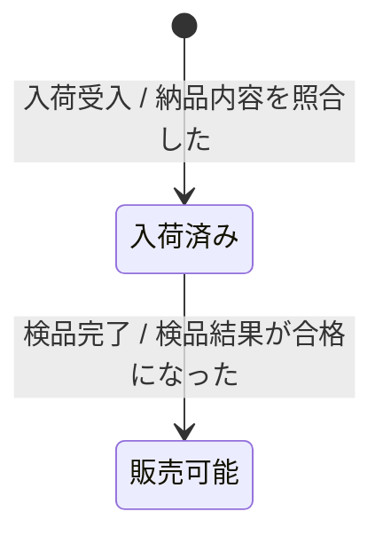

---
specdojo:
  id: specdojo:stsd-rulebook
  type: rulebook
  status: draft
  target_format: markdown
  recipe: specdojo:stsd-recipe
  sample: specdojo:stsd-sample
  template: specdojo:stsd-template
  includes:
    - specdojo:stsd-mermaid-rulebook
  based_on:
    - specdojo:rulebook-authoring-standard
---

# ステータス定義（Status Definition: STSD）作成ルール

Status Definition Documentation Rulebook

業務上の一つの対象が取り得る状態と、その状態間の遷移を一文書で定義するためのルールです。状態一覧、状態遷移図、遷移の説明を STSD に集約し、状態の意味とライフサイクルの二重管理を防ぎます。

## 1. 全体方針

- 一文書は一つの対象（エンティティまたは業務概念）だけを扱います。対象が異なる場合は `stsd-<term>` を分けます。
- 状態一覧を状態名・意味・成立条件の正本、状態遷移図と遷移の説明を遷移元・遷移先・イベント・条件の正本として同じ文書で管理します。
- 状態一覧の全状態を状態遷移図と遷移の説明へ対応付け、図だけ、表だけで意味が決まる状態を残しません。
- AS-IS と TO-BE を同じ図に混在させません。両方が必要な場合は `<term>` にスコープを含めて文書を分けます。
- 実装上の enum、フラグ、物理テーブル、API、画面操作ではなく、業務で合意する状態とイベントを記述します。

## 2. 位置づけと用語定義

| 用語       | 定義                                                                                |
| ---------- | ----------------------------------------------------------------------------------- |
| 対象       | 状態を持つ一つの業務上のエンティティまたは概念                                      |
| 状態       | 対象について、意味と成立条件を業務上判定できる時点の区分                            |
| 管理場所   | 現在状態を確認する正本の帳簿、台帳、記録、または概念上の保管先                      |
| 遷移       | イベントと条件により、対象が遷移元の状態から遷移先の状態へ変わること                |
| イベント   | 遷移の契機となる業務上の出来事または操作                                            |
| 遷移条件   | イベント発生時に遷移を成立させる、業務上判定可能な条件                              |
| 初期・終了 | Mermaid の `[*]` で表すライフサイクルの開始点・終了点。業務上の状態一覧には含めない |

## 3. ファイル命名・ID規則

- ファイル名は `stsd-<term>.md`、成果物 ID は拡張子を除いた `stsd-<term>` とします。
- `<term>` は対象と、必要に応じて AS-IS / TO-BE などのスコープを表す英小文字・数字・ハイフンのスラッグにします。
- 一つの対象に複数の STSD を作らず、例外状態も同じライフサイクルに属する限り同じ文書へ記載します。
- 状態値を外部参照に使う場合は `lower-kebab-case` とし、状態名は業務で使う日本語の名詞句にします。
- 遷移 ID は文書内で一意な `T-<nn>` 形式とし、遷移の説明とレビュー指摘で同じ ID を使います。

## 4. 推奨 Frontmatter 項目

| 項目         | 説明                                                  | 必須 |
| ------------ | ----------------------------------------------------- | ---- |
| `id`         | プロジェクト修飾なしの `stsd-<term>`                  | ○    |
| `type`       | `data`                                                | ○    |
| `status`     | `draft` / `ready` / `deprecated`                      | ○    |
| `rulebook`   | `specdojo:stsd-rulebook`                              | ○    |
| `based_on`   | 依存関係上許可された対象定義・業務データ辞書などの ID | 任意 |
| `supersedes` | 置き換える旧 STSD の ID                               | 任意 |

- `based_on` は成果物カタログの `depends_on` の推移閉包に含まれる先行成果物だけを記載します。
- 作成途中は `status: draft` とし、`ready` への昇格は定められた人間の承認後に行います。
- 対象名や文書タイトルの独自メタ項目は追加せず、H1 と「概要」で示します。

## 5. 本文要件

見出し順、表、記入欄の骨組みは template を正本とし、本章では各章の目的と必須性を定めます。

| 番号 | 見出し         | 必須     | 内容                                                                               |
| ---- | -------------- | -------- | ---------------------------------------------------------------------------------- |
| 1    | 概要           | ○        | 対象、スコープ、状態を管理する目的、利用者                                         |
| 2    | 状態一覧       | ○        | 値、状態名、通称、意味、成立条件、管理場所                                         |
| 3    | 状態遷移図     | ○        | 状態一覧と一致する状態、初期・終了、イベント・条件を示す Mermaid `stateDiagram-v2` |
| 4    | 遷移の説明     | ○        | 遷移 ID、遷移元、遷移先、イベント、条件、業務上の補足                              |
| 5    | 今後の検討メモ | 条件付き | 未決の例外状態、遷移、用語、責任境界。未決事項がある場合だけ設ける                 |

状態が一つしかない対象も、状態変化がない根拠を「概要」に記載し、状態遷移図では初期点からその状態への遷移を示します。状態自体を持たない対象には STSD を作成しません。

## 6. 記述ガイド

### 6.1. 概要

- 対象を一つの業務用語で特定し、AS-IS / TO-BE などのスコープを明示します。
- 状態管理によって誰が何を判断するかを 1〜3 文で記述します。
- 状態の正本となる管理場所と、状態変更を起こす業務範囲を示します。

### 6.2. 状態一覧

| 列名     | 記述ルール                                                            |
| -------- | --------------------------------------------------------------------- |
| 値       | 外部参照に使う安定した `lower-kebab-case`。コードを持たない場合は `-` |
| 状態名   | 対象が置かれた状態を表す、日本語の名詞句                              |
| 通称     | 現場で異なる呼び方を使う場合の呼称。ない場合は `-`                    |
| 意味     | その状態に含む範囲と、含まない範囲が分かる説明                        |
| 成立条件 | いつその状態と判定できるかを、確認可能な事実で記述                    |
| 管理場所 | 現在状態を確認する正本の帳簿、台帳、記録、または概念上の保管先        |

- 状態名は用語集や業務データ辞書の名称と一致させます。
- 終了条件は遷移の説明へ置き、状態一覧の成立条件と同じ説明を重複させません。
- 同じ状態を管理場所ごとに別名で複製せず、意味または成立条件が異なる場合だけ別状態とします。

### 6.3. 状態遷移図

- Mermaid の `stateDiagram-v2` を使用し、Frontmatter の `includes` で指定された記法ルールに従います。
- 状態一覧の「状態名」を図の状態ラベルにそのまま使用します。
- 遷移ラベルは `イベント / 条件` とし、条件がない場合も業務イベントを省略しません。
- 初期点・終了点は必要な場合に `[*]` で示し、業務上の状態として状態一覧へ追加しません。
- 状態数が 15 を超える、または通常系と例外系を同時に追えない場合は同じ文書内で図を分け、共有する状態名を一致させます。

### 6.4. 遷移の説明

| 列名     | 記述ルール                                                        |
| -------- | ----------------------------------------------------------------- |
| 遷移 ID  | 文書内で一意な `T-<nn>`                                           |
| 遷移元   | 状態一覧の状態名。初期点の場合は `開始`                           |
| 遷移先   | 状態一覧の状態名。終了点の場合は `終了`                           |
| イベント | 状態変更の契機となる業務上の出来事または操作                      |
| 条件     | 遷移成立を yes / no で判定できる条件。無条件なら `イベント発生時` |
| 補足     | 判断者、例外時の扱い、記録する証跡など、図だけでは伝わらない事項  |

- 図にある全遷移を一行ずつ記載し、表にだけある遷移を残しません。
- 同じイベントから複数の遷移先へ分岐する場合は、条件を相互排他的かつ判定可能にします。
- 自己遷移は、状態の意味を変えずに記録更新や再確認を行う業務上の必要がある場合だけ使用します。

### 6.5. 今後の検討メモ

- 調査で確定できる不足は _TODO_:、意思決定待ちは _UNDECIDED_:、仮置きする前提は _ASSUMPTION_: で区別します。
- 各項目に影響する状態または遷移 ID、決定者、決定時期を記載します。
- 未決事項がない場合は章を省略し、空欄や「なし」だけの章を残しません。

### 6.6. 完成判定

- 状態一覧の全状態が状態遷移図に登場し、図の業務状態がすべて状態一覧にあります。
- 状態一覧の成立条件だけで現在状態を判定でき、複数状態へ同時に該当する場合の扱いが明示されています。
- 図の全遷移が遷移の説明へ一度ずつ対応し、遷移元・遷移先・イベント・条件が一致しています。
- 初期状態へ到達する条件、終了状態または継続状態、主要な例外経路を説明できます。
- 状態名、通称、イベント名が用語集・業務データ辞書・関連 CDFD と矛盾していません。

## 7. 禁止事項

- 同じ対象の状態一覧と状態遷移図を別文書へ分けません。
- 状態名に `is_active`、`FLAG_01`、数値だけのコードなど、実装上の識別子を使いません。
- 画面ページ、API 呼び出し、関数実行を業務状態または業務イベントとしてそのまま記載しません。
- 遷移ラベルを空にしたり、条件を実装式だけで表したりしません。
- 状態一覧にない状態を図へ追加したり、図にない遷移を遷移の説明へ追加したりしません。
- CDFD、業務データ辞書、用語集に同じ状態一覧や遷移表を複製しません。

## 8. サンプル

````markdown
---
specdojo:
  id: stsd-product
  type: data
  status: draft
  rulebook: specdojo:stsd-rulebook
---

# 商品のステータス定義

## 1. 概要

店頭商品の受入から販売終了までの状態と遷移を定義する。

## 2. 状態一覧

| 値       | 状態名   | 通称     | 意味                         | 成立条件               | 管理場所 |
| -------- | -------- | -------- | ---------------------------- | ---------------------- | -------- |
| received | 入荷済み | 入った品 | 店舗が受領し検品前の商品     | 納品内容を照合した     | 仕入記録 |
| sellable | 販売可能 | 売れる品 | 検品に合格し売場へ出せる商品 | 検品結果が合格になった | 在庫記録 |

## 3. 状態遷移図



## 4. 遷移の説明

| 遷移 ID | 遷移元   | 遷移先   | イベント | 条件                   | 補足           |
| ------- | -------- | -------- | -------- | ---------------------- | -------------- |
| `T-01`  | 開始     | 入荷済み | 入荷受入 | 納品内容を照合した     | 仕入記録へ残す |
| `T-02`  | 入荷済み | 販売可能 | 検品完了 | 検品結果が合格になった | 在庫記録へ残す |
````
