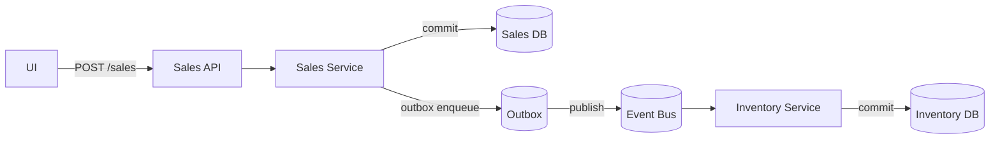

---
specdojo:
  id: specdojo:sysd-critical-flows-rulebook
  type: rulebook
  status: draft
  sample: specdojo:sysd-critical-flows-sample
---

# システム設計 重要フロー 作成ルール

System Design Critical Flows (SYSD-CF) Documentation Rules

本ドキュメントは、システム設計情報を **コード（定義ファイル）へ寄せる運用（Code as Spec）** を前提に、

「読まないと事故る」重要フローだけを最小限で記述する **System Design Critical Flows (SYSD-CF)** の記述ルールを定義する。

SYSD Critical Flows は詳細設計書ではない。**実装・テスト・運用の共通理解が必要な“難所”** に限定して可視化する。

## 1. 全体方針

SYSD-CF は、以下を目的とする。

- **誤解や事故が起きやすい処理**（冪等・非同期・補償・整合性・外部障害など）を最小限で共有する
- 実装が拡張されても崩れにくい **境界・永続化点・失敗時挙動** をSSOTとして残す

- テスト（ITS/ETS/STC）および運用（OPD/OPR）へ **観点と導線** を提供する

基本方針:

- 重要フローは **最大5件** を原則とし、追加時は統合・削減で総数を維持する
- 詳細手順の逐語化は行わず、境界・永続化点・整合性・冪等・失敗時・観測性を明示する
- API/イベント/DB/ジョブ/設定の詳細はコード・定義ファイルをSSOTとし、SYSD-CFは導線を担う

## 2. 位置づけと用語定義

### 2.1. 位置づけ

- `sysd-critical-flows`：システム設計上の重要フローを集約する文書（本体）
- `sysd-index`：SSOTへのリンク集（SYSD-CFから必ず参照する）
- `itc-*` / `etc-*` / `stc-*`：SYSD-CFで示した観点を検証するテスト仕様
- `opd-*` / `opr-*`：失敗時運用・監視・手順の実行ルール
- `dec-*`：設計判断の背景・採否理由

### 2.2. 用語定義

| 用語       | 定義                                                     |
| ---------- | -------------------------------------------------------- |
| 重要フロー | 実装・運用事故に直結しやすく、共通理解が必須な処理フロー |

| 永続化点 | commit / outbox / enqueue など、状態確定や配送起点となる地点 |
| 補償 | 一部成功後の不整合を是正するための戻し・取り消し・代替処理 |

## 3. ファイル命名・ID規則

- 生成対象ドキュメントIDは `sysd-critical-flows` を推奨する。
- フローIDは `scf-001` 形式の連番とし、1フロー=1IDとする。
- フロータイトルは業務結果が分かる表現を使う（例: `scf-001: 売上確定→在庫更新→発注候補生成`）。

## 4. 推奨 Frontmatter 項目

### 4.1. 設定内容

Frontmatter は共通スキーマに従います（参照: [docs/specdojo/schemas/v1/deliverable-frontmatter.schema.yaml](../../../specdojo/schemas/v1/deliverable-frontmatter.schema.yaml) / [document-metadata-standard.md](../standards/document-metadata-standard.md)）。

| 項目 | 説明 | 必須 |

| ---------- | ----------------------------------------------- | ---- |
| id | SYSD-CF ID（推奨: `sysd-critical-flows`） | ○ |
| type | `architecture` など共通スキーマで許容される種別 | ○ |
| title | システム設計: 重要フロー | ○ |
| status | `draft` / `ready` / `deprecated` | ○ |
| based_on | 根拠となる仕様ID（ID配列。未指定は `[]` 可） | 任意 |
| supersedes | 置き換え関係（ID配列。未指定は `[]` 可） | 任意 |

### 4.2. 推奨ルール

- `based_on` には対象フローの判断に直接利用した成果物のみを列挙する。
- `based_on` / `supersedes` は ID 配列（未指定は `[]` 可）。

## 5. 本文構成（標準テンプレ）

`sysd-critical-flows` は以下の見出し構成を **順序固定** で配置する。

| 番号 | 見出し                                      | 必須 |
| ---- | ------------------------------------------- | ---- |
| 1    | 概要（対象・運用方針）                      | ○    |
| 2    | 重要フロー一覧（最大5件）                   | ○    |
| 3    | フロー詳細（IDごと）                        | ○    |
| 4    | 観測性と運用連携                            | ○    |
| 5    | 関連ドキュメント導線（SDI/テスト/運用/DEC） | ○    |

`3. フロー詳細` は、フローIDごとに以下の構成で記述する。

- ヘッダ：ID、フロー名、目的、トリガー、範囲（含む/含まない）
- フロー概要：図（推奨Mermaid）または箇条書き、登場要素、永続化点
- 整合性・冪等・再実行：整合性モデル、冪等キー、重複時挙動、再実行方針
- 失敗時：失敗分類、リトライ方針、補償/ロールバック、影響・通知
- 観測性：trace_id引き回し、必須ログ項目、監査ログ要件
- 参照：SDI、外部I/F、NFR、OPD/OPR、DEC、ITS/ETS/STC

補足:

- フロー数が5件を超える場合は、分割前に統合・重複排除を検討する。

## 6. 記述ガイド

### 6.1. 概要（対象・運用方針）

生成する本文の見出しは **## 1. 概要（対象・運用方針）**

- SYSD-CFの適用対象と「最大5件運用」の方針を1〜3段落で明記する。
- SYSD-CFが詳細実装書ではなく、事故予防のための重要フロー文書であることを明記する。
- SSOTはコード/定義ファイル側であること（SYSD-CFは導線）を明記する。

### 6.2. 重要フロー一覧（最大5件）

生成する本文の見出しは **## 2. 重要フロー一覧（最大5件）**

- フローID、フロー名、事故論点、優先度、備考を表形式で記載する。
- 一覧は最大5件までとし、6件目以降は統合・削減の検討結果を反映してから追加する。

- 事故論点は「冪等」「非同期整合性」「補償」「外部I/F障害」「再実行性」などで明示する。

重要フロー選定の判断基準（いずれか該当）:

- 冪等が必須（重複実行の現実的リスクがある）
- 非同期（順序・再実行・重複が絡む）
- 補償が必要（分散トランザクション、取り消し、戻し）
- 整合性が難しい（最終的整合性、二重書き込み、在庫/金額/残高）
- 外部I/F障害が業務影響に直結（タイムアウト、リトライ、部分失敗）
- 監査対象（改ざん/追跡が必要）
- 性能/可用性のボトルネック候補（ピーク処理、バッチ遅延）

### 6.3. フロー詳細（IDごと）

生成する本文の見出しは **## 3. フロー詳細（IDごと）**

各フローは以下を順に記載する。

- ヘッダ：ID、フロー名、目的、トリガー、範囲（含む/含まない）
- フロー概要：図（推奨Mermaid）または箇条書き、登場要素、永続化点
  - 図は原則として **C4ダイアグラムのコンポーネント図レベル相当**（コンテナ内の主要コンポーネント間連携）で記述する
- 整合性・冪等・再実行：整合性モデル、冪等キー、重複時挙動、再実行方針
- 失敗時：失敗分類、リトライ方針、補償/ロールバック、影響・通知
- 観測性：trace_id引き回し、必須ログ項目、監査ログ要件
- 参照：SDI、外部I/F、NFR、OPD/OPR、DEC、ITS/ETS/STC

図の記法（推奨）:

- Flowchart：境界と流れ（同期/非同期）を表現
- SequenceDiagram：時系列と呼び出し順（必要時のみ）
- 概要図の粒度は **C4コンポーネント図レベル相当** とし、実装クラス/メソッド詳細には踏み込まない

図に必ず入れる情報:

- 境界（システム内/外、サービス境界）
- 永続化点（commit/outbox/enqueue）
- 非同期点（queue/event）
- 主要識別子（冪等キー、entity_id）

### 6.4. 観測性と運用連携

生成する本文の見出しは **## 4. 観測性と運用連携**

- 各フローで trace_id 伝搬範囲を明記する。

- 必須ログ項目（`flow_id`, `request_id`, `entity_id`, `result` 等）を最低限定義する。
- 監視条件（アラート閾値）、手動介入条件、OPR手順への導線を明記する。
- 業務影響の大きい失敗は OPD の停止判断基準に接続する。

### 6.5. 関連ドキュメント導線

生成する本文の見出しは **## 5. 関連ドキュメント導線**

- 各フローごとに SDI（一次情報）、テスト仕様（ITS/ETS/STC）、運用（OPD/OPR）、DEC を明記する。
- 参照先は「ID」または「リポジトリ相対パス」で一意に辿れる形にする。
- 分冊が無い場合でも `（本書のみ）` または `（なし）` を明記し、空欄にしない。

## 7. 禁止事項

| 禁止事項                                    | 理由                                     |
| ------------------------------------------- | ---------------------------------------- |
| 正常系を逐語で長文記述する                  | 重要論点が埋もれて参照性が落ちるため     |
| 図を巨大化させ複数論点を混在させる          | 1フロー1論点の原則が崩れるため           |
| 実装クラス名/メソッド名/DBカラムを列挙する  | コードSSOTと二重管理になるため           |
| 冪等/整合性/失敗時の記述を省略する          | SYSD-CFの主目的を満たせないため          |
| SDI・運用・テスト・DECへの導線を置かない    | 実行・検証・運用へ接続できないため       |
| 重要フローを6件以上に増やす（無整理の追加） | 文書が肥大化し、合意形成が困難になるため |
