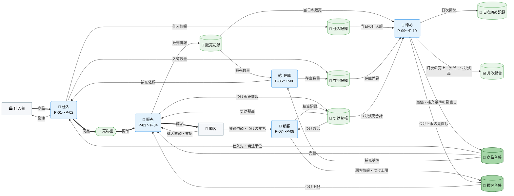
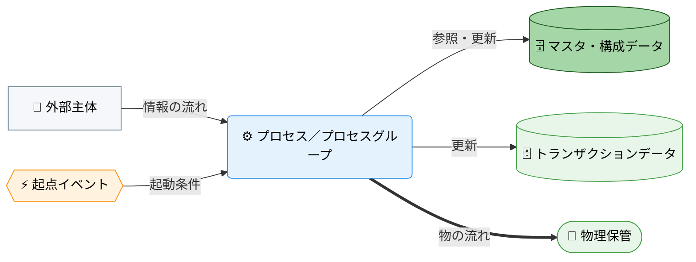

---
specdojo:
  id: specdojo:cdfd-overview-sample
  type: flow
  status: ready
  rulebook: specdojo:cdfd-overview-rulebook
  based_on: []
  supersedes: []
  grade:
    rubric: grade-rubric-v1
    target: kata
    verdict: needs-work
    score: 78
    graded_at: "2026-09-14T16:40:52.345Z"
    graded_by: codex-expert-executor
    content_hash: f3f87a89f75c1ae4474df70cd599b1cfb1b18e1293a22dc5274b728518293288
    categories:
      consistency: { score: 63 }
      usability: { score: 92 }
      architecture: { score: 100 }
      quality: { score: 63 }
    viewpoints:
      vp-arc-cross-document-consistency: { level: 3, score: 75 }
      vp-arc-conciseness: { level: 4, score: 100 }
      vp-arc-single-responsibility: { level: 4, score: 100 }
      vp-qe-verifiability: { level: 2, score: 50 }
      vp-qe-omissions-consistency: { level: 2, score: 50 }
      vp-qe-kata-conformance: { level: 3, score: 75 }
      vp-ux-readability: { level: 4, score: 100 }
      vp-ux-language-consistency: { level: 3, score: 75 }
      vp-arc-document-structure: { level: 4, score: 100 }
    findings: { blocker: 0, major: 2, minor: 5, note: 0 }
---

# 概念データフロー図（全体概要）: 駄菓子屋きぬや販売管理

本書は、駄菓子屋きぬやの店舗運営について、仕入から店頭販売、在庫管理、常連客のつけ管理、日次・月次の締めまでを業務プロセスとして整理する。

## 1. 目的

駄菓子屋きぬやの販売管理業務の全体像を、プロセス領域とデータの連関として整理し、後続のプロセスグループ別 CDFD とユースケース別 CDFD の位置付けを明確にする。対象者と利用場面は次のとおり。

- 店主代表は、対象範囲と領域分割を承認する。
- 開発担当は、各プロセスグループ別 CDFD の範囲と、ユースケース別 CDFD がどの領域を横断するかを本書で確認し、詳細化する。
- 技術メンターは、データストアと領域間の受け渡しを設計入力として使う。
- 同行レビュー担当は、領域とプロセスグループ別 CDFD の対応から重複・欠落を確認する。

## 2. 適用範囲

<!-- specdojo:finding id=F001 severity=minor rule=vp-arc-cross-document-consistency line=19 共通 sample 文脈と参照先のプロジェクト概要では家族の店番利用者を「家族利用者代表」としているが、本書は未定義の「店番担当」を使用しているため、正式な役割名へ統一するか両者の対応を明記する必要がある。 -->
<!-- specdojo:finding id=F006 severity=minor rule=vp-ux-language-consistency line=19 「店主代表」「家族利用者代表」を用いる共通 sample 文脈に対して「店主」「店番担当」を併用しているため、正式な役割名へ統一するか用語の対応を定義する必要がある。 -->

- 対象は、単一店舗での仕入計画から入荷、店頭販売、在庫確認と補充判断、常連客の登録とつけ精算、日次締めと月次見直しまでの店舗運営全体である。
- 本書が扱うのは、プロセス領域の分割と、領域間・データストア間の受け渡しまでである。各領域の内部（レジ操作の手順、記録項目、値引き・取消を行う処理、記録漏れ時の復旧手順）は対象外とし、プロセスグループ別 CDFD で詳細化する。状態名・意味・成立条件・遷移元・遷移先・イベント・遷移条件はステータス定義（Status Definition: STSD）を正本とし、詳細 CDFD は参照に留める。
- 商品検索、在庫参照、つけ残高参照など、記録を変更しない参照操作は独立した業務フローに含めず、各領域を支える補助操作として扱う。EC、複数店舗、本格会計、仕入先とのシステム連携は対象外とする。
- 店主と家族の店番担当、およびシステムの責任分担は [[specdojo:prj-overview-sample|プロジェクト概要]] に従う。補充の判断、つけの承認、締めの確定は店主が担い、システムは記録と確認を支援する。

## 3. プロセス領域

業務は 10 のプロセス領域に分かれ、五つのプロセスグループにまとめる。領域の分割と領域間の受け渡しは本書を正本とし、領域内の詳細はプロセスグループ別 CDFD を正本とする。各グループの主要入力・主要出力・データストアは「概念データフロー（概要）」のエッジの根拠である。

### 3.1. 仕入（P-01〜P-02）

在庫の補充依頼と商品台帳の仕入先情報から発注を行い、入荷した商品を検品して売場へ出し、仕入記録と在庫記録を更新する。

- **主要入力**: 在庫からの補充依頼、商品台帳の仕入先・発注単位、仕入先からの納品
- **主要出力**: 仕入先への発注、売場棚へ出す商品、仕入記録、入荷数量
- **データストア**: 商品台帳、仕入記録、在庫記録、売場棚

<!-- prettier-ignore -->
| 領域 ID | プロセス領域 | 業務目的 | 主な担当 | 起点イベント |
| --- | --- | --- | --- | --- |
| `P-01` | 仕入計画 | 補充対象と数量を発注単位に合わせて確定し、仕入先へ発注する。 | 店主代表 | 在庫から補充依頼を受けた |
| `P-02` | 入荷検品 | 納品された商品を検品し、売場棚へ出して仕入記録と在庫記録を更新する。 | 店番担当（管理責任: 店主代表） | 仕入先から商品が納品された |

### 3.2. 販売（P-03〜P-04）

顧客の購入依頼に対して商品を渡し、現金またはつけで販売を記録する。つけ販売では顧客台帳のつけ上限とつけ台帳の残高を確認する。

- **主要入力**: 顧客からの購入依頼と支払、売場棚の商品、商品台帳の売価、顧客台帳のつけ上限、つけ台帳の残高
- **主要出力**: 顧客へ渡す商品、販売記録、つけ販売の記録
- **データストア**: 商品台帳、顧客台帳、販売記録、つけ台帳、売場棚

<!-- prettier-ignore -->
| 領域 ID | プロセス領域 | 業務目的 | 主な担当 | 起点イベント |
| --- | --- | --- | --- | --- |
| `P-03` | 店頭販売 | 現金販売を記録し、商品を顧客へ渡す。 | 店番担当（管理責任: 店主代表） | 顧客が商品を購入した |
| `P-04` | つけ販売 | つけ上限と残高を確認したうえで、つけ販売を記録する。 | 店主代表 | 常連客がつけでの購入を依頼した |

### 3.3. 在庫（P-05〜P-06）

<!-- specdojo:finding id=F002 severity=major rule=vp-qe-verifiability line=55 仕入の `P-02` と在庫の `P-05` がともに入荷数量を在庫記録へ反映すると定義されているため、入荷時の更新責務を一方へ定め、他方を受け渡しまたは参照として表現しなければ更新の成否を一意に判定できない。 -->

販売記録と入荷数量から在庫記録を更新し、商品台帳の補充基準を下回った商品について仕入へ補充を依頼する。

<!-- specdojo:finding id=F003 severity=major rule=vp-qe-omissions-consistency line=57 主要入力の「仕入からの入荷数量」に対応する図のエッジが在庫グループへ到達せず `仕入 → 在庫記録` となり、さらに在庫グループも同じ在庫記録を更新しているため、単一の更新責務とそれに対応する受け渡し経路へ修正する必要がある。 -->

- **主要入力**: 販売記録の販売数量、仕入からの入荷数量、商品台帳の補充基準
- **主要出力**: 在庫記録、仕入への補充依頼
- **データストア**: 商品台帳、販売記録、在庫記録

<!-- prettier-ignore -->
| 領域 ID | プロセス領域 | 業務目的 | 主な担当 | 起点イベント |
| --- | --- | --- | --- | --- |
| `P-05` | 在庫確認 | 販売と入荷を在庫記録へ反映し、現在庫を確認できる状態に保つ。 | 店番担当（管理責任: 店主代表） | 販売または入荷が記録された |
| `P-06` | 補充判断 | 補充基準を下回った商品を特定し、補充対象と数量を判断する。 | 店主代表 | 在庫が補充基準を下回った |

### 3.4. 顧客（P-07〜P-08）

常連客を顧客台帳へ登録してつけ上限を定め、つけ台帳の残高を精算する。

- **主要入力**: 顧客からの登録依頼とつけの支払、つけ台帳の残高
- **主要出力**: 顧客台帳の顧客情報とつけ上限、つけ台帳の精算記録
- **データストア**: 顧客台帳、つけ台帳

<!-- prettier-ignore -->
| 領域 ID | プロセス領域 | 業務目的 | 主な担当 | 起点イベント |
| --- | --- | --- | --- | --- |
| `P-07` | 顧客登録 | 常連客の情報とつけ上限を登録し、つけ販売の可否を判断できるようにする。 | 店主代表 | 常連客がつけの利用を申し出た |
| `P-08` | つけ精算 | つけ残高の支払を受け付け、残高を更新する。 | 店主代表 | 常連客がつけの支払を申し出た |

### 3.5. 締め（P-09〜P-10）

日々の販売、仕入、在庫、つけを突き合わせて日次締めを確定し、月次で売価・補充基準・つけ上限を見直す。

- **主要入力**: 販売記録、仕入記録、在庫記録、つけ台帳
- **主要出力**: 日次締め記録、月次報告、商品台帳と顧客台帳の見直し
- **データストア**: 販売記録、仕入記録、在庫記録、つけ台帳、日次締め記録、月次報告、商品台帳、顧客台帳

<!-- prettier-ignore -->
| 領域 ID | プロセス領域 | 業務目的 | 主な担当 | 起点イベント |
| --- | --- | --- | --- | --- |
| `P-09` | 日次締め | 当日の販売、仕入、在庫、つけを突き合わせ、差異を確認して締めを確定する。 | 店主代表 | 閉店した |
| `P-10` | 月次見直し | 月次の売上・欠品・つけ残高を報告し、売価、補充基準、つけ上限を見直す。 | 店主代表 | 月末の締めが確定した |

## 4. データストア

店舗運営で読み書きするデータストアを、マスタ・構成データとトランザクションデータに分けて示す。現行の保管先はレジ横のノートと店主の記憶であり、システム化後の保管先は未確定のため「主な保管先」列に `_UNDECIDED_` を含む。常連客ノートと販売ノートは物理媒体を共有するが、顧客情報とつけ記録、および販売明細と日次締め記録は、それぞれ専用の欄を論理境界として別の正本にする。店頭のタブレット端末そのものは保管先の候補であり、データストアとしては扱わない。

### 4.1. マスタ・構成データ

<!-- prettier-ignore -->
| データストア | 主な内容 | 主な保管先 |
| --- | --- | --- |
| 商品台帳 | 商品名、売価、補充基準、仕入先、発注単位 | 商品ノート（現行）、 _UNDECIDED_: システム化後の保管先 |
| 顧客台帳 | 常連客の氏名、連絡先、つけ上限 | 常連客ノートの顧客欄（つけ台帳と媒体を共有）、 _UNDECIDED_: システム化後の保管先 |

### 4.2. トランザクションデータ

<!-- specdojo:finding id=F004 severity=minor rule=vp-qe-omissions-consistency line=118 「売場棚」をトランザクションデータ表へ配置している一方、凡例では物理保管はいずれのデータ区分にも属さないと定義しているため、物理保管用の区分を設けるかトランザクションデータ表へ置く例外規則を明記する必要がある。 -->
<!-- specdojo:finding id=F005 severity=minor rule=vp-qe-kata-conformance line=118 完成例が「売場棚」をトランザクションデータ表へ置きながら凡例で同区分に属さないと説明しているため、rulebook・template と合わせて物理保管の配置規則を確定し、その規則に従う完成例へ修正する必要がある。 -->
<!-- prettier-ignore -->
| データストア | 主な内容 | 主な保管先 |
| --- | --- | --- |
| 販売記録 | 販売日時、商品、数量、金額、支払区分（現金・つけ） | 販売ノートの販売明細欄（日次締め記録と媒体を共有）、 _UNDECIDED_: システム化後の保管先 |
| 仕入記録 | 発注日、仕入先、商品、数量、入荷日、仕入額 | 仕入ノート（現行）、 _UNDECIDED_: システム化後の保管先 |
| 在庫記録 | 商品ごとの現在庫、入出庫の履歴 | 店主の記憶（現行）、 _UNDECIDED_: システム化後の保管先 |
| つけ台帳 | 顧客ごとのつけ販売、精算、残高 | 常連客ノートのつけ欄（顧客台帳と媒体を共有）、 _UNDECIDED_: システム化後の保管先 |
| 日次締め記録 | 日ごとの売上、仕入額、在庫差異、つけ残高合計 | 販売ノート末尾の日次締め欄（販売記録と媒体を共有）、 _UNDECIDED_: システム化後の保管先 |
| 月次報告 | 月ごとの売上、欠品回数、つけ残高、見直し内容 | 未作成（現行）、 _UNDECIDED_: システム化後の保管先 |
| 売場棚 | 店頭に陳列した商品の現物 | 店内の売場棚（物理保管） |

## 5. 概念データフロー（概要）

プロセスは五つのプロセスグループの代表ノード、データストアは「データストア」の各行をノードとして示す。矢印は情報または実行要求の受け渡しであり、実行順や毎回の通過を意味しない。更新のエッジは更新前の参照を含む。店主代表と店番担当は各領域の担当として内側にいるため外部主体としては描かず、対象範囲外の顧客と仕入先を外部主体として描く。ノード総数は、外部主体を除く代表ノード 5 とデータストア 9 の計 14 のため 1 図で示す。

凡例は「凡例（本プロダクト共通）」に従う。`-->` は情報の流れ、`==>` は商品の物の流れであり、売場棚は物理保管として描く。各領域の起点イベントと担当は「プロセス領域」の表に記載し、本図では省略する。外部主体は顧客と仕入先である。

## 6. 詳細 CDFD 一覧

本書の詳細化先は、プロセスグループ別 CDFD とユースケース別 CDFD の 2 種類である。役割分担は次のとおり。

- プロセスグループ別 CDFD は、グループに属する領域の内部プロセス、起点イベント、例外・復旧、データストアの読み書きを定める正本である。状態の定義と遷移は STSD を正本とし、プロセスグループ別 CDFD は参照に留める。各領域はちょうど一つのプロセスグループ別 CDFD に属する。
- ユースケース別 CDFD は、複数のプロセスグループをまたぐ順序と引き渡し条件だけを定める。グループ内部のプロセスは再掲せず、プロセスグループ別 CDFD を参照する。単一のグループに閉じる業務はユースケース別 CDFD を作らない。

### 6.1. プロセスグループ別 CDFD

<!-- prettier-ignore -->
| プロセスグループ | 含む領域 | プロセスグループ別 CDFD |
| --- | --- | --- |
| 仕入 | `P-01`〜`P-02` | `cdfd-purchasing` |
| 販売 | `P-03`〜`P-04` | `cdfd-sales` |
| 在庫 | `P-05`〜`P-06` | `cdfd-inventory` |
| 顧客 | `P-07`〜`P-08` | `cdfd-customer` |
| 締め | `P-09`〜`P-10` | `cdfd-closing` |

### 6.2. ユースケース別 CDFD

複数のプロセスグループを横断する業務のうち、順序と引き渡し条件を定める必要があるものを示す。顧客登録や日次締めのように単一のグループに閉じる業務はプロセスグループ別 CDFD で扱い、必要になった時点でユースケース別 CDFD を追加する。

<!-- prettier-ignore -->
| ケース ID | ユースケース | 業務目的 | 横断するプロセスグループ | ユースケース別 CDFD |
| --- | --- | --- | --- | --- |
| `C-01` | つけ販売から精算まで | つけ上限の確認、つけ販売の記録、精算、月次のつけ上限見直しまでの引き渡しを定める | 販売 → 顧客 → 締め | `cdfd-uc-credit-sales` |
| `C-02` | 欠品から補充まで | 在庫の補充判断、発注、入荷検品、売場への補充までの引き渡しを定める | 在庫 → 仕入 → 販売 | `cdfd-uc-replenishment` |

## 7. 凡例（本プロダクト共通）

本プロダクトの全 CDFD（本書、プロセスグループ別 CDFD、ユースケース別 CDFD）が共通して参照するノード形状・色・絵文字の対応を示す。個々の CDFD は、以下の定義を再掲せず、本章への参照に留める。

<!-- prettier-ignore -->
| 概念 | 形状 | 色 | 絵文字例 |
| --- | --- | --- | --- |
| プロセス／プロセスグループ | 角丸長方形 | 青（`#e3f2fd` / `#1e88e5`） | 業務内容が伝わる絵文字（例: 🛒） |
| 起点イベント | 六角形 | 橙（`#fff3e0` / `#fb8c00`） | 出来事が伝わる絵文字（例: 🚦） |
| データストア（マスタ・構成データ） | 円柱 | 濃い緑（`#a5d6a7` / `#1b5e20`） | 保管物が伝わる絵文字（例: 📐） |
| データストア（トランザクションデータ） | 円柱 | 薄い緑（`#e8f5e9` / `#43a047`） | 保管物が伝わる絵文字（例: 📒） |
| 物理保管 | スタジアム形 | 薄い緑（トランザクションデータと同じ） | 保管場所が伝わる絵文字（例: 🏬） |
| 外部主体 | 四角 | グレー（`#f5f7fa` / `#607d8b`） | 主体が伝わる絵文字（例: 🧑） |
| 情報の流れ | ラベル付き `-->` | — | — |
| 物の流れ | ラベル付き `==>` | — | — |

<!-- specdojo:finding id=F007 severity=minor rule=vp-ux-language-consistency line=265 第4章では売場棚を「トランザクションデータ」に含めている一方、本段落では物理保管を「いずれの区分にも属さない」と定義しており、売場棚の分類を読み手が一意に識別できないため表現を統一する必要がある。 -->

データストアの色分けは、大分類「データストア」の中の業務上のサブ分類を表す。マスタ・構成データは、他のプロセスから参照される比較的安定した基準情報（商品台帳、顧客台帳）を指す。トランザクションデータは、業務活動に伴い都度更新される記録（販売記録、仕入記録、在庫記録、つけ台帳、締めの記録）を指す。物理保管は現物の保管先であり、いずれの区分にも属さないため、便宜上トランザクションデータと同じ色を用いる。

ノード形状・線種そのものの記法は `specdojo:cdfd-mermaid-rulebook` に従う。本章は、その記法に基づき駄菓子屋きぬや販売管理の全 CDFD が実際に採用する色・絵文字の割り当てを固定する。

## 8. 未決事項

<!-- prettier-ignore -->
| 論点 | 影響 | 決定者 | 決定時期 | 状態 |
| --- | --- | --- | --- | --- |
| _UNDECIDED_: システム化後の各データストアの保管先（タブレット端末内、クラウド、紙との併用） | 「データストア」の保管先列と、プロセスグループ別 CDFD の記録・復旧手順 | 店主代表（技術メンターの助言を受けて） | システム設計の着手前 | open |
