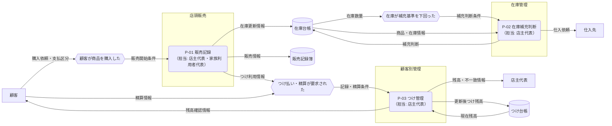

---
specdojo:
  id: specdojo:cdfd-overview-sample
  type: sample
  status: draft
  rulebook: specdojo:cdfd-overview-rulebook
  based_on: []
  supersedes: []
---

# 概念データフロー図（全体概要）: 駄菓子屋きぬや販売管理

店頭販売、在庫補充、つけ管理の三領域について、店主代表が対象境界を承認し、開発担当が領域別 CDFD へ詳細化するための全体概要である。

## 1. 目的と適用範囲

- 対象者は、対象範囲を承認する店主代表、業務の受け渡しを整理する開発担当、領域分割の重複・欠落を確認する同行レビュー担当である。
- 対象は、単一店舗での商品販売、在庫補充判断、常連顧客のつけ記録・精算に伴う情報の受け渡しである。
- 本書は TO-BE の全体概要であり、商品の陳列・引き渡し、現金保管などの現物の流れは対象外とする。
- 商品検索、在庫参照、残高参照は独立した業務成果を作らないため、各領域の入力確認を支える補助操作として扱う。
- 画面操作、データ項目、保存方式、例外経路、EC、複数店舗、本格会計、仕入先とのシステム連携は対象外とする。

## 2. プロセス領域一覧

<!-- prettier-ignore -->
| 領域 ID | プロセス領域 | 業務目的 | 主な担当 | 起点イベント | 主要入力 | 主要出力 | データストア | 領域別 CDFD |
| --- | --- | --- | --- | --- | --- | --- | --- | --- |
| `P-01` | 販売記録 | 店頭販売を記録し、在庫管理とつけ管理へ同じ取引情報を引き渡す。 | 店主代表、家族利用者代表 | 顧客が商品を購入した | 購入依頼、商品情報、支払区分 | 販売情報、在庫更新情報、つけ利用情報 | 販売記録簿 | `cdfd-sales` |
| `P-02` | 在庫補充判断 | 販売後の在庫を確認し、欠品前に補充対象と数量を判断する。 | 店主代表 | 在庫が補充基準を下回った | 在庫更新情報、在庫数量、商品情報 | 補充判断、仕入依頼 | 在庫台帳 | `cdfd-inventory-replenishment` |
| `P-03` | つけ管理 | つけ利用と精算を記録し、店主と顧客が残高を確認できるようにする。 | 店主代表 | つけ払いまたはつけ精算が要求された | つけ利用情報、精算情報、顧客情報 | 更新後つけ残高、残高確認情報 | つけ台帳 | `cdfd-tab-management` |

## 3. 概念データフロー

凡例: 角丸長方形はプロセス領域、六角形は起点イベント、円柱はデータストア、四角は外部主体、`-->` は情報の流れを表す。本図は現物の流れを対象外とする。

## 4. 境界と分割方針

### 4.1. 対象境界

| 区分           | 判定                                                           | 本書での扱い                                       |
| -------------- | -------------------------------------------------------------- | -------------------------------------------------- |
| 独立領域       | 販売記録、補充判断、つけ残高更新という異なる業務成果を持つ     | `P-01`〜`P-03` として一ノード一領域で表す          |
| 補助操作       | 商品検索、在庫参照、残高参照は単独では記録や判断結果を作らない | 対応領域の入力確認として扱い、独立領域にしない     |
| 領域別詳細     | 値引き、取消、入荷、残高不一致など一領域内の手順・例外         | 領域別 CDFD へ委譲する                             |
| 人間の最終判断 | 補充数量、つけ精算の合意、対象範囲変更など責任を伴う判断       | 店主代表を外部主体または担当として残す             |
| 実装詳細       | 画面、データ項目、保存方式、外部連携方式                       | UI、データ仕様、外部インターフェース仕様へ委譲する |

### 4.2. 領域別 CDFD への対応

| 領域 ID | 全体概要上の責務                           | 詳細化先                       | 委譲境界                                            |
| ------- | ------------------------------------------ | ------------------------------ | --------------------------------------------------- |
| `P-01`  | 販売成立を記録し、取引情報を隣接領域へ渡す | `cdfd-sales`                   | 補充判断は `P-02`、つけ残高更新は `P-03` へ委譲する |
| `P-02`  | 在庫数量から補充対象と仕入数量を判断する   | `cdfd-inventory-replenishment` | 販売記録は `P-01`、実際の入荷と支払は対象外とする   |
| `P-03`  | つけ利用・精算を記録し、残高を通知する     | `cdfd-tab-management`          | 販売成立は `P-01`、本格会計処理は対象外とする       |

### 4.3. 受入確認

| 確認者           | 確認対象       | 受入条件                                                                           |
| ---------------- | -------------- | ---------------------------------------------------------------------------------- |
| 開発担当         | 業務価値と網羅 | 三領域の目的と相互の情報の流れを、一覧と全体図の両方から説明できる                 |
| 店主代表         | 対象境界       | 独立領域、補助操作、領域別詳細、現物の流れ、実装詳細の境界を承認できる             |
| 技術メンター     | 詳細化入力     | 各領域の起点イベント、主要入力、主要出力、データストア、詳細化先を一行で識別できる |
| 同行レビュー担当 | 重複・欠落     | `P-01`〜`P-03` が全体図と詳細化先へ一対一に対応し、責務の重複・委譲先の欠落がない  |
