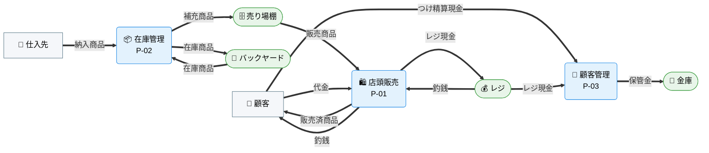
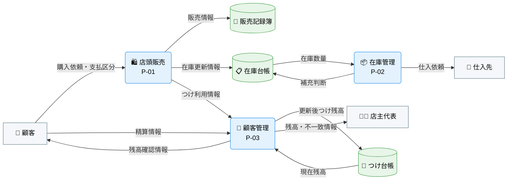
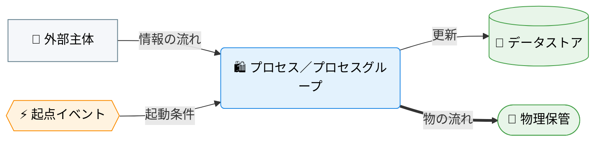

---
specdojo:
  id: specdojo:cdfd-overview-sample
  type: sample
  status: draft
  rulebook: specdojo:cdfd-overview-rulebook
  based_on: []
  supersedes: []
---

# 概念データフロー図（全体概要）: 駄菓子屋きぬや販売管理

本書は、駄菓子屋きぬやの店頭販売、在庫管理、顧客管理を、三つのプロセス領域と領域間の情報の流れとして定義する全体概要である。

## 1. 目的

店頭販売、在庫補充、つけ管理の三領域について、店主代表が対象境界を承認し、開発担当が領域別 CDFD へ詳細化するために使用する。対象者は、対象範囲を承認する店主代表、業務の受け渡しを整理する開発担当、領域分割の重複・欠落を確認する同行レビュー担当である。

## 2. 適用範囲

- 対象は、単一店舗での商品販売、在庫補充判断、常連顧客のつけ記録・精算に伴う情報の受け渡しである。
- 商品検索、在庫参照、残高参照は独立した業務成果を作らないため、各領域の入力確認を支える補助操作として扱う。
- 画面操作、データ項目、保存方式、例外経路、EC、複数店舗、本格会計、仕入先とのシステム連携は対象外とする。
- 店主と家族利用者の責任分担の原則は [[specdojo:prj-overview-sample|プロジェクト概要]] に従う。

## 3. プロセス領域

業務は三つのプロセス領域に分かれる。三領域の分割、領域 ID、領域間の受け渡しに関する規則は本書を正本とし、各領域内の詳細規則は対応する領域別 CDFD を正本とする。主要入力・主要出力・データストアは「個別プロセス領域入出力」、委譲境界は「委譲境界」に記載する。

<!-- prettier-ignore -->
| 領域 ID | プロセス領域 | 業務目的 | 主な担当 | 起点イベント | 領域別 CDFD |
| --- | --- | --- | --- | --- | --- |
| `P-01` | 販売記録 | 店頭販売を記録し、在庫管理とつけ管理へ同じ取引情報を引き渡す。 | 店主代表、家族利用者代表 | 顧客が商品を購入した | `cdfd-sales` |
| `P-02` | 在庫補充判断 | 販売後の在庫を確認し、欠品前に補充対象と数量を判断する。 | 店主代表 | 在庫が補充基準を下回った | `cdfd-inventory-replenishment` |
| `P-03` | つけ管理 | つけ利用と精算を記録し、店主と顧客が残高を確認できるようにする。 | 店主代表 | つけ払いまたはつけ精算が要求された | `cdfd-tab-management` |

## 4. 概念データフロー（概要）

一画面では領域間の受け渡しを追いにくいため、外部主体・物理保管に着目した現物の流れと、データストアに着目した情報の流れを図に分ける。両図でプロセス領域 ID・名称を統一する。

### 4.1. 外部主体と物理保管に着目した概要フロー

凡例: 角丸長方形はプロセス領域、スタジアム形は物理保管、四角は外部主体、`==>` は現物・現金の流れを表す。情報の流れはデータストアに着目した概要フロー（4.2）を参照する。色・絵文字の割り当ては「凡例（本プロダクト共通）」を参照する。

### 4.2. データストアに着目した概要フロー

凡例: 角丸長方形はプロセス領域（内訳は「プロセス領域」の一覧表を参照）、円柱はデータストア、四角は外部主体、`-->` は情報の流れを表す。表示ラベル先頭の絵文字は視認性向上のための任意の補助であり、形状・色による意味区別を置き換えない。現物の流れは外部主体と物理保管に着目した概要フロー（4.1）を参照する。色・絵文字の割り当ては「凡例（本プロダクト共通）」を参照する。

## 5. 個別プロセス領域入出力

### 5.1. 店頭販売（P-01）

顧客の購入を記録し、在庫管理とつけ管理へ同じ取引情報を引き渡す。P-01 単独で完結する領域である。

<!-- prettier-ignore -->
| 領域 ID | プロセス領域 | 主要入力 | 主要出力 | データストア |
| --- | --- | --- | --- | --- |
| `P-01` | 販売記録 | 購入依頼、商品情報、支払区分 | 販売情報、在庫更新情報、つけ利用情報 | 販売記録簿 |

### 5.2. 在庫管理（P-02）

販売後の在庫水準を確認し、欠品前に補充対象と数量を判断する。P-02 単独で完結する領域である。

<!-- prettier-ignore -->
| 領域 ID | プロセス領域 | 主要入力 | 主要出力 | データストア |
| --- | --- | --- | --- | --- |
| `P-02` | 在庫補充判断 | 在庫更新情報、在庫数量、商品情報 | 補充判断、仕入依頼 | 在庫台帳 |

### 5.3. 顧客管理（P-03）

つけ利用と精算を記録し、店主と顧客が残高を確認できるようにする。P-03 単独で完結する領域である。

<!-- prettier-ignore -->
| 領域 ID | プロセス領域 | 主要入力 | 主要出力 | データストア |
| --- | --- | --- | --- | --- |
| `P-03` | つけ管理 | つけ利用情報、精算情報、顧客情報 | 更新後つけ残高、残高確認情報 | つけ台帳 |

## 6. 委譲境界

各領域が対象外として他領域へ委ねる境界を示す。詳細化先は「プロセス領域」（3章）の領域別 CDFD 列を参照する。

<!-- prettier-ignore -->
| 領域 ID | プロセス領域 | 委譲境界 |
| --- | --- | --- |
| `P-01` | 販売記録 | 補充判断は `P-02`、つけ残高更新は `P-03` に委譲する。 |
| `P-02` | 在庫補充判断 | 販売記録は `P-01`、実際の入荷と支払は対象外とする。 |
| `P-03` | つけ管理 | 販売成立は `P-01`、本格会計処理は対象外とする。 |

## 7. 凡例（本プロダクト共通）

駄菓子屋きぬやの全 CDFD（本書および領域別 CDFD）が共通して参照するノード形状・色・絵文字の対応を示す。個々の CDFD は、以下の定義を再掲せず、本章への参照に留める。

<!-- prettier-ignore -->
| 概念 | 形状 | 色 | 絵文字例 |
| --- | --- | --- | --- |
| プロセス／プロセスグループ | 角丸長方形 | 青（`#e3f2fd` / `#1e88e5`） | 業務内容が伝わる絵文字（例: 🛍️） |
| 起点イベント | 六角形 | 橙（`#fff3e0` / `#fb8c00`） | 出来事が伝わる絵文字（例: ⚡） |
| データストア | 円柱 | 緑（`#e8f5e9` / `#43a047`） | 保管物が伝わる絵文字（例: 📒） |
| 物理保管 | スタジアム形 | 緑（データストアと同じ） | 保管場所が伝わる絵文字（例: 🏬） |
| 外部主体 | 四角 | グレー（`#f5f7fa` / `#607d8b`） | 主体が伝わる絵文字（例: 🧑） |
| 情報の流れ | ラベル付き `-->` | — | — |
| 物の流れ | ラベル付き `==>` | — | — |

ノード形状・線種そのものの記法は `specdojo:cdfd-mermaid-rulebook` に従う。本章は、その記法に基づき駄菓子屋きぬやが実際に採用する色・絵文字の割り当てを固定する。
