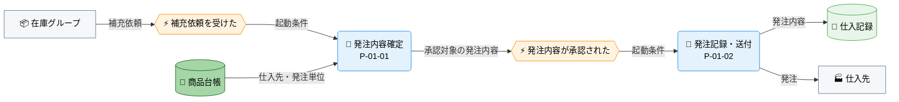
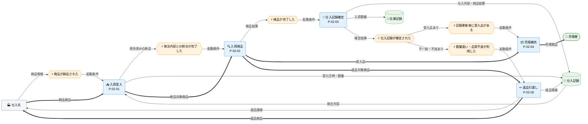

---
specdojo:
  id: specdojo:cdfd-sample
  type: sample
  status: ready
  rulebook: specdojo:cdfd-rulebook
  based_on:
    - specdojo:cdfd-overview-sample
  supersedes: []
---

# 概念データフロー図（プロセスグループ別）: 仕入

本書は、駄菓子屋きぬや販売管理の「仕入」グループ（[[specdojo:cdfd-overview-sample|概念データフロー図（全体概要）]] の `P-01`〜`P-02`）について、店主代表が補充依頼から発注、入荷検品、売場補充までの業務境界を承認し、開発担当と同行レビュー担当が領域内部と領域間のフロー、主要例外、グループ外への委譲を確認するための概念仕様である。product 成果物として作成する場合の ID は `cdfd-purchasing` とする。

## 1. 目的

- 店主代表は、仕入計画と入荷検品の責任境界、必須・条件付きプロセスの起動条件、発注・受入に関する主要例外を承認する。
- 開発担当は、`P-01` と `P-02` の受け渡し、各プロセスの入出力、データストアの読み書きを後続設計へ利用する。
- 同行レビュー担当は、対象グループの領域網羅、プロセス ID の所属、状態遷移の参照、在庫・販売グループへの委譲に重複や欠落がないことを確認する。

## 2. 適用範囲

- 対象グループは仕入であり、単一店舗の仕入計画（`P-01`）と入荷検品（`P-02`）を扱う。期間を限定せず、現行業務（AS-IS）の正本として、在庫グループから補充依頼を受けてから、発注し、納品された商品を検品して仕入記録と在庫記録を更新し、受入品を売場棚へ出すまでを対象とする。
- 対象組織は店主代表と家族利用者代表、外部主体は仕入先である。システム境界は商品台帳の参照と仕入記録・在庫記録の更新までとし、画面操作、物理項目、保存方式は対象外とする。
- 在庫数の算出と補充判断は `cdfd-inventory`、売場棚に出した後の店頭販売は `cdfd-sales`、在庫から仕入を経て販売へ至るグループ横断の順序は `cdfd-uc-replenishment` を参照する。
- 状態名・成立条件・状態遷移は、発注について `stsd-purchase`、商品について `stsd-product` を参照し、本書では状態を変えるプロセスと起動条件だけを扱う。
- 店主代表、家族利用者代表、システムの責任分担は [[specdojo:prj-overview-sample|プロジェクト概要]] に従う。発注数量、受入可否、返品の最終判断は店主代表が担い、家族利用者代表は店番業務を担い、システムは記録と照合を支援する。

## 3. プロセス領域

仕入グループは、全体概要で定めた仕入計画（`P-01`）と入荷検品（`P-02`）の二領域を引き継ぐ。領域 ID、名称、業務目的、主な担当、起点イベントは全体概要を正本とし、本章では領域内部の入出力とプロセスを定める。

### 3.1. 仕入計画（P-01）

在庫グループからの補充依頼を商品台帳の発注条件へ合わせ、店主代表が承認した発注内容を仕入先と後続の入荷検品へ引き渡す。

- **主要入力**: 在庫からの補充依頼、商品台帳の仕入先・発注単位
- **主要出力**: 仕入先への発注、仕入記録の発注内容
- **データストア**: 商品台帳、仕入記録

| プロセス ID | プロセス       | 業務目的                                                             | 主な担当 | 起動条件                         | 完了条件                                                             | 必須性 |
| ----------- | -------------- | -------------------------------------------------------------------- | -------- | -------------------------------- | -------------------------------------------------------------------- | ------ |
| `P-01-01`   | 発注内容確定   | 補充対象と数量を発注単位に合わせ、仕入先へ提示できる発注内容にする。 | 店主代表 | 在庫グループから補充依頼を受けた | 仕入先、商品、数量、発注単位が承認対象の発注内容として確定している。 | 必須   |
| `P-01-02`   | 発注記録・送付 | 承認済みの発注内容を記録し、仕入先へ発注する。                       | 店主代表 | 店主代表が発注内容を承認した     | 承認済み発注内容を仕入記録へ記録し、仕入先への送付を確認している。   | 必須   |

### 3.2. 入荷検品（P-02）

仕入先からの納品を発注内容へ対応付け、受入可否を判定して記録し、受入品を売場棚へ、返品対象を仕入先へ引き渡す。

- **主要入力**: 仕入先からの納品、仕入記録の発注内容
- **主要出力**: 売場棚へ出す商品、仕入記録、在庫記録の入荷数量、返品情報
- **データストア**: 仕入記録、在庫記録、売場棚

| プロセス ID | プロセス     | 業務目的                                                               | 主な担当                             | 起動条件                                               | 完了条件                                                                       | 必須性                                             |
| ----------- | ------------ | ---------------------------------------------------------------------- | ------------------------------------ | ------------------------------------------------------ | ------------------------------------------------------------------------------ | -------------------------------------------------- |
| `P-02-01`   | 入荷受入     | 納品と発注内容を対応付け、受入事実を記録して検品対象として受け付ける。 | 家族利用者代表（管理責任: 店主代表） | 仕入先から商品と納品情報を受け取った                   | 納品商品と一意な発注記録を対応付け、受入日時と数量を仕入記録で確認できる。     | 必須                                               |
| `P-02-02`   | 入荷検品     | 納品数量と品質を確認し、受入品と返品対象を判定する。                   | 家族利用者代表（管理責任: 店主代表） | 納品と発注内容の対応付けが完了した                     | 全検品対象を受入品または返品対象へ漏れなく分類し、理由を確認している。         | 必須                                               |
| `P-02-03`   | 仕入記録確定 | 検品結果と仕入内容を記録し、受入品の入荷数量を在庫記録へ反映する。     | 家族利用者代表（管理責任: 店主代表） | 検品が完了した                                         | 仕入記録を読み返して検品結果と一致し、受入品の入荷数量を在庫記録で確認できる。 | 必須                                               |
| `P-02-04`   | 売場補充     | 受入品を売場棚へ出し、販売グループが扱えるようにする。                 | 家族利用者代表（管理責任: 店主代表） | 仕入記録確定後に受入品がある                           | 全受入品を売場棚へ配置し、販売グループへ売場商品として引き渡せる。             | 条件付き（受入品がなければ起動せず返品後に完了）   |
| `P-02-05`   | 返品引渡し   | 受入不可の商品と返品情報を仕入先へ引き渡す。                           | 店主代表                             | 仕入記録確定後に検品で数量違いまたは品質不良が判明した | 返品対象商品を仕入先へ引き渡し、返品日と数量を仕入記録で確認できる。           | 条件付き（該当品がなければ起動せず売場補充へ進む） |

## 4. データストア

全体概要の「データストア」から、仕入グループが読み書きする行だけを同じ名称・区分で示す。各行は概念データフローの同名ノードと対応する。

### 4.1. マスタ・構成データ

| データストア | 読み書き | 本グループでの利用               |
| ------------ | -------- | -------------------------------- |
| 商品台帳     | 参照     | 仕入先、発注単位を発注判断に使う |

### 4.2. トランザクションデータ

| データストア | 読み書き   | 本グループでの利用                                     |
| ------------ | ---------- | ------------------------------------------------------ |
| 仕入記録     | 参照・更新 | 発注内容を記録し、入荷時の照合と返品情報の記録に使う   |
| 在庫記録     | 更新       | 受入品の入荷数量を反映し、売場補充前の在庫を確定する   |
| 売場棚       | 更新       | 受入品を現物として配置し、販売グループへ引き渡す保管先 |

## 5. 概念データフロー

領域ごとの起点と出力、および `P-01` から `P-02` へ渡す発注内容を追跡しやすくするため、仕入計画と入荷検品の二図に分ける。

### 5.1. 仕入計画（P-01）

凡例の形状・色・絵文字は全体概要の「凡例（本プロダクト共通）」を参照する。`-->` は情報の流れであり、本図は物の流れを扱わない。在庫グループは本グループ外の入力元で、内部プロセスを省略している。`P-01-02` が仕入記録へ保存した発注内容は、入荷検品の図にある同名データストアから参照する。

### 5.2. 入荷検品（P-02）

凡例の形状・色・絵文字は全体概要の「凡例（本プロダクト共通）」を参照する。`-->` は情報、`==>` は商品の流れを表す。仕入記録は仕入計画の図と同じデータストアである。仕入グループは仕入記録の確定と同じプロセスで受入品の入荷数量を在庫記録へ直接反映する。返品対象がなければ `P-02-05` は起動せず、受入品がなければ `P-02-04` は起動しない。仕入記録の確定後、受入品があれば売場補充、返品対象があれば返品引渡しを行い、該当する条件付き経路をすべて完了することでグループが正常完了する。

## 6. 個別プロセス主要入出力

### 6.1. 仕入計画（P-01）

補充依頼と商品台帳の発注条件から発注内容を確定し、仕入先と後続の入荷検品へ引き渡す処理を扱う。

| プロセス ID | プロセス       | 主要入力                   | 主要出力                       | データストア |
| ----------- | -------------- | -------------------------- | ------------------------------ | ------------ |
| `P-01-01`   | 発注内容確定   | 補充依頼、仕入先、発注単位 | 承認対象の発注内容             | 商品台帳     |
| `P-01-02`   | 発注記録・送付 | 承認済みの発注内容         | 仕入先への発注、発注内容の記録 | 仕入記録     |

### 6.2. 入荷検品（P-02）

納品を発注内容へ対応付け、検品結果に応じて受入品の記録と売場補充、または返品を行う処理を扱う。

| プロセス ID | プロセス     | 主要入力                       | 主要出力                                       | データストア       |
| ----------- | ------------ | ------------------------------ | ---------------------------------------------- | ------------------ |
| `P-02-01`   | 入荷受入     | 納品商品、納品情報、発注内容   | 照合済みの納品、検品対象商品、受入日時・数量   | 仕入記録           |
| `P-02-02`   | 入荷検品     | 検品対象商品、照合済みの納品   | 受入品、検品結果、返品対象                     | 仕入記録           |
| `P-02-03`   | 仕入記録確定 | 検品結果、受入品、返品対象     | 仕入内容、入荷数量、仕入記録の確定結果         | 仕入記録、在庫記録 |
| `P-02-04`   | 売場補充     | 受入品、仕入記録確定           | 売場商品                                       | 売場棚             |
| `P-02-05`   | 返品引渡し   | 返品対象商品、不一致・不良情報 | 返品商品、返品連絡、仕入記録に記録した返品情報 | 仕入記録           |

## 7. 状態遷移の参照

本書は次のプロセスを状態変化の契機として示すだけとし、状態名・成立条件・遷移元・遷移先・イベント・遷移条件は STSD を正本とする。

| 対象 | 状態を変えるプロセス                                                                                     | ステータス定義（STSD） |
| ---- | -------------------------------------------------------------------------------------------------------- | ---------------------- |
| 発注 | `P-01-02` 発注記録・送付                                                                                 | `stsd-purchase`        |
| 商品 | `P-02-01` 入荷受入、`P-02-02` 入荷検品、`P-02-03` 仕入記録確定、`P-02-04` 売場補充、`P-02-05` 返品引渡し | `stsd-product`         |

## 8. 主要例外とグループ外への委譲

### 8.1. 主要例外

| 例外 ID   | 対象プロセス | 検出条件                                                     | 停止範囲                                       | 本グループでの扱い                                                                                        | 継続・再開条件                                                                             |
| --------- | ------------ | ------------------------------------------------------------ | ---------------------------------------------- | --------------------------------------------------------------------------------------------------------- | ------------------------------------------------------------------------------------------ |
| `E-01-01` | `P-01-02`    | 発注送付後に仕入先から受注不可の回答を受けた                 | 当該発注の入荷受入と、確定数量の仕入先への再送 | 発注内容を未確定として店主代表へ戻し、在庫グループへ再検討が必要な数量を引き渡す                          | 店主代表が代替仕入先または数量を承認した後、`P-01-01` から再開する                         |
| `E-02-01` | `P-02-01`    | 納品情報から対応する発注内容を一意に特定できない             | 当該商品の入荷検品、記録更新、売場補充、返品   | 商品を検品へ渡さず、納品情報と候補となる発注内容を店主代表へ提示する                                      | 店主代表が対応する発注を確定した後、`P-02-01` から再開する                                 |
| `E-02-02` | `P-02-03`    | 仕入記録の更新結果を読み返して検品結果との一致を確認できない | 当該商品の在庫記録更新、売場補充、返品引渡し   | 未確定の仕入記録と検品済み商品を分けて保持し、一致を確認できるまで `P-02-03` の更新と読み返しを再試行する | 一致確認後は `P-02-03` で在庫記録を更新し、受入品は `P-02-04`、返品対象は `P-02-05` へ進む |

### 8.2. グループ外への委譲

| 委譲先                  | 委譲する事項                                         | 引き渡す情報                           | 本グループへ戻す条件                                         |
| ----------------------- | ---------------------------------------------------- | -------------------------------------- | ------------------------------------------------------------ |
| `cdfd-inventory`        | 在庫数の算出、補充基準との比較、補充対象・数量の判断 | 在庫記録、発注不可となった商品・数量   | 新規・修正済み補充依頼が仕入グループへ渡された               |
| `cdfd-sales`            | 売場棚の商品を用いた店頭販売                         | 売場商品                               | 販売後の在庫が補充基準を下回り、在庫グループが補充を依頼した |
| `cdfd-uc-replenishment` | 在庫・仕入・販売を横断する順序と引き渡し条件         | 補充依頼、発注結果、入荷数量、売場商品 | グループ間の引き渡し条件を変更する判断が生じた               |
