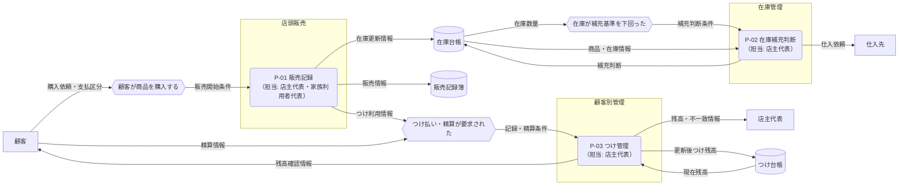

---
specdojo:
  id: specdojo:cdfd-sample
  type: sample
  status: draft
  rulebook: specdojo:cdfd-rulebook
  based_on: []
  supersedes: []
---

# 概念データフロー図（全体概要）: 駄菓子屋きぬや販売管理

販売、在庫補充、つけ管理の三領域について、店主代表と家族利用者代表が情報の受け渡しと領域別詳細化の境界を合意するための最小例である。

## 1. 目的と適用範囲

- 対象は、単一店舗での商品販売、在庫補充判断、常連顧客のつけ記録・精算である。
- 店主代表が対象範囲を承認し、開発担当が領域別 CDFD を作成するために使用する。
- TO-BE の情報の流れを扱い、商品の陳列・引き渡し、現金保管など現物の流れは対象外とする。
- EC、複数店舗、本格会計、仕入先とのシステム連携、画面操作、データ項目定義は対象外とする。

## 2. プロセス領域一覧

<!-- prettier-ignore -->
| 領域 ID | プロセス領域 | 業務目的 | 主な担当 | 起点イベント | 主要入力 | 主要出力 | データストア | 領域別 CDFD |
| --- | --- | --- | --- | --- | --- | --- | --- | --- |
| `P-01` | 販売記録 | 店頭販売を記録し、在庫とつけ管理へ同じ取引情報を引き渡す。 | 店主代表、家族利用者代表 | 顧客が商品を購入する | 購入依頼、商品情報、支払区分 | 販売情報、在庫更新情報、つけ利用情報 | 販売記録簿 | `cdfd-sales` |
| `P-02` | 在庫補充判断 | 販売後の在庫を確認し、欠品前に補充対象と数量を判断する。 | 店主代表 | 在庫が補充基準を下回った | 在庫更新情報、在庫数量、商品情報 | 補充判断、仕入依頼 | 在庫台帳 | `cdfd-inventory-replenishment` |
| `P-03` | つけ管理 | つけ利用と精算を記録し、店主と顧客が残高を確認できるようにする。 | 店主代表 | つけ払いまたはつけ精算が要求された | つけ利用情報、精算情報、顧客情報 | 更新後つけ残高、残高確認情報 | つけ台帳 | `cdfd-tab-management` |

## 3. 概念データフロー

凡例: 角丸長方形はプロセス領域、六角形は起点イベント、円柱はデータストア、四角は外部主体、`-->` は情報の流れを表す。本図は現物の流れを対象外とする。

## 4. 境界と分割方針

| 区分       | 判定                                                             | 扱い                                                         |
| ---------- | ---------------------------------------------------------------- | ------------------------------------------------------------ |
| 独立領域   | 販売記録、補充判断、つけ残高更新という異なる業務成果を持つ       | `P-01`〜`P-03` として分け、各一つの領域別 CDFD へ詳細化する  |
| 補助操作   | 商品検索、在庫参照、残高参照は、単独では記録や判断結果を作らない | 対応領域の入力確認として扱い、独立した領域別 CDFD を作らない |
| 現物の流れ | 商品の陳列・引き渡しと現金保管は、今回の情報管理範囲を越える     | 本図から除外し、店舗業務全体を分析する場合に別の CDFD で扱う |
| 実装詳細   | 画面、データ項目、保存方式、外部連携方式は概念境界の合意に不要   | UI、データ仕様、外部インターフェース仕様へ委譲する           |

| 領域 ID | 詳細化先                       | 境界                                                             |
| ------- | ------------------------------ | ---------------------------------------------------------------- |
| `P-01`  | `cdfd-sales`                   | 販売成立と取引情報の引き渡しまで。補充判断と残高更新は含めない   |
| `P-02`  | `cdfd-inventory-replenishment` | 在庫数量の確認から仕入依頼まで。販売記録と実際の入荷は含めない   |
| `P-03`  | `cdfd-tab-management`          | つけ利用・精算の記録と残高通知まで。販売成立と会計処理は含めない |
