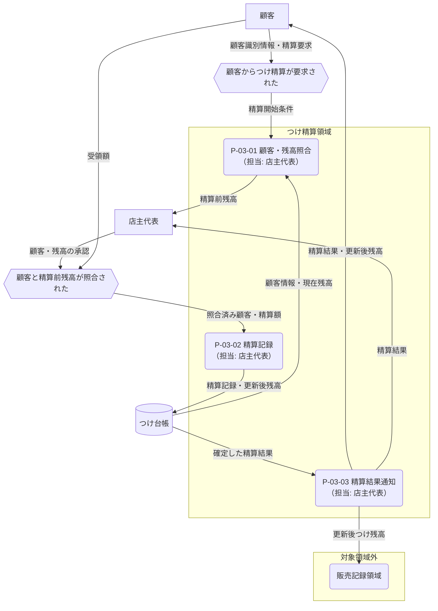

---
specdojo:
  id: specdojo:cdfd-sample
  type: sample
  status: draft
  rulebook: specdojo:cdfd-rulebook
  based_on: []
  supersedes: []
---

# 概念データフロー図（領域別）: つけ精算

本書は、駄菓子屋きぬや販売管理の「つけ精算」領域について、店主代表が精算の対象境界を承認し、開発担当と同行レビュー担当が領域内フロー、主要例外、販売記録領域への委譲を確認するための TO-BE CDFD である。

## 1. 目的と適用範囲

- 対象者は、業務境界と残高変更を承認する店主代表、後続設計に使う開発担当、主要例外を確認する同行レビュー担当である。
- 対象は、常連顧客からつけ精算を受け付けてから、顧客と現在残高を照合し、精算を記録して結果を通知するまでである。
- 顧客照合、精算記録、結果通知は必須とする。残高全額ではなく一部だけを精算する場合も、同じ三プロセスを通る。
- 新しいつけ利用を伴う販売記録、会計処理、現金保管、画面操作、データ項目と保存方式は対象外とする。
- 店主代表が残高差異と精算可否を最終判断し、システムは顧客・残高の照合、記録、通知を支援する。

## 2. 領域内プロセス一覧

<!-- prettier-ignore -->
| プロセス ID | プロセス | 業務目的 | 主な担当 | 起動条件 | 主要入力 | 主要出力・生成先 | 正本・データストア | 必須性 |
| --- | --- | --- | --- | --- | --- | --- | --- | --- |
| `P-03-01` | 顧客・残高照合 | 精算対象の顧客と記録上の残高を特定し、店主代表と顧客が同じ金額を確認できるようにする。 | 店主代表 | 顧客からつけ精算が要求された | 顧客識別情報、現在のつけ残高 | 照合済み顧客、精算前残高 → 精算記録 | つけ台帳 | 必須 |
| `P-03-02` | 精算記録 | 受領額を残高へ反映し、つけ残高の正本を更新する。 | 店主代表 | 顧客と精算前残高が照合され、精算額が承認された | 照合済み顧客、精算前残高、受領額 | 精算記録、更新後残高 → つけ台帳 | つけ台帳 | 必須 |
| `P-03-03` | 精算結果通知 | 顧客と店主代表が更新結果を確認し、後続の販売時に同じ残高を参照できるようにする。 | 店主代表 | 精算記録が確定した | 精算記録、更新後残高 | 精算結果 → 顧客、更新後残高 → `cdfd-sales` | つけ台帳 | 必須 |

## 3. 概念データフロー

凡例: 角丸長方形は一つのプロセス、六角形は起点・承認イベント、円柱はデータストア、四角は外部主体、`-->` は情報の流れを表す。販売記録領域は委譲先だけを示し、内部処理は対象外とする。本図は現金の受け渡しなど現物の流れを扱わない。

## 4. 主要例外と領域外への委譲

### 4.1. 主要例外

| 例外 ID | 対象プロセス | 検出条件                                                           | 本領域での扱い                                                   | 継続・引き渡し条件                                                                    |
| ------- | ------------ | ------------------------------------------------------------------ | ---------------------------------------------------------------- | ------------------------------------------------------------------------------------- |
| `E-01`  | `P-03-01`    | 顧客を特定できない、または顧客が認識する残高とつけ台帳が一致しない | 精算記録を起動せず、店主代表へ差異の内容を提示する               | 店主代表が対象顧客と精算前残高を確認し、照合結果を承認した後に `P-03-01` から再開する |
| `E-02`  | `P-03-02`    | 受領額が0以下、または精算前残高を上回る                            | つけ台帳を更新せず、受領額の再確認を求める                       | 0より大きく精算前残高以下の受領額が承認された後に `P-03-02` から再開する              |
| `E-03`  | `P-03-02`    | 精算記録または更新後残高をつけ台帳へ確定できない                   | 顧客へ完了を通知せず、未確定の精算結果と再開位置を店主代表へ示す | つけ台帳への記録が成功し、更新後残高を読み返せた後に `P-03-02` から再開する           |

### 4.2. 領域外への委譲

| 委譲先         | 委譲する事項                                     | 引き渡す情報                 | 本領域へ戻す条件                                       |
| -------------- | ------------------------------------------------ | ---------------------------- | ------------------------------------------------------ |
| `cdfd-sales`   | 新しいつけ利用を伴う販売記録と、販売時の残高参照 | 更新後つけ残高、精算確定時点 | 販売処理で参照した残高とつけ台帳の確定残高に差異がある |
| 会計処理       | 売上・入金の会計上の仕訳と集計                   | 精算額、精算確定時点         | 会計上の差異がつけ残高の誤りに起因すると判明する       |
| 店舗の現金管理 | 受領した現金の保管、釣銭、締め作業               | 受領額、精算結果             | 現金実績と精算記録の差異がある                         |

### 4.3. 受入確認

| 確認者           | 確認対象       | 受入条件                                                                           |
| ---------------- | -------------- | ---------------------------------------------------------------------------------- |
| 店主代表         | 業務境界と判断 | 顧客・残高照合、精算記録、結果通知の範囲と、残高差異時の判断責任を承認できる       |
| 開発担当         | 設計入力       | 各プロセスの起動条件、入出力、つけ台帳の更新、販売記録領域への引き渡しを識別できる |
| 同行レビュー担当 | 主要例外       | 顧客・残高不一致、不正な受領額、記録失敗の停止範囲と再開条件を確認できる           |
