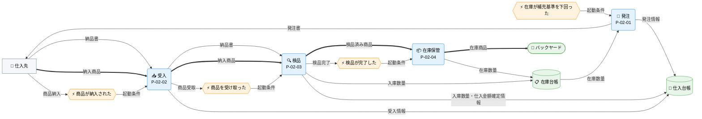
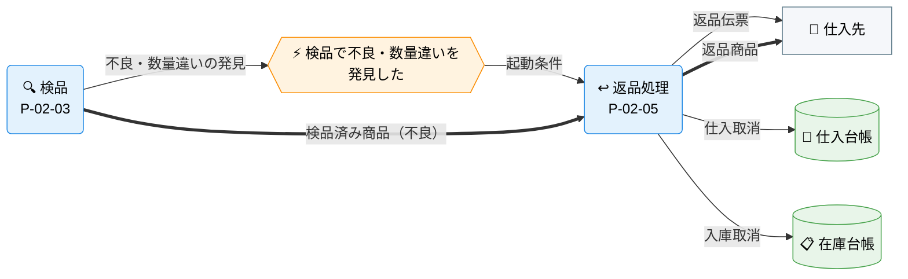

---
specdojo:
  id: specdojo:cdfd-sample
  type: sample
  status: draft
  rulebook: specdojo:cdfd-rulebook
  based_on:
    - specdojo:cdfd-overview-sample
  supersedes: []
---

# 概念データフロー図（領域別）: 在庫補充判断

本書は、駄菓子屋きぬや販売管理の「在庫補充判断」領域（[[specdojo:cdfd-overview-sample]] の `P-02`）について、店主代表が発注・検品・返品の業務境界を承認し、開発担当と同行レビュー担当が領域内フロー、主要例外、店頭販売領域への委譲を確認するための概念仕様である。

## 1. 目的

- 対象者は、業務境界と発注・返品の判断を承認する店主代表、後続設計に使う開発担当、主要例外を確認する同行レビュー担当である。
- 店主代表は起動条件と必須・条件付きの境界を、開発担当は入出力と正本を、同行レビュー担当は主要例外の停止範囲と再開条件を、それぞれ本書から確認する。

## 2. 適用範囲

- 対象は、在庫が補充基準を下回ってから、仕入先へ発注し、納品を受け入れて検品し、正常品を在庫として計上するまでである。検品で不良・数量違いが判明した場合の返品処理も対象に含む。
- 発注、受入、検品、在庫保管は必須とする。返品処理は検品で不良・数量違いを発見した場合にだけ起動する条件付きプロセスとする。
- 補充後の店頭販売、仕入先との契約・支払条件、仕入・返品に伴う会計処理、画面操作、データ項目と保存方式は対象外とする。
- 店主と家族利用者の責任分担の原則は [[specdojo:prj-overview-sample|プロジェクト概要]] に従う。

## 3. 領域内プロセス一覧

| プロセス ID | プロセス | 業務目的                                                               | 主な担当 | 起動条件                       | 必須性   |
| ----------- | -------- | ---------------------------------------------------------------------- | -------- | ------------------------------ | -------- |
| `P-02-01`   | 発注     | 在庫不足を検知し、必要な品目・数量を判断して仕入先へ注文する。         | 店主代表 | 在庫が補充基準を下回った       | 必須     |
| `P-02-02`   | 受入     | 仕入先からの納品物を受け取り、検品対象として引き渡す。                 | 店主代表 | 商品が納入された               | 必須     |
| `P-02-03`   | 検品     | 数量・品質を確認し、正常品は在庫保管へ、不良品は返品処理へ振り分ける。 | 店主代表 | 商品を受け取った               | 必須     |
| `P-02-04`   | 在庫保管 | 検品済み商品をバックヤードへ保管し、在庫台帳を更新する。               | 店主代表 | 検品が完了した                 | 必須     |
| `P-02-05`   | 返品処理 | 不良・数量違いの商品を仕入先へ返送し、仕入・在庫記録を取り消す。       | 店主代表 | 検品で不良・数量違いを発見した | 条件付き |

## 4. 概念データフロー

在庫が補充基準を下回ってから在庫計上に至る正常系と、検品結果に応じて起動する返品処理では性質が異なるため、フローを二図に分ける。

### 4.1. 必須プロセスのフロー

凡例: 色・絵文字の割り当ては [[specdojo:cdfd-overview-sample]] の「凡例（本プロダクト共通）」を参照する。

### 4.2. 条件付きプロセスのフロー

凡例: 検品（`P-02-03`）は必須プロセスのフロー（4.1）と同一のプロセスを指す。色・絵文字の割り当ては [[specdojo:cdfd-overview-sample]] の「凡例（本プロダクト共通）」を参照する。

## 5. 個別プロセス主要入出力

### 5.1. 必須プロセス（P-02-01〜P-02-04）

在庫補充のうち常に実行される、発注から在庫計上までの一連の処理を扱う。

| プロセス ID | プロセス | 主要入力           | 主要出力                                 | データストア       |
| ----------- | -------- | ------------------ | ---------------------------------------- | ------------------ |
| `P-02-01`   | 発注     | 在庫数量、商品情報 | 発注情報、発注書                         | 在庫台帳、仕入台帳 |
| `P-02-02`   | 受入     | 納入商品、納品書   | 受入情報                                 | 仕入台帳           |
| `P-02-03`   | 検品     | 納入商品、納品書   | 検品済み商品、入庫数量・仕入金額確定情報 | 仕入台帳、在庫台帳 |
| `P-02-04`   | 在庫保管 | 検品済み商品       | 在庫商品、在庫数量                       | 在庫台帳           |

### 5.2. 条件付きプロセス（P-02-05）

検品で不良・数量違いが判明した場合にだけ実行される返品処理を扱う。

| プロセス ID | プロセス | 主要入力                       | 主要出力           | データストア       |
| ----------- | -------- | ------------------------------ | ------------------ | ------------------ |
| `P-02-05`   | 返品処理 | 検品済み商品（不良）、検品結果 | 返品商品、返品伝票 | 仕入台帳、在庫台帳 |

## 6. 主要例外と領域外への委譲

### 6.1. 主要例外

| 例外 ID | 対象プロセス | 検出条件                                                       | 本領域での扱い                                                               | 継続・再開条件                                                                     |
| ------- | ------------ | -------------------------------------------------------------- | ---------------------------------------------------------------------------- | ---------------------------------------------------------------------------------- |
| `E-01`  | `P-02-01`    | 発注書送付後、仕入先から受注不可の回答があった                 | 発注情報を確定せず、代替仕入先または数量の検討を店主代表へ促す               | 店主代表が代替仕入先または数量を承認した後に `P-02-01` から再開する                |
| `E-02`  | `P-02-03`    | 納品物の数量が発注情報と一致しない、または品質基準を満たさない | 在庫保管を起動せず、不一致点を `P-02-05`（返品処理）の判断材料として提示する | 店主代表が受入可否を判断し、正常品と不良品を切り分けた後に該当プロセスから再開する |
| `E-03`  | `P-02-04`    | 在庫台帳への入庫数量の反映が失敗する                           | 在庫商品をバックヤードへ計上せず、未確定の入庫内容を店主代表へ示す           | 在庫台帳への記録が成功し、入庫数量を読み返せた後に `P-02-04` から再開する          |

### 6.2. 領域外への委譲

| 委譲先             | 委譲する事項                                 | 引き渡す情報                 | 本領域へ戻す条件                                       |
| ------------------ | -------------------------------------------- | ---------------------------- | ------------------------------------------------------ |
| `cdfd-sales`       | 補充後の商品の店頭販売と、販売に伴う在庫更新 | 在庫商品、在庫数量           | 在庫が再び補充基準を下回った                           |
| 仕入先との契約管理 | 仕入先の選定基準、支払条件、契約更新         | 発注情報、受入情報           | 契約条件の変更が発注・受入の手順に影響する             |
| 会計処理           | 仕入・返品に伴う会計上の仕訳                 | 発注情報、受入情報、返品伝票 | 会計上の差異が仕入・返品記録の誤りに起因すると判明する |
