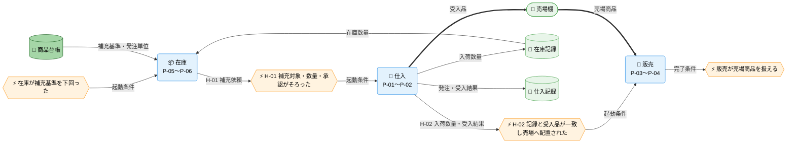

---
specdojo:
  id: specdojo:cdfd-uc-sample
  type: sample
  status: draft
  rulebook: specdojo:cdfd-uc-rulebook
  based_on:
    - specdojo:cdfd-overview-sample
  supersedes: []
  grade:
    rubric: grade-rubric-v1
    target: kata
    verdict: pass
    score: 100
    graded_at: "2026-09-18T08:14:11.571Z"
    graded_by: gemma-expert-executor
    content_hash: db28c06e55225a29757047136e3047a3aec5a2049671781b12e1646a40cd53ba
    categories:
      consistency: { score: 100 }
      usability: { score: 100 }
      architecture: { score: 100 }
      quality: { score: 100 }
    viewpoints:
      vp-arc-cross-document-consistency: { level: 4, score: 100 }
      vp-arc-conciseness: { level: 4, score: 100 }
      vp-arc-single-responsibility: { level: 4, score: 100 }
      vp-qe-verifiability: { level: 4, score: 100 }
      vp-qe-omissions-consistency: { level: 4, score: 100 }
      vp-qe-kata-conformance: { level: 4, score: 100 }
      vp-ux-readability: { level: 4, score: 100 }
      vp-ux-language-consistency: { level: 4, score: 100 }
      vp-arc-document-structure: { level: 4, score: 100 }
    findings: { blocker: 0, major: 0, minor: 0, note: 0 }
---

# 概念データフロー図（ユースケース別）: 欠品から補充まで

本書は、[[specdojo:cdfd-overview-sample|概念データフロー図（全体概要）]] のケース `C-02`「欠品から補充まで」について、在庫、仕入、販売の順序と、グループ間の引き渡し条件を定める概念仕様である。product 成果物として作成する場合の ID は `cdfd-uc-replenishment` とする。

## 1. 目的

- 店主代表は、欠品を検知してから売場で販売可能になるまでのグループ順序、引き渡し条件、条件不成立時の戻り先を承認する。
- 開発担当は、在庫・仕入・販売の境界で受け渡す補充依頼、入荷数量、売場商品を後続設計の入力として利用する。
- 同行レビュー担当は、ケース `C-02` の参加グループ、引き渡し、戻り経路に重複・欠落がなく、各グループの内部処理を再掲していないことを確認する。

## 2. 適用範囲

- ケースは `C-02`「欠品から補充まで」であり、在庫の補充判断、仕入への依頼、発注・入荷を経た売場補充、販売による売場商品の引き受けまでの責任境界を扱う。
- 開始イベントは、在庫記録の数量が商品台帳の補充基準を下回ったことである。終了条件は、受入品が売場棚へ配置され、販売グループが販売対象として扱えることである。
- 正常系は在庫（`P-05`〜`P-06`）→ 仕入（`P-01`〜`P-02`）→ 販売（`P-03`〜`P-04`）の三グループを横断する。単一店舗の店主代表と店番担当を対象組織とし、仕入先は各グループ内部の外部主体として本書では展開しない。
- システム境界は、補充依頼、発注・受入結果、入荷数量の記録確認と、売場商品の引き渡しまでである。画面操作、保存方式、仕入先との通信方式は対象外とする。
- 在庫計算と補充判断の内部は `cdfd-inventory`、発注と入荷検品の内部は `cdfd-purchasing`、店頭販売の内部は `cdfd-sales` を正本とし、本書では内部プロセスと内部例外を再掲しない。
- 商品の状態名・成立条件・遷移元・遷移先・イベント・遷移条件は `stsd-product` を正本とし、本書では定義しない。
- 店主代表、店番担当、システムの責任分担は [[specdojo:prj-overview-sample|プロジェクト概要]] に従う。補充数量、発注、受入可否の最終判断は店主代表が担い、システムは記録と照合を支援する。

## 3. プロセス領域

ケース `C-02` は在庫、仕入、販売の三つのプロセスグループを正常系の順序で横断する。グループ名、含む領域、業務目的は全体概要を正本とし、本章では各グループが欠品から補充までで担う役割を定める。

### 3.1. 在庫（P-05〜P-06）

補充基準を下回った商品を特定して補充対象と数量を確定し、店主代表の承認を得た補充依頼を仕入へ渡す。

- **主要入力**: 商品台帳の補充基準・発注単位、在庫記録の在庫数量
- **主要出力**: 補充対象の商品・数量・補充判断
- **データストア**: 商品台帳、在庫記録

| 順序 | プロセスグループ | 含む領域       | 横断上の役割                                                                 | 参照先           |
| ---- | ---------------- | -------------- | ---------------------------------------------------------------------------- | ---------------- |
| 1    | 在庫             | `P-05`〜`P-06` | 補充基準を下回った商品について補充対象と数量を確定し、仕入へ補充依頼を渡す。 | `cdfd-inventory` |

### 3.2. 仕入（P-01〜P-02）

補充依頼を受けて発注・入荷を行い、受入結果と入荷数量を記録して受入品を売場へ渡す。

- **主要入力**: 補充対象の商品・数量・補充判断
- **主要出力**: 受入品、入荷数量、受入結果、売場への配置
- **データストア**: 仕入記録、在庫記録、売場棚

| 順序 | プロセスグループ | 含む領域       | 横断上の役割                                                     | 参照先            |
| ---- | ---------------- | -------------- | ---------------------------------------------------------------- | ----------------- |
| 2    | 仕入             | `P-01`〜`P-02` | 補充依頼を受け、受入結果と入荷数量を記録し、受入品を売場へ渡す。 | `cdfd-purchasing` |

### 3.3. 販売（P-03〜P-04）

売場棚へ配置された受入品を販売対象として引き受け、店頭販売で利用できる状態にする。

- **主要入力**: 受入品、入荷数量、受入結果、売場への配置
- **主要出力**: 販売対象として引き受けた売場商品
- **データストア**: 売場棚

| 順序 | プロセスグループ | 含む領域       | 横断上の役割                                         | 参照先       |
| ---- | ---------------- | -------------- | ---------------------------------------------------- | ------------ |
| 3    | 販売             | `P-03`〜`P-04` | 売場棚へ配置された受入品を販売対象として引き受ける。 | `cdfd-sales` |

## 4. データストア

全体概要の「データストア」から、`H-01`・`H-02` で引き渡す情報または引き渡し条件の判定に使う行だけを同じ名称・区分で示す。各行は概念データフローの同名ノードと対応する。

### 4.1. マスタ・構成データ

| データストア | 関連引き渡し | 横断上の利用                       |
| ------------ | ------------ | ---------------------------------- |
| 商品台帳     | `H-01`       | 補充基準と発注単位の判定根拠にする |

### 4.2. トランザクションデータ

| データストア | 関連引き渡し   | 横断上の利用                                     |
| ------------ | -------------- | ------------------------------------------------ |
| 在庫記録     | `H-01`、`H-02` | 補充対象の判定と入荷数量の引き渡しを確認する     |
| 仕入記録     | `H-02`         | 発注・受入結果が確定したことを確認する           |
| 売場棚       | `H-02`         | 受入品の現物が販売グループへ渡ったことを確認する |

## 5. 概念データフロー

開始イベントから在庫、仕入、販売へ進む正常系と、`H-01`・`H-02` の成立条件を一図で示す。各角丸長方形は一つのプロセスグループを表す。

凡例の形状・色・絵文字は全体概要の「凡例（本プロダクト共通）」を参照する。`-->` は情報、`==>` は商品の流れを表す。各グループ内部の在庫計算、補充判断、発注、入荷検品、売場補充、店頭販売は省略し、三つの代表ノードだけを置く。商品台帳と在庫記録は `H-01`、仕入記録と売場棚は `H-02` の成立を確認する正本として必要なため図へ置いている。

## 6. 引き渡し

| 引き渡し ID | 送り元グループ | 受け側グループ | 引き渡す情報                             | 引き渡し条件                                                                                   | 戻す条件                                                                         |
| ----------- | -------------- | -------------- | ---------------------------------------- | ---------------------------------------------------------------------------------------------- | -------------------------------------------------------------------------------- |
| `H-01`      | 在庫           | 仕入           | 補充対象の商品、数量、補充判断           | 商品を商品台帳で一意に特定でき、補充数量が発注単位で示され、店主代表が補充判断を承認している。 | 商品を特定できない、数量がない、発注単位に合わない、または承認を確認できない。   |
| `H-02`      | 仕入           | 販売           | 受入品、入荷数量、受入結果、売場への配置 | 入荷数量と受入結果が記録され、受入品と記録が一致し、受入品が売場棚へ配置されている。           | 記録と受入品が一致しない、受入結果が確定していない、または売場棚に受入品がない。 |

## 7. 例外時の戻り先

| 対象引き渡し | 条件不成立                                                                                       | 戻り先グループ | 戻す情報                                                 | 再開条件                                                                                     |
| ------------ | ------------------------------------------------------------------------------------------------ | -------------- | -------------------------------------------------------- | -------------------------------------------------------------------------------------------- |
| `H-01`       | 商品を一意に特定できない、数量または発注単位が不足している、または店主代表の承認を確認できない。 | 在庫           | 不足項目、商品候補、現在庫、補充基準                     | 商品と発注単位に合う数量を確定し、店主代表が修正後の補充依頼を承認して `H-01` を再提示した。 |
| `H-02`       | 入荷数量・受入結果と受入品が一致しない、受入結果が未確定、または受入品が売場棚にない。           | 仕入           | 記録と受入品の差異、未確定の受入結果、売場棚への配置状況 | 記録と受入品が一致し、受入結果の確定と売場棚への配置を確認して `H-02` を再提示した。         |
