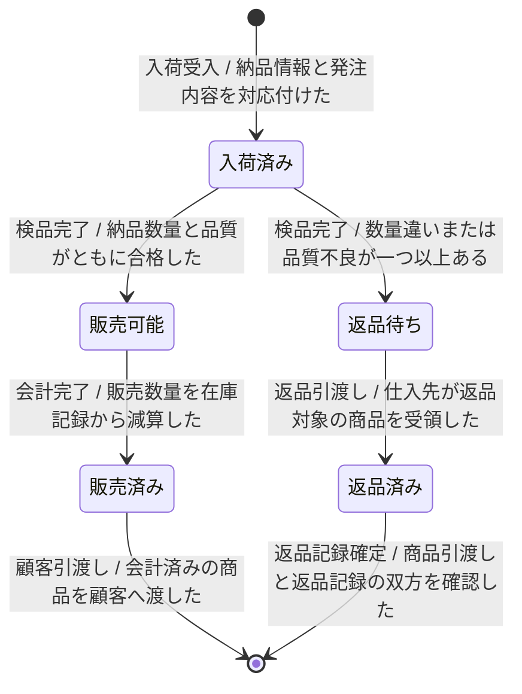

---
specdojo:
  id: specdojo:stsd-sample
  type: sample
  status: draft
  rulebook: specdojo:stsd-rulebook
  based_on:
    - specdojo:sample-authoring-standard
  grade:
    rubric: grade-rubric-v1
    target: kata
    verdict: needs-work
    score: 64
    graded_at: "2026-09-18T08:57:58.790Z"
    graded_by: codex-expert-executor
    content_hash: e91d3b81fa24210e7d9b6c01266f4fbccde939a9b925f6c69186345e44dcecc9
    categories:
      consistency: { score: 50 }
      usability: { score: 67 }
      architecture: { score: 100 }
      quality: { score: 50 }
    viewpoints:
      vp-arc-cross-document-consistency: { level: 2, score: 50 }
      vp-arc-conciseness: { level: 4, score: 100 }
      vp-arc-single-responsibility: { level: 4, score: 100 }
      vp-qe-verifiability: { level: 2, score: 50 }
      vp-qe-omissions-consistency: { level: 2, score: 50 }
      vp-qe-kata-conformance: { level: 2, score: 50 }
      vp-ux-readability: { level: 2, score: 50 }
      vp-ux-language-consistency: { level: 2, score: 50 }
      vp-arc-document-structure: { level: 4, score: 100 }
    findings: { blocker: 0, major: 6, minor: 4, note: 0 }
---

# 商品のステータス定義

<!-- specdojo:finding id=F002 severity=minor rule=vp-arc-cross-document-consistency line=3 共通 sample 文脈とプロジェクト概要では「家族利用者代表」「同行レビュー担当」を正式な役割名としているが、本書は未定義の「店番担当」「品質確認担当」を使用しているため、正式名へ統一するか対応関係を明記する必要がある。 -->
<!-- specdojo:finding id=F010 severity=minor rule=vp-ux-language-consistency line=3 「店番担当」「品質確認担当」は共通 sample 文脈で定義された「家族利用者代表」「同行レビュー担当」との対応が示されていないため、正式な役割名へ統一するか用語対応を説明する必要がある。 -->
駄菓子屋きぬやの商品について、納品から販売または返品までの状態と遷移を定義する。店主代表と店番担当は仕入記録と在庫記録から現在状態を判定し、開発担当と品質確認担当は状態変更の設計・検証に利用する。

## 1. 概要

<!-- specdojo:finding id=F006 severity=minor rule=vp-qe-omissions-consistency line=9 概要は状態の正本を仕入記録と在庫記録に限定しているが、`販売済み` の管理場所は販売記録であるため、概要へ販売記録を追加するか販売済みを判定できる別の正本へ統一する必要がある。 -->
- 対象: 店舗が仕入先へ発注し、納品を受けた商品
- スコープ: 現行業務（AS-IS）の入荷受入、検品、売場補充、販売、返品
- 状態の正本: 仕入記録と在庫記録。現物の配置は売場棚または返品保管箱で確認する

## 2. 状態一覧

<!-- specdojo:finding id=F003 severity=major rule=vp-qe-verifiability line=17 `販売済み` は意味上すでに顧客へ引き渡した状態、`返品済み` は意味上すでに返品記録まで更新した状態だが、T-06 と T-07 がそれらを各状態への遷移後に行うため、状態名・意味を中間状態へ変更するか顧客引渡しと返品記録確定を各状態への進入条件へ統合する必要がある。 -->
<!-- specdojo:finding id=F004 severity=minor rule=vp-qe-verifiability line=16 `販売可能` の成立条件は在庫数量への反映を要求する一方、T-02 の条件は検品合格だけで在庫更新を補足欄の処理としているため、在庫更新前後のどちらで状態が成立するかを遷移条件として明示する必要がある。 -->
<!-- specdojo:finding id=F007 severity=major rule=vp-qe-kata-conformance line=17 rulebook は状態一覧の成立条件で現在状態を判定し、図と遷移説明を一致させる完成例を要求しているが、`販売済み` と `返品済み` は各行で完了済みとする事実を T-06・T-07 で後から実行しているため、一覧と遷移を同じ状態境界へ修正する必要がある。 -->
<!-- specdojo:finding id=F008 severity=major rule=vp-ux-readability line=17 `販売済み` の説明では顧客引渡し済みと読めるのに T-06 がその後に顧客引渡しを行い、`返品済み` も同様に記録確定前後の位置が逆転しているため、中間状態を明示するか完了イベントを状態への進入遷移へまとめて時系列を一意に読めるようにする必要がある。 -->
<!-- specdojo:finding id=F009 severity=major rule=vp-ux-language-consistency line=17 `販売済み` と `返品済み` が状態一覧では引渡し・記録まで完了した状態を指す一方、遷移図ではそれらの完了前の状態名として使われているため、状態名と意味を各遷移段階で一貫する用語へ変更する必要がある。 -->
| 値             | 状態名   | 通称     | 意味                                         | 成立条件                                               | 管理場所             |
| -------------- | -------- | -------- | -------------------------------------------- | ------------------------------------------------------ | -------------------- |
| received       | 入荷済み | 入った品 | 店舗が納品を受け、検品結果が未確定の商品     | 納品情報を発注内容へ照合し、店舗で商品を受け取った     | 仕入記録、検品場所   |
| sellable       | 販売可能 | 売れる品 | 検品に合格し、店頭販売できる商品             | 数量と品質の検品結果が合格で、在庫数量へ反映された     | 在庫記録、売場棚     |
| sold           | 販売済み | 売れた品 | 会計を終え、店舗在庫から顧客へ引き渡した商品 | 会計が完了し、販売数量を在庫記録から減算した           | 販売記録             |
| return-pending | 返品待ち | 返す品   | 数量違いまたは品質不良により受入不可の商品   | 検品結果が不合格で、返品対象として仕入記録へ記録された | 仕入記録、返品保管箱 |
| returned       | 返品済み | 返した品 | 仕入先へ返却し、店舗の管理対象から外れた商品 | 仕入先への商品の引き渡しと返品記録の更新が完了した     | 仕入記録             |

## 3. 状態遷移図

<!-- specdojo:finding id=F001 severity=major rule=vp-arc-cross-document-consistency line=26 関連 CDFD は `P-02-04` 売場補充を商品の状態を変えるプロセスとし、販売グループが扱えるのは売場配置後と定義しているが、本書は `検品完了` の時点で販売可能へ遷移して売場補充の遷移を持たないため、状態境界を売場補充に合わせるか関連 CDFD 側の定義を修正する必要がある。 -->
<!-- specdojo:finding id=F005 severity=major rule=vp-qe-omissions-consistency line=26 スコープに売場補充を含み、関連 CDFD が売場補充を販売グループへの引渡し条件としているのに、状態遷移には売場補充の完了を表すイベントまたは条件がなく、検品合格直後の商品と売場配置済みの商品を区別できないため、販売可能への遷移へ売場補充の完了条件を追加する必要がある。 -->

## 4. 遷移の説明

| 遷移 ID | 遷移元   | 遷移先   | イベント     | 条件                                 | 補足                                           |
| ------- | -------- | -------- | ------------ | ------------------------------------ | ---------------------------------------------- |
| `T-01`  | 開始     | 入荷済み | 入荷受入     | 納品情報と発注内容を対応付けた       | 仕入記録へ受入日時と数量を記録する             |
| `T-02`  | 入荷済み | 販売可能 | 検品完了     | 納品数量と品質がともに合格した       | 在庫記録を更新し、売場棚へ配置できる           |
| `T-03`  | 入荷済み | 返品待ち | 検品完了     | 数量違いまたは品質不良が一つ以上ある | 受入品と返品対象を分け、返品理由を記録する     |
| `T-04`  | 販売可能 | 販売済み | 会計完了     | 販売数量を在庫記録から減算した       | 顧客への引き渡し前に販売記録を確定する         |
| `T-05`  | 返品待ち | 返品済み | 返品引渡し   | 仕入先が返品対象の商品を受領した     | 仕入記録へ返品日と数量を記録する               |
| `T-06`  | 販売済み | 終了     | 顧客引渡し   | 会計済みの商品を顧客へ渡した         | 店舗在庫としてのライフサイクルを終了する       |
| `T-07`  | 返品済み | 終了     | 返品記録確定 | 商品引渡しと返品記録の双方を確認した | 店舗の管理対象としてのライフサイクルを終了する |
