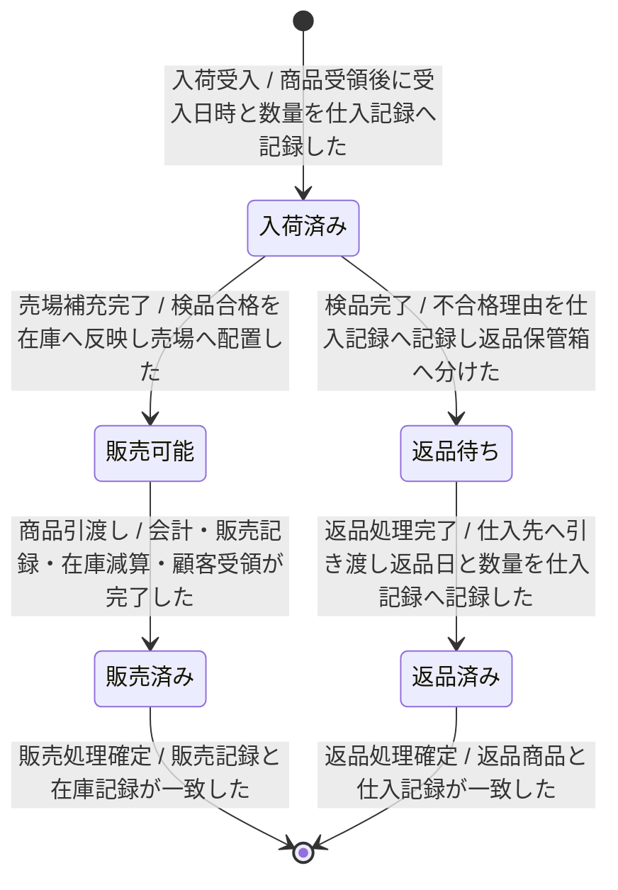

---
specdojo:
  id: specdojo:stsd-sample
  type: sample
  status: draft
  rulebook: specdojo:stsd-rulebook
  based_on:
    - specdojo:sample-authoring-standard
---

# 商品のステータス定義

駄菓子屋きぬやの商品について、納品から販売または返品までの状態と遷移を定義する。店主代表と家族利用者代表は仕入記録、在庫記録、販売記録から現在状態を判定し、開発担当と同行レビュー担当は状態変更の設計・検証に利用する。

## 1. 概要

- 対象: 店舗が仕入先へ発注し、納品を受けた商品
- スコープ: 現行業務（AS-IS）の入荷受入、検品、売場補充、販売、返品
- 状態の正本: 仕入記録、在庫記録、販売記録。現物の配置は売場棚または返品保管箱で補助確認する
- 一意判定: 対象商品の仕入記録・在庫記録・販売記録を時系列で照合し、最後に成立した遷移の遷移先を現在状態とする。後続遷移が成立した時点で遷移元の状態は終了するため、同時に複数状態へは分類しない

## 2. 状態一覧

| 値             | 状態名   | 通称     | 意味                                         | 成立条件                                                                                   | 管理場所             |
| -------------- | -------- | -------- | -------------------------------------------- | ------------------------------------------------------------------------------------------ | -------------------- |
| received       | 入荷済み | 入った品 | 店舗が納品を受け、検品結果が未確定の商品     | 納品情報を発注内容へ照合して受入日時と数量を仕入記録へ記録し、検品結果をまだ記録していない | 仕入記録、検品場所   |
| sellable       | 販売可能 | 売れる品 | 検品に合格し、店頭販売できる商品             | 検品合格を記録し、在庫数量を更新して受入品を売場棚へ配置し、販売完了をまだ記録していない   | 在庫記録、売場棚     |
| sold           | 販売済み | 売れた品 | 会計を終え、店舗在庫から顧客へ引き渡した商品 | 販売記録を確定し、在庫を減算して、顧客が商品を受領した                                     | 販売記録             |
| return-pending | 返品待ち | 返す品   | 数量違いまたは品質不良により受入不可の商品   | 不合格理由を仕入記録へ記録して返品保管箱へ分け、返品日と数量をまだ記録していない           | 仕入記録、返品保管箱 |
| returned       | 返品済み | 返した品 | 仕入先へ返却し、店舗の管理対象から外れた商品 | 仕入先へ商品を引き渡し、返品日と数量を仕入記録へ記録した                                   | 仕入記録             |

## 3. 状態遷移図

## 4. 遷移の説明

| 遷移 ID | 遷移元   | 遷移先   | イベント     | 条件                                             | 補足                                           |
| ------- | -------- | -------- | ------------ | ------------------------------------------------ | ---------------------------------------------- |
| `T-01`  | 開始     | 入荷済み | 入荷受入     | 商品受領後に受入日時と数量を仕入記録へ記録した   | 検品前の商品を一意に識別する                   |
| `T-02`  | 入荷済み | 販売可能 | 売場補充完了 | 検品合格を在庫へ反映し売場へ配置した             | 販売グループへ売場商品を引き渡せる             |
| `T-03`  | 入荷済み | 返品待ち | 検品完了     | 不合格理由を仕入記録へ記録し返品保管箱へ分けた   | 受入品と返品対象を物理的にも分ける             |
| `T-04`  | 販売可能 | 販売済み | 商品引渡し   | 会計・販売記録・在庫減算・顧客受領が完了した     | 販売記録で顧客への引き渡しを確認する           |
| `T-05`  | 返品待ち | 返品済み | 返品処理完了 | 仕入先へ引き渡し返品日と数量を仕入記録へ記録した | 仕入記録を返品経路の正本とする                 |
| `T-06`  | 販売済み | 終了     | 販売処理確定 | 販売記録と在庫記録が一致した                     | 店舗在庫としてのライフサイクルを終了する       |
| `T-07`  | 返品済み | 終了     | 返品処理確定 | 返品商品と仕入記録が一致した                     | 店舗の管理対象としてのライフサイクルを終了する |
