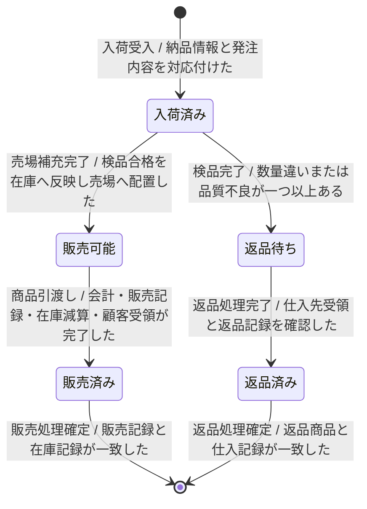

---
specdojo:
  id: specdojo:stsd-sample
  type: sample
  status: draft
  rulebook: specdojo:stsd-rulebook
  based_on:
    - specdojo:sample-authoring-standard
  grade:
    rubric: grade-rubric-v1
    target: kata
    verdict: needs-work
    score: 68
    graded_at: "2026-09-19T21:34:35.714Z"
    graded_by: codex-expert-executor
    content_hash: 20239dc878640b0c2778d519ff0601a0cf14afa23b361930dfa10dd28000a01e
    categories:
      consistency: { score: 50 }
      usability: { score: 83 }
      architecture: { score: 100 }
      quality: { score: 50 }
    viewpoints:
      vp-arc-cross-document-consistency: { level: 2, score: 50 }
      vp-arc-conciseness: { level: 4, score: 100 }
      vp-arc-single-responsibility: { level: 4, score: 100 }
      vp-qe-verifiability: { level: 2, score: 50 }
      vp-qe-omissions-consistency: { level: 2, score: 50 }
      vp-qe-kata-conformance: { level: 2, score: 50 }
      vp-ux-readability: { level: 3, score: 75 }
      vp-ux-language-consistency: { level: 3, score: 75 }
      vp-arc-document-structure: { level: 4, score: 100 }
    findings: { blocker: 0, major: 4, minor: 3, note: 0 }
---

# 商品のステータス定義

駄菓子屋きぬやの商品について、納品から販売または返品までの状態と遷移を定義する。店主代表と家族利用者代表は仕入記録、在庫記録、販売記録から現在状態を判定し、開発担当と同行レビュー担当は状態変更の設計・検証に利用する。

## 1. 概要

- 対象: 店舗が仕入先へ発注し、納品を受けた商品
- スコープ: 現行業務（AS-IS）の入荷受入、検品、売場補充、販売、返品
- 状態の正本: 仕入記録、在庫記録、販売記録。現物の配置は売場棚または返品保管箱で補助確認する

## 2. 状態一覧

<!-- specdojo:finding id=F002 severity=minor rule=vp-arc-cross-document-consistency line=19 返品経路では「返品記録」を条件にしている一方、概要、管理場所、`T-05` の補足では「仕入記録」を正本としているため、返品記録が仕入記録の一部であることを明記するか正本名称を統一してください。 -->
<!-- specdojo:finding id=F003 severity=major rule=vp-qe-verifiability line=15 「入荷済み」の受領事実は販売後や返品後も成立し、「販売可能」は販売後も、「返品待ち」は返品後も成立し続けるため、現在の記録状態を示す条件、後続状態の除外条件、または優先順位を追加して各商品が同時に一状態だけへ該当するよう修正してください。 -->
<!-- specdojo:finding id=F004 severity=major rule=vp-qe-omissions-consistency line=15 状態の成立条件が重複した場合の排他条件または優先関係が定義されておらず、rulebook の完成判定を満たせないため、状態一覧または概要へ一意判定規則を追加してください。 -->
<!-- specdojo:finding id=F005 severity=major rule=vp-qe-kata-conformance line=15 完成例である sample が、累積して重複する成立条件と遷移先を成立させない遷移条件を正例として示しているため、rulebook の完成判定を満たす排他的な状態条件と整合する遷移条件へ修正してください。 -->
<!-- specdojo:finding id=F006 severity=minor rule=vp-ux-readability line=19 「返品記録」が概要で示した正本の「仕入記録」と別の記録か、その一部かを判断できないため、関係を説明するか「仕入記録」に統一してください。 -->
<!-- specdojo:finding id=F007 severity=minor rule=vp-ux-language-consistency line=19 返品済みの成立条件と `T-05` の条件にある「返品記録」を、管理場所と補足で使う「仕入記録」と統一するか、両者の包含関係を用語として定義してください。 -->
| 値             | 状態名   | 通称     | 意味                                         | 成立条件                                               | 管理場所             |
| -------------- | -------- | -------- | -------------------------------------------- | ------------------------------------------------------ | -------------------- |
| received       | 入荷済み | 入った品 | 店舗が納品を受け、検品結果が未確定の商品     | 納品情報を発注内容へ照合し、店舗で商品を受け取った     | 仕入記録、検品場所   |
| sellable       | 販売可能 | 売れる品 | 検品に合格し、店頭販売できる商品             | 在庫数量を更新し、受入品を売場棚へ配置した             | 在庫記録、売場棚     |
| sold           | 販売済み | 売れた品 | 会計を終え、店舗在庫から顧客へ引き渡した商品 | 販売記録を確定し、在庫を減算して、顧客が商品を受領した | 販売記録             |
| return-pending | 返品待ち | 返す品   | 数量違いまたは品質不良により受入不可の商品   | 検品結果が不合格で、返品対象として仕入記録へ記録された | 仕入記録、返品保管箱 |
| returned       | 返品済み | 返した品 | 仕入先へ返却し、店舗の管理対象から外れた商品 | 仕入先への商品の引き渡しと返品記録の更新が完了した     | 仕入記録             |

## 3. 状態遷移図

<!-- specdojo:finding id=F001 severity=major rule=vp-arc-cross-document-consistency line=25 `T-01` は商品の受領を確認せず「納品情報と発注内容を対応付けた」だけで「入荷済み」へ遷移でき、`T-03` も返品対象の仕入記録への記録前に「返品待ち」へ遷移できるため、各遷移条件を遷移先の成立条件が確実に成立する内容へ揃えてください。 -->

## 4. 遷移の説明

| 遷移 ID | 遷移元   | 遷移先   | イベント     | 条件                                         | 補足                                           |
| ------- | -------- | -------- | ------------ | -------------------------------------------- | ---------------------------------------------- |
| `T-01`  | 開始     | 入荷済み | 入荷受入     | 納品情報と発注内容を対応付けた               | 仕入記録へ受入日時と数量を記録する             |
| `T-02`  | 入荷済み | 販売可能 | 売場補充完了 | 検品合格を在庫へ反映し売場へ配置した         | 販売グループへ売場商品を引き渡せる             |
| `T-03`  | 入荷済み | 返品待ち | 検品完了     | 数量違いまたは品質不良が一つ以上ある         | 受入品と返品対象を分け、返品理由を記録する     |
| `T-04`  | 販売可能 | 販売済み | 商品引渡し   | 会計・販売記録・在庫減算・顧客受領が完了した | 販売記録で顧客への引き渡しを確認する           |
| `T-05`  | 返品待ち | 返品済み | 返品処理完了 | 仕入先受領と返品記録を確認した               | 仕入記録へ返品日と数量を記録する               |
| `T-06`  | 販売済み | 終了     | 販売処理確定 | 販売記録と在庫記録が一致した                 | 店舗在庫としてのライフサイクルを終了する       |
| `T-07`  | 返品済み | 終了     | 返品処理確定 | 返品商品と仕入記録が一致した                 | 店舗の管理対象としてのライフサイクルを終了する |
