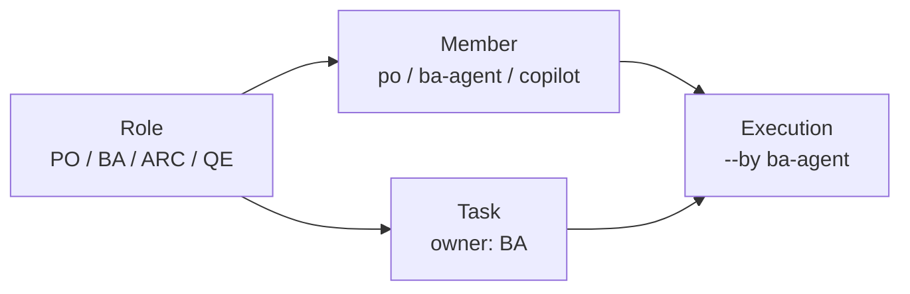
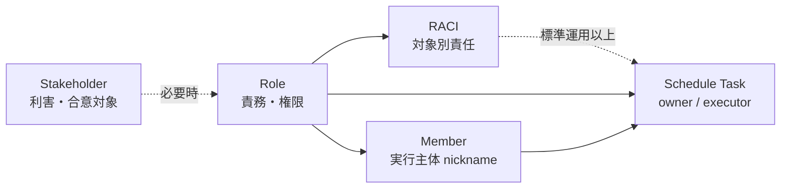

# 人と組織の定義標準

People and Organization Definition Standard

## 1. 目的

本標準は、SpecDojo における **人・組織・ロール・実行主体・タスク担当** の定義方法を整理し、WBS、Schedule、実行ログに一貫して展開できるようにするための標準である。

本標準では、**Role（ロール）を中心概念** とする。

プロジェクトでは、「誰が関与するか」「誰が責任を持つか」「誰が実行するか」が混在しやすい。そこで、本標準では次のように分けて扱う。

| 概念 | 役割 |
| --- | --- |
| Role | 責務・判断権限を表す論理的な役割 |
| Member | 実際に作業する人または agent |
| Task owner | タスクの主責任ロール |
| Executor | 実際にタスクを claim / 実行する主体 |
| Stakeholder | 利害・期待・懸念・合意対象を管理する相手 |
| RACI | 必要時に作成・承認・相談・通知を分ける責任分担 |

すべてのプロジェクトで、最初から stakeholder register や RACI を管理する必要はない。
個人・小規模プロジェクトでは、まず **Role、Member、Task owner** のみを定義すればよい。

## 2. 基本方針

### 2.1. Role を中心にする

People / Organization 定義では、Role を中心に管理する。

Role は、個人名ではなく、プロジェクト上の責務・判断権限・専門性を表す論理的な役割である。

例:

| Role code | 正式名称 | 主な責務 |
| --- | --- | --- |
| `PO` | Project Owner | 目的、スコープ、優先順位、公開方針、最終判断 |
| `BA` | Business Analyst | 要件、業務、受入条件、関係者調整 |
| `ARC` | Architect | 構成、技術方針、設計判断 |
| `QE` | Quality Engineer | 品質基準、レビュー、検証観点 |

小規模プロジェクトでは、`PO` が計画、進捗、課題、リスク管理を兼務してよい。
必要になった場合のみ、`PM` を独立ロールとして追加する。

### 2.2. owner はタスク側だけに使う

`owner` は、WBS / Schedule 上の **主責任ロール** を表す。

`owner` には、個人名や member nickname を書かない。
必ず Role code を書く。

例:

```yaml
tasks:
  - id: T-SCOPE-010
    name: スコープを整理する
    owner: BA
```

この場合、`BA` がこのタスクの主責任ロールである。
実際に誰が実行するかは、`owner` ではなく `--by <nickname>` で指定する。

### 2.3. Member 側では role を使う

Member は、実際に作業する人間または agent を表す。

Member がどの Role に対応するかは、`role` フィールドで表す。
`pm-members.yaml` では `owner` という名前を使わない。

例:

```yaml
members:
  - nickname: po
    display_name: Project Owner
    role: PO
    type: human

  - nickname: ba-agent
    display_name: Business Analyst Agent
    role: BA
    type: agent

  - nickname: copilot
    display_name: General Agent
    role: null
    type: agent
```

`role: null` は、特定の Role に固定しない汎用 agent を表す。
この場合は、実行時の文脈や明示指定によって対象ロールを補う。

### 2.4. executor は実行時に決まる

Executor は、実際にタスクを claim / 実行する Member である。

CLI では、次のように `--by <nickname>` で指定する。

```bash
specdojo exec T-SCOPE-010 --by ba-agent
```

このとき、Schedule Task の `owner` が `BA` であり、`ba-agent` の `role` も `BA` であれば、自然な対応関係になる。

## 3. 最小モデル

個人・小規模プロジェクトでは、次の 3 つだけを管理すればよい。

1. Role を定義する
2. Member を Role に紐づける
3. Task の owner に Role code を書く



この最小モデルでは、stakeholder register、RACI、コミュニケーション計画は必須ではない。
必要になった時点で追加する。

## 4. 運用レベル

People / Organization 定義は、プロジェクトの規模や外部関係者の有無に応じて、次の 3 段階で運用する。

| レベル | 適用場面 | 管理するもの | 代表ファイル |
| --- | --- | --- | --- |
| 最小 | 個人・小規模・AI 実行をまず回したい場合 | Role、Member、Schedule owner | `prj-organization.md`, `pm-members.yaml`, `sch-track-*.yaml` |
| 標準 | 複数人・レビュー・承認がある場合 | 最小 + RACI | 最小 + `pm-raci.md` |
| 拡張 | OSS 公開・外部協力・監査・調整がある場合 | 標準 + stakeholder register、関与方針、コミュニケーション要件 | 標準 + `prj-stakeholder-register.md`, communication 関連文書 |

### 4.1. 最小運用

最小運用では、Schedule のタスクを誰が実行できるかに必要な情報だけを管理する。

最小運用で必要な項目:

| 定義 | 最小項目 | 目的 |
| --- | --- | --- |
| Role 定義 | Role code、正式名称、主な責務 | `tasks[].owner` に使う値を固定する |
| Member 定義 | nickname、display_name、role、type | `specdojo exec --by` の候補を定義する |
| Schedule | Task ID、WBS ID、`owner`、依存関係 | 実行可能なタスクに展開する |

最小運用では、RACI、影響度 / 関心度分析、エンゲージメント方針、コミュニケーション要件は必須ではない。

### 4.2. 標準運用

標準運用では、レビュー・承認・相談先を明確にするために RACI を追加する。

複数人で作業する場合、または agent が草案を作成し、人間が承認する場合は、このレベルを推奨する。

標準運用で追加する項目:

| 定義 | 追加項目 | 目的 |
| --- | --- | --- |
| RACI | 成果物またはプロセスごとの `R` と `A` | 作成責任と承認責任を分ける |
| RACI | 必要に応じた `C` と `I` | レビュー・共有の期待値を明確にする |
| Schedule | 承認・レビュータスクの分割判断 | `R` と `A` が異なる場合に実行計画へ反映する |

### 4.3. 拡張運用

拡張運用では、外部関係者、将来利用者、貢献者、公開基盤などを Stakeholder として管理する。

OSS 公開前、外部からの Issue / Pull Request 受付開始前、監査・説明責任が必要な場合に採用する。

拡張運用で追加する項目:

| 定義 | 追加項目 | 目的 |
| --- | --- | --- |
| Stakeholder register | 関係者、影響度、関心度、期待、懸念、必要な合意 | 利害と合意対象を見える化する |
| 関与方針 | 現状、目標、対応方針、責任者、期限、証跡 | 外部関係者との関わり方を管理する |
| コミュニケーション | 情報要求、希望チャネル、合意・報告、証跡要件 | 共有・承認・フィードバックを整える |

## 5. 用語定義

| 用語 | 意味 |
| --- | --- |
| Role | 責務・判断権限・専門性を表す論理的な役割 |
| Role code | Role を表す短い識別子。例: `PO`, `BA`, `ARC`, `QE` |
| Member | 実際に作業または支援する主体。人間または agent を含む |
| nickname | CLI や実行ログで使う Member の安定識別子 |
| role | Member が対応する Role code。`pm-members.yaml` で使う |
| owner | WBS / Schedule 上の主責任ロール。Role code を使う |
| Executor | `specdojo exec --by <nickname>` でタスクを実行する主体 |
| Stakeholder | プロジェクトに影響する、または影響を受ける関係者・集団・外部基盤 |
| RACI | Responsible / Accountable / Consulted / Informed の責任分担 |
| scheduler_strategy | scheduler が実行候補を選ぶ際の既定戦略 |

## 6. 正規化モデル

People / Organization 定義は、次の 5 層で考える。
ただし、最小運用では Role、Member、Schedule Task の 3 層だけを使えばよい。



| 層 | 識別子 | 目的 | 必須度 |
| --- | --- | --- | --- |
| Role | `PO`, `BA`, `ARC`, `QE` など | 責務・権限・タスク owner | 必須 |
| Member | `po`, `ba-agent` など | 実行主体の識別 | 必須 |
| Schedule Assignment | `tasks[].owner` | 実行計画上の主責任ロール | 必須 |
| RACI Assignment | `R`, `A`, `C`, `I` | 対象別の責任分担 | 任意 |
| Stakeholder | `STH-FUTURE-USER` など | 利害関係・合意対象の識別 | 任意 |

## 7. 識別子と命名規則

### 7.1. Role code

- Role code は英大文字の短い識別子とする。
- Schedule の `owner`、WBS の `owner`、RACI の列名は同じ Role code を参照する。
- Role code は個人名、担当者名、部署名を含めない。
- Role code の変更は過去の実行履歴や schedule 参照を壊すため、原則として新規 code の追加で対応する。

標準的な Role code:

| Role code | 正式名称 | 主な責務 |
| --- | --- | --- |
| `PO` | Project Owner | 目的、スコープ、優先順位、公開方針、最終判断 |
| `PM` | Project Manager | 計画、進捗、課題、リスク、実行管理 |
| `BA` | Business Analyst | 業務仕様、受入条件、ステークホルダー調整 |
| `ARC` | Architect | システム設計、構成方針、技術判断 |
| `QE` | Quality Engineer | レビュー方針、品質基準、検証観点、受入確認 |

補足:

- 小規模プロジェクトでは `PO` が `PM` を兼務してよい。
- `PM` を明示しない場合は、管理・実行計画上の PM 責務を `PO` が担うことを組織定義に記載する。
- 兼務していても、必要に応じて Role code を分けることで責務境界を明確にできる。

### 7.2. Member nickname

- nickname は英小文字、数字、ハイフンを使った安定識別子とする。
- nickname は一度イベントログに記録された後は変更しない。
- 人間メンバーと agent メンバーを同じ `role` に紐づけてよい。
- 汎用 agent は `role: null` とし、実行時に対象ロールを補う。

例:

| nickname | type | role | 用途 |
| --- | --- | --- | --- |
| `po` | human | `PO` | PO ロールの人間実行主体 |
| `ba-agent` | agent | `BA` | BA ロールの agent 実行支援 |
| `arc-agent` | agent | `ARC` | ARC ロールの agent 実行支援 |
| `copilot` | agent | null | 必要に応じて対象ロールを指定する汎用 agent |

### 7.3. Stakeholder ID

Stakeholder ID は、拡張運用で stakeholder register を管理する場合に使用する。

- 形式は `STH-<KEY>` とする。
- `<KEY>` は英大文字、数字、ハイフンで構成する意味付きキーとする。
- `<KEY>` には、表示名ではなくステークホルダーの概念を表す語を使う。
- ID は表示名や組織名が変わっても、管理対象の概念が同じであれば変更しない。
- 外部サービス基盤のような非人格的な関係者も、合意・影響・制約を管理する必要があれば Stakeholder として登録してよい。

例:

| ID | 関係者 | 関与区分 |
| --- | --- | --- |
| `STH-PROJECT-OWNER` | プロジェクトオーナー | スポンサー / 意思決定者 |
| `STH-AI-AGENT` | AI Agent | 実行支援者 |
| `STH-FUTURE-USER` | 将来の利用者 | 利用者 |
| `STH-FUTURE-CONTRIBUTOR` | 将来の貢献者 | 外部協力者 |
| `STH-PUBLICATION-PLATFORM` | 配布・公開基盤 | 外部関係者 |

## 8. ファイル別の責務

### 8.1. `prj-organization.md`

`prj-organization.md` は、プロジェクトの Role、責務、意思決定構造を管理する。

最小運用で必要な観点:

| 観点 | 内容 |
| --- | --- |
| Role 一覧 | Role code、正式名称、主な責務 |
| 兼務 | 兼務する Role と責務境界 |

標準運用以上で追加する観点:

| 観点 | 内容 |
| --- | --- |
| 意思決定 | 判断対象、決定者、相談先、記録先 |
| 委任 | 人間から agent へ委任できる作業と、委任できない判断 |
| エスカレーション | 判断不能・競合・遅延時の相談先と記録先 |

最小構成例:

```markdown
# 組織

## Role 一覧

| Role code | 正式名称 | 主な責務 |
| --- | --- | --- |
| `PO` | Project Owner | 目的、スコープ、優先順位、計画、進捗、公開方針、最終判断 |
| `BA` | Business Analyst | 要件、業務、受入条件、関係者調整 |
| `ARC` | Architect | 構成、技術方針、設計判断 |
| `QE` | Quality Engineer | 品質基準、レビュー、検証観点 |

## 兼務

現時点では、`PO` が `PM` 相当の計画・進捗・課題・リスク管理を兼務する。
```

### 8.2. `pm-members.yaml`

`pm-members.yaml` は、実行主体の machine-readable な一覧を管理する。
CLI や scheduler が参照するため、Markdown ではなく YAML で定義する。

標準フィールド:

| フィールド | 必須 | 内容 |
| --- | --- | --- |
| `version` | ○ | メンバー定義のバージョン |
| `project_id` | ○ | プロジェクト ID |
| `members[].nickname` | ○ | 実行ログに残る安定識別子 |
| `members[].display_name` | ○ | 表示名 |
| `members[].email` | 任意 | 公開可能な連絡先。公開文書では `null` を推奨 |
| `members[].role` | 任意 | 対応する Role code。汎用 agent は `null` 可 |
| `members[].type` | ○ | `human` または `agent` |
| `members[].persona` | 任意 | agent の実行姿勢 |
| `members[].focus` | 任意 | agent が重視する観点 |
| `members[].scheduler_strategy` | 任意 | scheduler の既定選択戦略 |
| `members[].note` | 任意 | 補足 |

例:

```yaml
version: 1
project_id: prj-0001
members:
  - nickname: po
    display_name: Project Owner
    email: null
    role: PO
    type: human

  - nickname: po-agent
    display_name: Project Owner Agent
    email: null
    role: PO
    type: agent
    scheduler_strategy: critical-first

  - nickname: ba-agent
    display_name: Business Analyst Agent
    email: null
    role: BA
    type: agent
    scheduler_strategy: fifo

  - nickname: copilot
    display_name: General Agent
    email: null
    role: null
    type: agent
```

### 8.3. `sch-track-*.yaml`

Schedule は、実行可能なタスクと、その主責任ロールを管理する。

`tasks[].owner` には Role code を書く。
Member nickname は書かない。

例:

```yaml
tasks:
  - id: T-SCOPE-010
    wbs: WBS-SCOPE-010
    name: スコープを整理する
    duration_days: 0.5
    depends_on: []
    owner: BA
```

### 8.4. `pm-raci.md`

RACI は、標準運用以上で使用する。
成果物、プロセス、または主要タスク単位の責任分担を管理する。

最小運用では、WBS または Schedule の `owner` だけで責務を判断できる場合、RACI の作成を省略してよい。

RACI の意味:

| 記号 | 意味 | 説明 |
| --- | --- | --- |
| `R` | Responsible | 実作業を担当する |
| `A` | Accountable | 最終責任を持ち、承認する |
| `C` | Consulted | 相談・レビューに参加する |
| `I` | Informed | 結果の共有を受ける |

RACI は、Schedule のタスク owner を決める入力として使う。
ただし、RACI 自体は日付、依存関係、実行順序を管理しない。

### 8.5. `prj-stakeholder-register.md`

Stakeholder register は、拡張運用で使用する。

Stakeholder は、Role の上位概念ではない。
Stakeholder は、プロジェクトに影響する、または影響を受ける対象であり、利害、期待、懸念、必要な合意、関与方針を管理するために使う。

最小運用と標準運用では、外部関係者や公開前確認が必要になるまで作成・更新を省略してよい。

拡張運用で扱う観点:

| 観点 | 内容 |
| --- | --- |
| 関係者識別 | ID、関係者名、関与区分、所属 / 組織 |
| 期待・懸念 | 主な期待、主な懸念、必要な合意 |
| 影響度・関心度 | High / Medium / Low の基準と評価 |
| 関与方針 | 現状、目標、対応方針、責任者、期限、証跡 |
| 連絡要件 | 情報要求、希望チャネル、合意・報告、証跡要件 |
| 見直し条件 | 更新トリガー、見直し内容、責任者、承認者、証跡 |

Stakeholder register には、Schedule の `owner` に直接使う値を定義しない。
Schedule に展開する責務は、Role と RACI を経由して決める。

## 9. Schedule への担当展開

### 9.1. 基本変換

WBS Item から Schedule Task を作る際は、以下の順で担当を決める。

1. WBS Item の `owner` が明示されていれば、その Role code を Schedule Task の `owner` に引き継ぐ。
2. WBS Item の `owner` が未定義で、RACI がある場合は、成果物別 RACI の `R` を Schedule Task の `owner` とする。
3. `R` が複数ある場合は、タスクの action に最も近い Role を `owner` とし、残りはレビュー・相談タスクまたは notes に分離する。
4. `A/R` のように同一 Role が実作業と承認を兼ねる場合は、作業タスクの `owner` はその Role とする。
5. 承認、レビュー、外部待ちを Schedule Task として分割する場合は、RACI の `A` または `C` を owner にした別 Task / Milestone を作る。
6. `I` は Schedule の owner にはしない。通知・共有はコミュニケーション計画または実行イベントで扱う。

最小運用では 1 のみでよい。
標準運用以上では 2 から 6 も適用し、RACI から作成・承認・レビューのタスク分割を判断する。

### 9.2. `owner`、`role`、`--by` の違い

| 項目 | 意味 | 値の例 | 管理先 |
| --- | --- | --- | --- |
| `owner` | タスクの主責任ロール | `PO`, `BA`, `ARC`, `QE` | WBS / Schedule |
| `role` | Member が対応するロール | `PO`, `BA`, `ARC`, `QE`, null | `pm-members.yaml` |
| `--by` | タスクを claim / 実行する主体 | `po`, `ba-agent` | 実行コマンド / 実行イベント |

原則:

- Schedule Task の `owner` には member nickname を書かない。
- `pm-members.yaml` の `role` には Role code または `null` を書く。
- `--by` に指定できる nickname は `pm-members.yaml` に存在しなければならない。
- `--by` の member が `role` を持つ場合、タスクの `owner` と一致することを推奨する。
- `role: null` の汎用 agent が実行する場合は、実行時の文脈で対象 Role を明示する。

### 9.3. 実行候補の選択

ある Task の `owner` が `BA` の場合、実行候補は `pm-members.yaml` の `role: BA` を持つ Member である。

例:

```yaml
members:
  - nickname: ba
    role: BA
    type: human

  - nickname: ba-agent
    role: BA
    type: agent
    scheduler_strategy: fifo
```

この場合、`owner: BA` の Schedule Task は、`ba` または `ba-agent` が実行候補になる。
どちらを実行主体にするかは、手動指定、scheduler strategy、agent override、または運用ルールで決める。

## 10. RACI から Schedule Task への展開例

標準運用以上では、RACI を Schedule Task へ展開できる。

成果物別 RACI:

| 成果物 | PO | BA | ARC | QE |
| --- | --- | --- | --- | --- |
| `prj-overview` | A/R | C | I | I |
| `prj-scope` | A | R | C | I |
| `pm-quality-management-plan` | C | I | C | A/R |

Schedule Task への変換例:

```yaml
tasks:
  - id: T-LAUNCH-PJD-SCOPE-010
    wbs: WBS-PJD-SCOPE-010
    name: prj-scope を作成する
    duration_days: 0.5
    depends_on: []
    owner: BA

  - id: T-LAUNCH-PJD-SCOPE-020
    wbs: WBS-PJD-SCOPE-010
    name: prj-scope を承認する
    duration_days: 0.125
    depends_on:
      - T-LAUNCH-PJD-SCOPE-010
    owner: PO

  - id: T-LAUNCH-PM-QMP-010
    wbs: WBS-PM-QMP-010
    name: 品質管理計画を作成する
    duration_days: 0.5
    depends_on: []
    owner: QE
```

ポイント:

- 作成タスクは `R` を `owner` にする。
- 承認タスクを分ける場合は `A` を `owner` にする。
- `C` はレビュータスクとして独立させる場合のみ `owner` になり得る。
- `I` は owner にしない。

## 11. Agent 委任方針

Agent は実行支援者であり、人間の判断や説明責任を代替しない。

| 作業種別 | agent 委任 | 最終判断 |
| --- | --- | --- |
| 草案作成 | 可 | 対応 Role の人間 |
| 表記揺れ確認 | 可 | 対応 Role の人間 |
| 抜け漏れ検出 | 可 | 対応 Role の人間 |
| 既存ルールに基づく機械的更新 | 可 | 対応 Role の人間 |
| スコープ変更 | 不可 | `PO` |
| 公開可否判断 | 不可 | `PO` |
| 技術方針の最終決定 | 原則不可 | `ARC` |
| 品質基準の最終決定 | 原則不可 | `QE` |

Agent member には、必要に応じて `persona`、`focus`、`scheduler_strategy` を定義する。

```yaml
- nickname: qe-agent
  display_name: Quality Engineer Agent
  role: QE
  type: agent
  persona: risk-averse
  focus:
    - acceptance
    - regression
    - edge-cases
  scheduler_strategy: critical-first
```

## 12. 整合性ルール

- `prj-organization.md` に定義された Role code だけを、WBS / Schedule の `owner` に使用できる。
- `sch-track-*.yaml` の `tasks[].owner` は、組織定義に存在する Role code でなければならない。
- `pm-members.yaml` の `members[].role` は、`null` または組織定義に存在する Role code でなければならない。
- RACI の列に使う Role code は、組織定義に存在しなければならない。
- WBS の `owner` と Schedule の `owner` は、原則として同じ Role code を使う。
- RACI に存在しない Role を Schedule owner にする場合は、WBS または notes に根拠を残す。
- 1 つの Schedule Task に複数 owner を書かない。複数 Role の実作業が必要な場合はタスクを分割する。
- `pm-members.yaml` の nickname は過去の実行イベントと互換性を保つため、変更ではなく追加・無効化で扱う。
- Agent に最終承認責任を持たせない。
- 公開文書に個人名、私用メールアドレス、非公開の組織情報、機密性の高い利害関係を書かない。

## 13. 最小構成例

個人・小規模プロジェクトでは、まず次の構成だけで運用してよい。

### 13.1. `prj-organization.md`

```markdown
# 組織

## Role 一覧

| Role code | 正式名称 | 主な責務 |
| --- | --- | --- |
| `PO` | Project Owner | 目的、スコープ、優先順位、計画、進捗、公開方針、最終判断 |
| `BA` | Business Analyst | 要件、業務、受入条件、関係者調整 |
| `ARC` | Architect | 構成、技術方針、設計判断 |
| `QE` | Quality Engineer | 品質基準、レビュー、検証観点 |

## 兼務

現時点では、`PO` が `PM` 相当の計画・進捗・課題・リスク管理を兼務する。
```

### 13.2. `pm-members.yaml`

```yaml
version: 1
project_id: prj-0001
members:
  - nickname: po
    display_name: Project Owner
    email: null
    role: PO
    type: human

  - nickname: po-agent
    display_name: Project Owner Agent
    email: null
    role: PO
    type: agent
    scheduler_strategy: critical-first
```

### 13.3. `sch-track-*.yaml`

```yaml
tasks:
  - id: T-LAUNCH-PJD-SCOPE-010
    wbs: WBS-PJD-SCOPE-010
    name: prj-scope を作成する
    duration_days: 0.5
    depends_on: []
    owner: PO
```

## 14. 移行方針

既存の `pm-members.yaml` で `members[].owner` を使っている場合は、`members[].role` へ移行する。

移行前:

```yaml
members:
  - nickname: ba-agent
    owner: BA
    type: agent
```

移行後:

```yaml
members:
  - nickname: ba-agent
    role: BA
    type: agent
```

WBS / Schedule の `owner` は変更しない。
`owner` は引き続きタスクの主責任ロールとして使用する。

## 15. 見直し条件

People / Organization 定義は、以下のタイミングで見直す。

| 更新トリガー | 見直し対象 |
| --- | --- |
| プロジェクトスコープ変更 | Stakeholder、Role、RACI |
| 成果物カタログまたは WBS の変更 | RACI、Schedule owner |
| Schedule のトラック追加 | Role、Member、scheduler_strategy |
| agent 追加・削除 | `pm-members.yaml`、委任方針、agent overrides |
| 外部利用者・貢献者の関与開始 | stakeholder register、コミュニケーション要件 |
| 公開前 | 個人情報、機密情報、公開可能な連絡先 |
| 実行ログに存在する nickname の変更要求 | 変更せず、新 nickname 追加または無効化で対応 |

## 16. 禁止事項

- Schedule の `owner` に個人名や member nickname を書くこと。
- `pm-members.yaml` で `owner` を使って Member の対応 Role を表すこと。
- RACI の列名に未定義の Role code を使うこと。
- `pm-members.yaml` の nickname を履歴記録後に変更すること。
- Agent に最終承認責任を持たせること。
- `I` の Role をタスク owner にすること。
- 兼務を理由に RACI の責務境界を曖昧にすること。
- 公開文書に不要な個人情報や非公開組織情報を書くこと。
