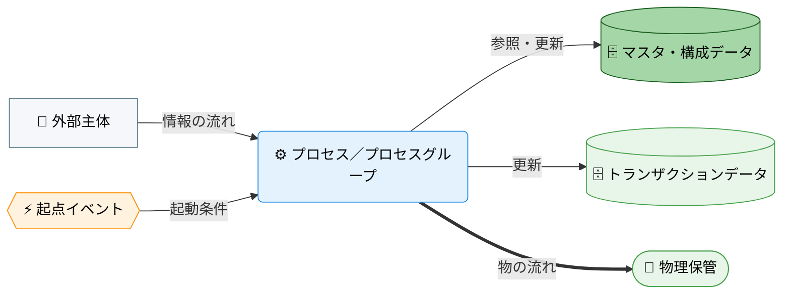

---
specdojo:
  id: specdojo:cdfd-overview-template
  type: template
  status: ready
  frontmatter_template:
    specdojo:
      id: cdfd-overview
      type: flow
      status: draft
      rulebook: specdojo:cdfd-overview-rulebook
      based_on: []
      supersedes: []
---

# 概念データフロー図（全体概要）: _TARGET_NAME_

_TODO_: 対象の業務または運用が何を扱うかを一文で定義する。

## 1. 目的

_TODO_: 全体像を整理する目的と、後続のプロセスグループ別 CDFD・ユースケース別 CDFD の位置付けを明確にすることを一文で書く。対象者と利用場面は次のとおり。

- _ROLE_ は、_TODO_: 対象範囲と領域分割を承認する、詳細化する、設計入力として使う、重複・欠落を確認する、のように利用結果を判定できる形で書く。
- _ROLE_ は、_TODO_
- _ROLE_ は、_TODO_

## 2. 適用範囲

- 対象は、_TODO_: 開始点、終了点、対象業務、組織またはシステム境界を書く。
- 本書が扱うのは、プロセス領域の分割と、領域間・データストア間の受け渡しまでである。各領域の内部（_TODO_: 操作手順、更新内容、処理の分岐、状態を変える処理と起点イベント、例外時の復旧手順など）は対象外とし、プロセスグループ別 CDFD で詳細化する。状態の定義と遷移はステータス定義（Status Definition: STSD、`specdojo:stsd-rulebook`）を正本とし、詳細 CDFD は参照に留める。
- _TODO_: 一覧、検索、状態参照、検証などの補助操作を列挙し、独立した業務フローに含めず各領域を支える操作として扱うことを書く。
- 人間と AI Agent の責任分担は、_TODO_: 対応する方針文書があれば `[[_AUTHORITY_:prj-overview|プロジェクト概要]]` のように参照し、なければ「承認・完了判断は人間が担い、作成・評価は人が担うほか AI Agent へ委譲できる」のように原則を一文で書く。

## 3. プロセス領域

業務は _AREA_COUNT_ のプロセス領域に分かれ、_GROUP_COUNT_ のプロセスグループにまとめる。領域の分割と領域間の受け渡しは本書を正本とし、領域内の詳細はプロセスグループ別 CDFD を正本とする。各グループの主要入力・主要出力・データストアは「概念データフロー（概要）」のエッジの根拠である。

<!-- プロセスグループごとに 3.n の節を繰り返す。グループ数は 8 以下。1 領域だけのグループも可。 -->

### 3.1. _PROCESS_GROUP_NAME_（_PROCESS_AREA_ID_〜_PROCESS_AREA_ID_）

_TODO_: グループの役割と、グループ内の領域がどう連携するかを 1〜3 文で要約する。

- **主要入力**: _TODO_: 他グループからの要求、外部主体からの入力、参照するデータストアの内容を名詞で列挙する。
- **主要出力**: _TODO_: 更新・生成するデータストアの内容、他グループへの要求を名詞で列挙する。
- **データストア**: _TODO_: 「データストア」と同じ名称で、参照・更新するデータストアを列挙する。

<!-- prettier-ignore -->
| 領域 ID | プロセス領域 | 業務目的 | 主な担当 | 起点イベント |
| --- | --- | --- | --- | --- |
| `_PROCESS_AREA_ID_` | _PROCESS_AREA_NAME_ | _BUSINESS_PURPOSE_ | _OWNER_ROLE_ | _START_EVENT_ |
| `_PROCESS_AREA_ID_` | _PROCESS_AREA_NAME_ | _BUSINESS_PURPOSE_ | _OWNER_ROLE_ | _START_EVENT_ |

### 3.2. _PROCESS_GROUP_NAME_（_PROCESS_AREA_ID_）

_TODO_

- **主要入力**: _TODO_
- **主要出力**: _TODO_
- **データストア**: _TODO_

<!-- prettier-ignore -->
| 領域 ID | プロセス領域 | 業務目的 | 主な担当 | 起点イベント |
| --- | --- | --- | --- | --- |
| `_PROCESS_AREA_ID_` | _PROCESS_AREA_NAME_ | _BUSINESS_PURPOSE_ | _OWNER_ROLE_ | _START_EVENT_ |

## 4. データストア

_TODO_: 区分の意味、パスの略記（例: `<project-id>` が指す範囲）、データストアとして扱わないもの（リポジトリ基盤、開発環境の設定など）を各一文で書く。

<!-- 「主な保管先」列は条件付き。実装が先にある場合は必須、設計中で候補がある場合は置いて未確定セルを _UNDECIDED_ にし、概念段階では列ごと削除する。 -->

### 4.1. マスタ・構成データ

<!-- prettier-ignore -->
| データストア | 主な内容 | 主な保管先 |
| --- | --- | --- |
| _DATA_STORE_NAME_ | _TODO_: 保持する情報の種別 | _TODO_: 複数ある場合は `、 ` で区切る |
| _DATA_STORE_NAME_ | _TODO_ | _TODO_ |

### 4.2. トランザクションデータ

<!-- prettier-ignore -->
| データストア | 主な内容 | 主な保管先 |
| --- | --- | --- |
| _DATA_STORE_NAME_ | _TODO_: 生成物なら生成元、退避先なら退避対象も書く | _TODO_ |
| _DATA_STORE_NAME_ | _TODO_ | _TODO_ |

## 5. 概念データフロー（概要）

プロセスは _GROUP_COUNT_ のプロセスグループの代表ノード、データストアは「データストア」の各行をノードとして示す。矢印は情報または実行要求の受け渡しであり、実行順や毎回の通過を意味しない。更新のエッジは更新前の参照を含む。_TODO_: 対象範囲内の参加者を外部主体として描かないこと、外部主体を描く場合はその範囲を一文で書く。

<!-- ノード総数（代表ノードとデータストアの合計）が 16 以下なら以下の 1 図を使う。16 を超える場合は、この図を削除して「5.1. トランザクションデータの流れ」「5.2. マスタ・構成データの流れ」の節に分け、各節に図と注記を置く。両図で名称を統一し、グループ間の要求はトランザクションの図にだけ描く。 -->

凡例は「凡例（本プロダクト共通）」に従う。`-->` は情報の流れであり、_TODO_: 物の流れ（`==>`）を使う場合はその旨、使わない場合は「本図は物の流れを対象外とする」と書く。各領域の起点イベントと担当は「プロセス領域」の表に記載し、本図では省略する。_TODO_: 外部主体の有無を書く。

## 6. 詳細 CDFD 一覧

本書の詳細化先は、プロセスグループ別 CDFD とユースケース別 CDFD の 2 種類である。役割分担は次のとおり。

- プロセスグループ別 CDFD は、グループに属する領域の内部プロセス、起点イベント、例外・復旧、データストアの読み書きを定める正本である。状態の定義と遷移は STSD を正本とし、プロセスグループ別 CDFD は参照に留める。各領域はちょうど一つのプロセスグループ別 CDFD に属する。
- ユースケース別 CDFD は、複数のプロセスグループをまたぐ順序と引き渡し条件だけを定める。グループ内部のプロセスは再掲せず、プロセスグループ別 CDFD を参照する。単一のグループに閉じる業務はユースケース別 CDFD を作らない。

### 6.1. プロセスグループ別 CDFD

<!-- prettier-ignore -->
| プロセスグループ | 含む領域 | プロセスグループ別 CDFD |
| --- | --- | --- |
| _PROCESS_GROUP_NAME_ | `_PROCESS_AREA_ID_`〜`_PROCESS_AREA_ID_` | `cdfd-_GROUP_` |
| _PROCESS_GROUP_NAME_ | `_PROCESS_AREA_ID_` | `cdfd-_GROUP_` |

### 6.2. ユースケース別 CDFD

_TODO_: 複数のプロセスグループを横断し、順序と引き渡し条件を定める必要がある業務だけを載せる旨と、単一グループに閉じる業務は必要になった時点で追加する旨を書く。

<!-- prettier-ignore -->
| ケース ID | ユースケース | 業務目的 | 横断するプロセスグループ | ユースケース別 CDFD |
| --- | --- | --- | --- | --- |
| `_USE_CASE_ID_` | _USE_CASE_NAME_ | _TODO_ | _PROCESS_GROUP_NAME_ → _PROCESS_GROUP_NAME_ | `cdfd-uc-_TOPIC_` |

## 7. 凡例（本プロダクト共通）

<!-- 詳細 CDFD が複数存在し、共通のノード形状・色・絵文字を使う場合に設ける。単一の CDFD しかない場合は章ごと削除し、以降の章番号を詰める。 -->

本プロダクトの全 CDFD（本書、プロセスグループ別 CDFD、ユースケース別 CDFD）が共通して参照するノード形状・色・絵文字の対応を示す。個々の CDFD は、以下の定義を再掲せず、本章への参照に留める。

<!-- prettier-ignore -->
| 概念 | 形状 | 色 | 絵文字例 |
| --- | --- | --- | --- |
| プロセス／プロセスグループ | 角丸長方形 | 青（`#e3f2fd` / `#1e88e5`） | 業務内容が伝わる絵文字（例: ⚙️） |
| 起点イベント | 六角形 | 橙（`#fff3e0` / `#fb8c00`） | 出来事が伝わる絵文字（例: 🚦） |
| データストア（マスタ・構成データ） | 円柱 | 濃い緑（`#a5d6a7` / `#1b5e20`） | 保管物が伝わる絵文字（例: 📐） |
| データストア（トランザクションデータ） | 円柱 | 薄い緑（`#e8f5e9` / `#43a047`） | 保管物が伝わる絵文字（例: 📒） |
| 物理保管 | スタジアム形 | 薄い緑（トランザクションデータと同じ） | 保管場所が伝わる絵文字（例: 🏬） |
| 外部主体 | 四角 | グレー（`#f5f7fa` / `#607d8b`） | 主体が伝わる絵文字（例: 👤） |
| 情報の流れ | ラベル付き `-->` | — | — |
| 物の流れ | ラベル付き `==>` | — | — |

データストアの色分けは、大分類「データストア」の中の業務上のサブ分類を表す。マスタ・構成データは、他のプロセスから参照される比較的安定した基準情報を指す。トランザクションデータは、業務活動に伴い都度更新される記録を指す。物理保管は現物の保管先であり、いずれの区分にも属さないため、便宜上トランザクションデータと同じ色を用いる。

ノード形状・線種そのものの記法は `specdojo:cdfd-mermaid-rulebook` に従う。本章は、その記法に基づき _TARGET_NAME_ が実際に採用する色・絵文字の割り当てを固定する。

<!-- 未決事項がある場合のみ、以下の章を追加する。ない場合は章ごと削除する。本文中の未確定箇所には _UNDECIDED_ を付け、表の論点と対応させる。

## 8. 未決事項

| 論点 | 影響 | 決定者 | 決定時期 | 状態 |
| --- | --- | --- | --- | --- |
| _UNDECIDED_: _TODO_ | _IMPACT_ | _DECISION_ROLE_ | _DECISION_TIMING_ | open |

-->
