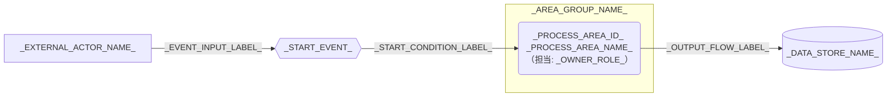

---
specdojo:
  id: specdojo:cdfd-overview-template
  type: template
  status: draft
  frontmatter_template:
    specdojo:
      id: _AUTHORITY_:cdfd-overview
      type: flow
      status: draft
      rulebook: specdojo:cdfd-overview-rulebook
      based_on: []
      supersedes: []
---

# 概念データフロー図（全体概要）: _TARGET_NAME_

_TODO_: 誰が、どの業務または運用の対象境界と領域間フローを合意するために使う全体概要かを 1〜3 文で記述する。

## 1. 目的と適用範囲

- 対象者: _TODO_: 対象範囲の承認者、作成者、領域別 CDFD の作成者、網羅性の確認者をロールで記述する。
- 利用場面: _TODO_: 境界合意、領域別詳細化、設計入力、重複・欠落確認の利用場面を記述する。
- 対象: _TODO_: 開始点、終了点、対象業務、組織、システム境界を記述する。
- 区分: _AS_IS_OR_TO_BE_
- 対象外: _TODO_: 補助操作、領域内の手順、実装詳細、別成果物や外部主体へ委譲する事項を記述する。
- 判断責任: _TODO_: 人間が責任を持つ主要判断と、AI Agent またはシステムが支援できる範囲を記述する。

## 2. プロセス領域一覧

<!-- prettier-ignore -->
| 領域 ID | プロセス領域 | 業務目的 | 主な担当 | 起点イベント | 主要入力 | 主要出力 | データストア | 領域別 CDFD |
| --- | --- | --- | --- | --- | --- | --- | --- | --- |
| `_PROCESS_AREA_ID_` | _PROCESS_AREA_NAME_ | _BUSINESS_PURPOSE_ | _OWNER_ROLE_ | _START_EVENT_ | _MAIN_INPUTS_ | _MAIN_OUTPUTS_ | _DATA_STORES_ | `_DETAIL_CDFD_ID_` |

## 3. 概念データフロー

凡例: 角丸長方形はプロセス領域、六角形は起点イベント、円柱はデータストア、四角は外部主体、`-->` は情報の流れを表す。_TODO_: 現物の流れを扱う場合は `==>` の意味を追記し、扱わない場合は対象外と明記する。

## 4. 境界と分割方針

### 4.1. 対象境界

| 区分          | 判定              | 本書での扱い        |
| ------------- | ----------------- | ------------------- |
| _SCOPE_CLASS_ | _BOUNDARY_REASON_ | _BOUNDARY_HANDLING_ |

_TODO_: 独立領域、補助操作、領域別詳細、人間の最終判断、AI Agent またはシステムによる支援を区別して記述する。

### 4.2. 領域別 CDFD への対応

| 領域 ID             | 全体概要上の責務          | 詳細化先           | 委譲境界              |
| ------------------- | ------------------------- | ------------------ | --------------------- |
| `_PROCESS_AREA_ID_` | _OVERVIEW_RESPONSIBILITY_ | `_DETAIL_CDFD_ID_` | _DELEGATION_BOUNDARY_ |

### 4.3. 受入確認

| 確認者          | 確認対象           | 受入条件               |
| --------------- | ------------------ | ---------------------- |
| _REVIEWER_ROLE_ | _REVIEW_VIEWPOINT_ | _ACCEPTANCE_CONDITION_ |

## 5. 未決事項

| 論点                | 影響     | 決定者          | 決定時期          |
| ------------------- | -------- | --------------- | ----------------- |
| _UNDECIDED_: _TODO_ | _IMPACT_ | _DECISION_ROLE_ | _DECISION_TIMING_ |
