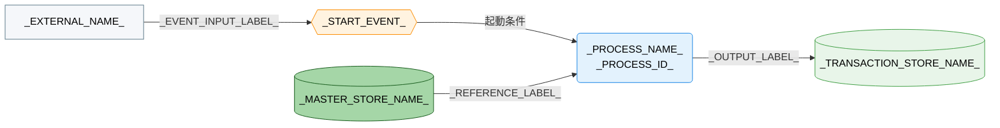

---
specdojo:
  id: specdojo:cdfd-template
  type: template
  status: ready
  frontmatter_template:
    specdojo:
      id: cdfd-_GROUP_ID_
      type: flow
      status: draft
      rulebook: specdojo:cdfd-rulebook
      based_on:
        - cdfd-overview
      supersedes: []
  grade:
    rubric: grade-rubric-v1
    target: kata
    verdict: pass
    score: 93
    graded_at: "2026-09-14T02:05:23.181Z"
    graded_by: codex-expert-executor
    content_hash: ba41235b054e6d459a4d6f0cffb668d46e86560b5d33a0d03eb97efe1f9741cd
    categories:
      consistency: { score: 88 }
      usability: { score: 100 }
      architecture: { score: 100 }
      quality: { score: 88 }
    viewpoints:
      vp-arc-cross-document-consistency: { level: 3, score: 75 }
      vp-arc-conciseness: { level: 4, score: 100 }
      vp-arc-single-responsibility: { level: 4, score: 100 }
      vp-qe-verifiability: { level: 4, score: 100 }
      vp-qe-omissions-consistency: { level: 4, score: 100 }
      vp-qe-kata-conformance: { level: 3, score: 75 }
      vp-ux-readability: { level: 4, score: 100 }
      vp-ux-language-consistency: { level: 4, score: 100 }
      vp-arc-document-structure: { level: 4, score: 100 }
    findings: { blocker: 0, major: 0, minor: 2, note: 0 }
---

# 概念データフロー図（プロセスグループ別）: _GROUP_NAME_

_TODO_: 全体概要のどのプロセスグループと領域群を詳細化し、誰がグループ内部のフロー、領域間の受け渡し、主要例外、グループ外への委譲を合意・利用するかを 1〜3 文で記述する。

## 1. 目的

_TODO_: 対象者ごとに、この CDFD から承認、後続設計、品質確認に利用する結果を記述する。

- _ROLE_ は、_TODO_: 対象グループの業務境界、起動条件、主要例外を承認する。
- _ROLE_ は、_TODO_: 領域間の受け渡しとプロセス入出力を後続成果物へ利用する。
- _ROLE_ は、_TODO_: 領域・プロセス・状態遷移参照・委譲の重複や欠落を確認する。

## 2. 適用範囲

- 対象グループ: _GROUP_NAME_（_AREA_ID_RANGE_）。_TODO_: 全体概要と同じグループ名と含む領域を書く。
- 対象業務: _TODO_: どのイベントから、どの出力がそろうまでを対象とするかを書く。
- 組織境界: _TODO_: グループ内部の担当と外部主体を書く。
- システム境界: _TODO_: 概念上の参照・記録範囲と、対象外の操作・保存方式を書く。
- 対象外: _TODO_: 補助操作、実装詳細、他グループの責務、ユースケース別 CDFD が扱う横断順序を、`cdfd-_OTHER_GROUP_` または `cdfd-uc-_TOPIC_` のような委譲先とともに書く。
- 状態遷移: _TODO_: 状態名・成立条件・遷移元・遷移先・イベント・条件を定める STSD の文書 ID を示し、本書は状態を変えるプロセスと起動条件だけを扱うことを書く。
- 責任分担: _TODO_: 人間と AI Agent の責任分担を本文で再定義せず、対応する文書への参照を書く。

## 3. プロセス領域

_GROUP_NAME_ グループは全体概要の _AREA_COUNT_ 領域を引き継ぐ。領域 ID、名称、業務目的、主な担当、起点イベントは全体概要を正本とし、本章では領域内部の入出力とプロセスを定める。

<!-- 対象グループに属する領域ごとに 3.n の節を繰り返す。 -->

### 3.1. _AREA_NAME_（_AREA_ID_）

_TODO_: 領域の役割と、領域内のプロセスがどう連携するかを 1〜3 文で要約する。

- **主要入力**: _TODO_: 外部主体、他領域、データストアから受け取る主要な情報・物を名詞で列挙する。
- **主要出力**: _TODO_: 外部主体、他領域、データストアへ渡す主要な情報・物を名詞で列挙する。
- **データストア**: _TODO_: 「データストア」と同じ名称で、参照・更新するデータストアを列挙する。

| プロセス ID    | プロセス       | 業務目的           | 主な担当     | 起動条件          | 必須性        |
| -------------- | -------------- | ------------------ | ------------ | ----------------- | ------------- |
| `_PROCESS_ID_` | _PROCESS_NAME_ | _BUSINESS_PURPOSE_ | _OWNER_ROLE_ | _START_CONDITION_ | _REQUIREMENT_ |

### 3.2. _AREA_NAME_（_AREA_ID_）

_TODO_

- **主要入力**: _TODO_
- **主要出力**: _TODO_
- **データストア**: _TODO_

| プロセス ID    | プロセス       | 業務目的           | 主な担当     | 起動条件          | 必須性        |
| -------------- | -------------- | ------------------ | ------------ | ----------------- | ------------- |
| `_PROCESS_ID_` | _PROCESS_NAME_ | _BUSINESS_PURPOSE_ | _OWNER_ROLE_ | _START_CONDITION_ | _REQUIREMENT_ |

<!-- プロセス ID は所属領域 ID に二桁の枝番を付けた P-01-01 形式にする。各領域に一つ以上のプロセスを置き、全プロセスを一行ずつ追加する。必須性は必須／条件付き／選択から選び、条件付き・選択では非起動時の正常な扱いも同じセルに書く。 -->

## 4. データストア

全体概要の「データストア」から、_GROUP_NAME_ グループが読み書きする行だけを同じ名称・区分で示す。各行は概念データフローの同名ノードと対応する。

### 4.1. マスタ・構成データ

| データストア      | 読み書き                    | 本グループでの利用 |
| ----------------- | --------------------------- | ------------------ |
| _DATA_STORE_NAME_ | _READ_WRITE_CLASSIFICATION_ | _USAGE_            |

### 4.2. トランザクションデータ

| データストア      | 読み書き                    | 本グループでの利用 |
| ----------------- | --------------------------- | ------------------ |
| _DATA_STORE_NAME_ | _READ_WRITE_CLASSIFICATION_ | _USAGE_            |

<!-- 「読み書き」は参照／更新／参照・更新のいずれかとする。該当する行がない区分は節ごと削除する。物の保管先は全体概要と同じ区分へ置き、利用内容に現物の受け渡しであることを書く。 -->

## 5. 概念データフロー

_TODO_: 「プロセス領域」の各表の行を一つのプロセスノードとして配置し、同一グループ内の領域間の受け渡し、起点イベント、「データストア」の各行、必要な外部主体、グループ外の委譲先をつなぐ。図は領域ごと、または業務の性質が近いプロセスごとに分ける。一図のプロセスノードが 15 個を超える場合も分割する。

### 5.1. _FLOW_SCOPE_NAME_（_AREA_ID_RANGE_）

_TODO_: 全体概要の「凡例（本プロダクト共通）」への参照、`-->` / `==>` のうち使用した線種、省略した入出力と理由、別図と共有するノード、他グループの内部処理を省略したことを記述する。状態名をノードとして並べず、状態間の遷移を描かない。

<!-- 図が一つで足りる場合は 5.1 の見出しを削除して図を直下へ置く。複数図に分ける場合は 5.2 以降として同じ「見出し＋図＋直後の注記」を繰り返す。 -->

## 6. 個別プロセス主要入出力

### 6.1. _PROCESS_SCOPE_NAME_（_AREA_ID_RANGE_）

_TODO_: この表が扱う領域または業務上のまとまりを数行で要約する。業務目的、主な担当、起動条件、必須性は「プロセス領域」の表と重複させない。

| プロセス ID    | プロセス       | 主要入力      | 主要出力       | データストア  |
| -------------- | -------------- | ------------- | -------------- | ------------- |
| `_PROCESS_ID_` | _PROCESS_NAME_ | _MAIN_INPUTS_ | _MAIN_OUTPUTS_ | _DATA_STORES_ |

<!-- 概念データフローを分けた単位と同じ節を設け、全プロセスをいずれか一つの表へ一行ずつ追加する。 -->

## 7. 状態遷移の参照

<!-- specdojo:finding id=F001 severity=minor rule=vp-arc-cross-document-consistency line=123 状態変更プロセスがない場合に章を保持して事実と確認根拠を記載する指示は rulebook と一致する一方、recipe 4.7 の「章を省略」という案内とは矛盾するため、kata 内で適用方法を統一してください。 -->
<!-- specdojo:finding id=F002 severity=minor rule=vp-qe-kata-conformance line=123 状態変更プロセスがない場合に章を保持するテンプレートの適用方法は rulebook と一致するが recipe 4.7 は章の省略を指示しているため、recipe を章保持・表削除・確認根拠記載の手順へ統一してください。 -->

_TODO_: 状態を変えるプロセスがある場合は次の表へ記入する。CDFD には状態名、状態説明、遷移元・遷移先、遷移条件を記載しない。状態を変えるプロセスがない場合は、その事実と確認根拠を一文で記述して表を削除する。

| 対象           | 状態を変えるプロセス | ステータス定義（STSD） |
| -------------- | -------------------- | ---------------------- |
| _STATE_TARGET_ | `_PROCESS_ID_`       | `stsd-_TERM_`          |

## 8. 主要例外とグループ外への委譲

### 8.1. 主要例外

| 例外 ID          | 対象プロセス   | 検出条件              | 本グループでの扱い   | 継続・再開条件                |
| ---------------- | -------------- | --------------------- | -------------------- | ----------------------------- |
| `_EXCEPTION_ID_` | `_PROCESS_ID_` | _DETECTION_CONDITION_ | _EXCEPTION_HANDLING_ | _RESUME_OR_HANDOFF_CONDITION_ |

<!-- 例外 ID は最初に検出する領域番号を使った E-01-01 形式にし、主要例外を一行ずつ追加する。 -->

### 8.2. グループ外への委譲

| 委譲先               | 委譲する事項               | 引き渡す情報          | 本グループへ戻す条件 |
| -------------------- | -------------------------- | --------------------- | -------------------- |
| `cdfd-_OTHER_GROUP_` | _DELEGATED_RESPONSIBILITY_ | _HANDOFF_INFORMATION_ | _RETURN_CONDITION_   |
| `cdfd-uc-_TOPIC_`    | _CROSS_GROUP_SEQUENCE_     | _HANDOFF_INFORMATION_ | _RETURN_CONDITION_   |

<!-- 同一グループ内の領域間受け渡しは本表に置かず、概念データフローへ描く。委譲先が未作成の場合も ID をバッククォートで示し、他グループの内部プロセスは展開しない。 -->

<!-- 未決事項がある場合のみ、以下の章を追加する。追加時は章番号を 9 とする。ない場合は章ごと削除する。

## 9. 未決事項

| 論点                | 影響する領域・プロセス・例外・委譲 | 決定者          | 決定時期          |
| ------------------- | ---------------------------------- | --------------- | ----------------- |
| _UNDECIDED_: _TODO_ | _IMPACTED_IDS_OR_TARGETS_          | _DECISION_ROLE_ | _DECISION_TIMING_ |

-->
