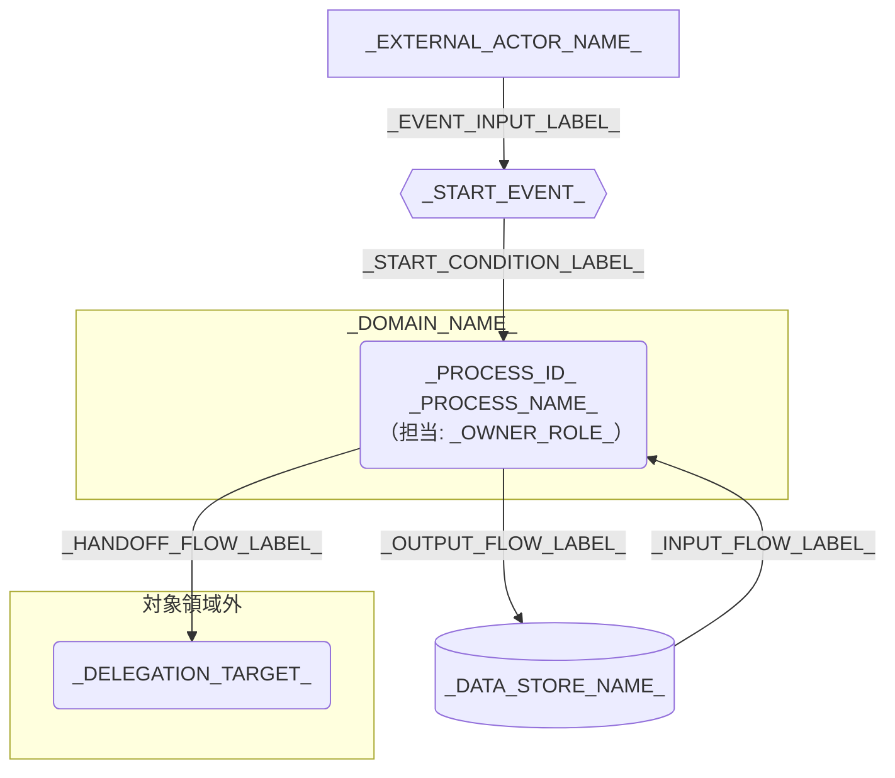

---
specdojo:
  id: specdojo:cdfd-template
  type: template
  status: draft
  frontmatter_template:
    specdojo:
      id: _AUTHORITY_:cdfd-_DOMAIN_ID_
      type: flow
      status: draft
      rulebook: specdojo:cdfd-rulebook
      based_on:
        - _AUTHORITY_:cdfd-overview
      supersedes: []
---

# 概念データフロー図（領域別）: _DOMAIN_NAME_

_TODO_: 全体概要のどの領域を詳細化し、誰が領域内フロー、主要例外、領域外への委譲を合意・利用する CDFD かを 1〜3 文で記述する。

## 1. 目的と適用範囲

- 対象者: _TODO_: owner、境界の承認者、設計利用者、例外の確認者をロールで記述する。
- 利用場面: _TODO_: 領域内フローの合意、必須・条件付きの承認、設計入力、例外確認の利用場面を記述する。
- 上位境界: _TODO_: 全体概要の領域 ID、目的、起点イベント、主要出力を記述する。
- 対象: _TODO_: 開始イベントから領域完了までの業務、組織、期間、システム境界を記述する。
- 区分: _AS_IS_OR_TO_BE_
- 対象外: _TODO_: 補助操作、隣接領域、外部責務、実装詳細を記述する。
- 判断責任: _TODO_: 人間が責任を持つ判断と、AI Agent またはシステムが支援できる範囲を記述する。

## 2. 領域内プロセス一覧

<!-- prettier-ignore -->
| プロセス ID | プロセス | 業務目的 | 主な担当 | 起動条件 | 主要入力 | 主要出力・生成先 | 正本・データストア | 必須性 |
| --- | --- | --- | --- | --- | --- | --- | --- | --- |
| `_PROCESS_ID_` | _PROCESS_NAME_ | _BUSINESS_PURPOSE_ | _OWNER_ROLE_ | _START_CONDITION_ | _MAIN_INPUTS_ | _MAIN_OUTPUTS_AND_DESTINATIONS_ | _SYSTEM_OF_RECORD_ | _REQUIRED_OR_CONDITIONAL_ |

## 3. 概念データフロー

凡例: 角丸長方形は一つのプロセス、六角形は起点・完了イベント、円柱はデータストア、四角は外部主体、`-->` は情報の流れを表す。_TODO_: 領域外ノードは委譲先だけを示し、内部処理を対象外と明記する。現物の流れを扱う場合は `==>` の意味を追記し、扱わない場合は対象外と明記する。

## 4. 主要例外と領域外への委譲

### 4.1. 主要例外

| 例外 ID          | 対象プロセス   | 検出条件              | 本領域での扱い       | 継続・引き渡し条件            |
| ---------------- | -------------- | --------------------- | -------------------- | ----------------------------- |
| `_EXCEPTION_ID_` | `_PROCESS_ID_` | _DETECTION_CONDITION_ | _EXCEPTION_HANDLING_ | _RESUME_OR_HANDOFF_CONDITION_ |

### 4.2. 領域外への委譲

| 委譲先                | 委譲する事項               | 引き渡す情報          | 本領域へ戻す条件   |
| --------------------- | -------------------------- | --------------------- | ------------------ |
| `_DELEGATION_TARGET_` | _DELEGATED_RESPONSIBILITY_ | _HANDOFF_INFORMATION_ | _RETURN_CONDITION_ |

### 4.3. 受入確認

| 確認者          | 確認対象           | 受入条件               |
| --------------- | ------------------ | ---------------------- |
| _REVIEWER_ROLE_ | _REVIEW_VIEWPOINT_ | _ACCEPTANCE_CONDITION_ |

## 5. 未決事項

| 論点                | 影響するプロセス・例外・委譲 | 決定者          | 決定時期          |
| ------------------- | ---------------------------- | --------------- | ----------------- |
| _UNDECIDED_: _TODO_ | _IMPACTED_IDS_OR_TARGETS_    | _DECISION_ROLE_ | _DECISION_TIMING_ |
