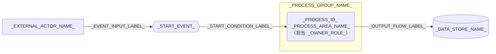

---
specdojo:
  id: specdojo:cdfd-template
  type: template
  status: draft
  frontmatter_template:
    specdojo:
      id: _AUTHORITY_:cdfd-_CDFD_ID_SUFFIX_
      type: flow
      status: draft
      rulebook: specdojo:cdfd-rulebook
      based_on: []
      supersedes: []
---

# 概念データフロー図（_CDFD_SCOPE_）: _TARGET_NAME_

_TODO_: 誰が、どの業務境界または情報の受け渡しを合意するために使用する CDFD かを 1〜3 文で記述する。

## 1. 目的と適用範囲

- 対象者: _TODO_: 承認者、作成者、後続利用者をロールで記述する。
- 利用場面: _TODO_: 合意、領域別詳細化、設計入力、網羅性確認のどれに使うかを記述する。
- 対象: _TODO_: 対象業務、組織、期間、システム境界を記述する。
- 区分: _AS_IS_OR_TO_BE_
- 対象外: _TODO_: 補助操作、別成果物へ委譲する詳細、外部責務を記述する。

## 2. プロセス領域一覧

<!-- prettier-ignore -->
| 領域 ID | プロセス領域 | 業務目的 | 主な担当 | 起点イベント | 主要入力 | 主要出力 | データストア | 領域別 CDFD |
| --- | --- | --- | --- | --- | --- | --- | --- | --- |
| `_PROCESS_ID_` | _PROCESS_AREA_NAME_ | _BUSINESS_PURPOSE_ | _OWNER_ROLE_ | _START_EVENT_ | _MAIN_INPUTS_ | _MAIN_OUTPUTS_ | _DATA_STORES_ | `_DETAIL_CDFD_ID_` |

## 3. 概念データフロー

凡例: 角丸長方形はプロセス領域、六角形は起点イベント、円柱はデータストア、四角は外部主体、`-->` は情報の流れを表す。_TODO_: 現物の流れを扱う場合は `==>` の意味を追記し、扱わない場合は対象外と明記する。

## 4. 境界と分割方針

| 区分    | 判定              | 本書での扱い        |
| ------- | ----------------- | ------------------- |
| _SCOPE_ | _BOUNDARY_REASON_ | _BOUNDARY_HANDLING_ |

| 領域 ID        | 詳細化先           | 境界                  |
| -------------- | ------------------ | --------------------- |
| `_PROCESS_ID_` | `_DETAIL_CDFD_ID_` | _DELEGATION_BOUNDARY_ |

## 5. 未決事項

| 論点                | 影響     | 決定者          | 決定時期          |
| ------------------- | -------- | --------------- | ----------------- |
| _UNDECIDED_: _TODO_ | _IMPACT_ | _DECISION_ROLE_ | _DECISION_TIMING_ |
