---
specdojo:
  id: specdojo:cdfd-uc-template
  type: template
  status: draft
  frontmatter_template:
    specdojo:
      id: cdfd-uc-_TOPIC_
      type: flow
      status: draft
      rulebook: specdojo:cdfd-uc-rulebook
      based_on:
        - cdfd-overview
      supersedes: []
  grade:
    rubric: grade-rubric-v1
    target: kata
    verdict: pass
    score: 95
    graded_at: "2026-09-18T10:14:59.222Z"
    graded_by: codex-expert-executor
    content_hash: 50c0382c8c2ebe57e3ba11a472cf22cc9f930f535769bec86c95c0b458ef8795
    categories:
      consistency: { score: 75 }
      usability: { score: 100 }
      architecture: { score: 100 }
      quality: { score: 100 }
    viewpoints:
      vp-arc-cross-document-consistency: { level: 3, score: 75 }
      vp-arc-conciseness: { level: 4, score: 100 }
      vp-arc-single-responsibility: { level: 4, score: 100 }
      vp-qe-verifiability: { level: 4, score: 100 }
      vp-qe-omissions-consistency: { level: 3, score: 75 }
      vp-qe-kata-conformance: { level: 4, score: 100 }
      vp-ux-readability: { level: 4, score: 100 }
      vp-ux-language-consistency: { level: 4, score: 100 }
      vp-arc-document-structure: { level: 4, score: 100 }
    findings: { blocker: 0, major: 0, minor: 2, note: 0 }
---

# 概念データフロー図（ユースケース別）: _USE_CASE_NAME_

_TODO_: 全体概要のケース `_CASE_ID_` が扱うユースケースと、複数のプロセスグループを横断して定める目的を一文で記述する。

## 1. 目的

_TODO_: 対象者ごとに、横断順序、引き渡し条件、例外時の戻り先を承認・設計・確認する利用結果を記述する。

- _ROLE_ は、_TODO_: グループの通過順と責任境界を承認する。
- _ROLE_ は、_TODO_: 引き渡す情報と条件を後続設計へ利用する。
- _ROLE_ は、_TODO_: 引き渡しと戻り経路の重複・欠落を確認する。

## 2. 適用範囲

- ケース: `_CASE_ID_` _USE_CASE_NAME_。_TODO_: `cdfd-overview` と同じケース ID、名称、業務目的を書く。
- 開始イベント: _START_EVENT_。_TODO_: 最初のグループが動き始める出来事を書く。
- 終了条件: _END_CONDITION_。_TODO_: 最後のグループが成果を利用可能と判断できる条件を書く。
- 横断するプロセスグループ: _PROCESS_GROUP_NAME_ → _PROCESS_GROUP_NAME_。_TODO_: 正常系の通過順で二つ以上を書く。
- 組織境界: _TODO_: 引き渡し可否、戻し、再開を判断するロールと、対象範囲外の主体を書く。
- システム境界: _TODO_: 横断条件の判定と情報・物の引き渡しまでを対象とし、画面・保存方式などの実装詳細を対象外とする旨を書く。
- 対象外: グループ内部の領域・プロセス・主要例外・補助操作は各 `cdfd-_GROUP_`、状態の定義と遷移は STSD を正本とし、本書では再掲しない。
- 責任分担: _TODO_: 人間と AI Agent の責任分担を定める既存文書への参照を書く。参照先がない場合は、承認と最終判断を人間が担う原則を書く。

## 3. プロセス領域

ケース `_CASE_ID_` は _GROUP_COUNT_ のプロセスグループを正常系の順序で横断する。グループ名、含む領域、業務目的は全体概要を正本とし、本章では各グループがこのユースケースで担う役割を定める。

<!-- 正常系で通過するプロセスグループごとに 3.n の節を繰り返す。同じグループが再登場する場合は別の節とし、理由を書く。 -->

### 3.1. _PROCESS_GROUP_NAME_（_AREA_ID_RANGE_）

_TODO_: 前段から何を受け取り、次段へ何を渡すかを 1〜3 文で要約する。

- **主要入力**: _TODO_: 開始イベントまたは前段から受け取る情報・物を名詞で列挙する。
- **主要出力**: _TODO_: 次段または終了側へ渡す情報・物を名詞で列挙する。
- **データストア**: _TODO_: 引き渡す情報または条件判定に使う「データストア」の名称を列挙する。

| 順序 | プロセスグループ     | 含む領域        | 横断上の役割                   | 参照先         |
| ---- | -------------------- | --------------- | ------------------------------ | -------------- |
| 1    | _PROCESS_GROUP_NAME_ | _AREA_ID_RANGE_ | _CROSS_CUTTING_RESPONSIBILITY_ | `cdfd-_GROUP_` |

### 3.2. _PROCESS_GROUP_NAME_（_AREA_ID_RANGE_）

_TODO_

- **主要入力**: _TODO_
- **主要出力**: _TODO_
- **データストア**: _TODO_

| 順序 | プロセスグループ     | 含む領域        | 横断上の役割                   | 参照先         |
| ---- | -------------------- | --------------- | ------------------------------ | -------------- |
| 2    | _PROCESS_GROUP_NAME_ | _AREA_ID_RANGE_ | _CROSS_CUTTING_RESPONSIBILITY_ | `cdfd-_GROUP_` |

## 4. データストア

全体概要の「データストア」から、引き渡す情報または引き渡し条件の判定に使う行だけを同じ名称・区分で示す。各行は概念データフローの同名ノードと対応する。

### 4.1. マスタ・構成データ

| データストア      | 関連引き渡し   | 横断上の利用 |
| ----------------- | -------------- | ------------ |
| _DATA_STORE_NAME_ | `_HANDOFF_ID_` | _USAGE_      |

### 4.2. トランザクションデータ

| データストア      | 関連引き渡し   | 横断上の利用 |
| ----------------- | -------------- | ------------ |
| _DATA_STORE_NAME_ | `_HANDOFF_ID_` | _USAGE_      |

<!-- 該当する行がない区分は節ごと削除する。新しい名称・区分は本書だけへ追加せず、先に全体概要を更新する。 -->

## 5. 概念データフロー

_TODO_: 開始イベント、プロセスグループ代表ノード、引き渡し条件、関連データストア、終了条件だけを配置し、正常系の順序を左から右へたどれるようにする。内部領域・内部プロセス・状態名は描かない。

```mermaid
flowchart LR
  classDef process fill:#e3f2fd,stroke:#1e88e5,color:#000
  classDef event fill:#fff3e0,stroke:#fb8c00,color:#000
  classDef storeMaster fill:#a5d6a7,stroke:#1b5e20,color:#000
  classDef storeTransaction fill:#e8f5e9,stroke:#43a047,color:#000

  _START_EVENT_NODE_ID_{{"_START_EVENT_"}}
  _SOURCE_GROUP_NODE_ID_("_SOURCE_GROUP_NAME_<br>_SOURCE_AREA_ID_RANGE_")
  _HANDOFF_EVENT_NODE_ID_{{"_HANDOFF_ID_ _HANDOFF_CONDITION_"}}
  _TARGET_GROUP_NODE_ID_("_TARGET_GROUP_NAME_<br>_TARGET_AREA_ID_RANGE_")
  _END_EVENT_NODE_ID_{{"_END_CONDITION_"}}
  _MASTER_STORE_NODE_ID_[("_MASTER_STORE_NAME_")]
  _TRANSACTION_STORE_NODE_ID_[("_TRANSACTION_STORE_NAME_")]

  _START_EVENT_NODE_ID_ -->|"起動条件"| _SOURCE_GROUP_NODE_ID_
  _MASTER_STORE_NODE_ID_ -->|"_CONDITION_INFORMATION_"| _SOURCE_GROUP_NODE_ID_
  _SOURCE_GROUP_NODE_ID_ -->|"_HANDOFF_ID_ _HANDOFF_INFORMATION_"| _HANDOFF_EVENT_NODE_ID_
  _HANDOFF_EVENT_NODE_ID_ -->|"起動条件"| _TARGET_GROUP_NODE_ID_
  _TARGET_GROUP_NODE_ID_ -->|"_RESULT_INFORMATION_"| _TRANSACTION_STORE_NODE_ID_
  _TARGET_GROUP_NODE_ID_ -->|"完了条件"| _END_EVENT_NODE_ID_

  class _SOURCE_GROUP_NODE_ID_,_TARGET_GROUP_NODE_ID_ process
  class _START_EVENT_NODE_ID_,_HANDOFF_EVENT_NODE_ID_,_END_EVENT_NODE_ID_ event
  class _MASTER_STORE_NODE_ID_ storeMaster
  class _TRANSACTION_STORE_NODE_ID_ storeTransaction
```

<!-- specdojo:finding id=F001 severity=minor rule=vp-arc-cross-document-consistency line=104 ノード形状の意味を全体概要の共通凡例への参照に留める記入指示は、包含される `specdojo:cdfd-mermaid-rulebook` の各図直後に使用したノード形状の意味を直接記述する要件と一致しないため、包含規則との優先関係を明示するか記載要件を統一してください。 -->
_TODO_: 全体概要の「凡例（本プロダクト共通）」への参照、`-->` / `==>` のうち使用した線種、グループ内部を省略したこと、図に置いたデータストアと選定理由を書く。

<!-- 物を引き渡す場合は ==> を使用する。関連データストアがない場合は該当ノード、エッジ、class を削除する。グループや引き渡しが多く一図で追えない場合は 5.1、5.2 の連続する引き渡し単位へ分け、接続点に同じ引き渡し ID を置く。 -->

## 6. 引き渡し

| 引き渡し ID    | 送り元グループ       | 受け側グループ       | 引き渡す情報          | 引き渡し条件        | 戻す条件           |
| -------------- | -------------------- | -------------------- | --------------------- | ------------------- | ------------------ |
| `_HANDOFF_ID_` | _PROCESS_GROUP_NAME_ | _PROCESS_GROUP_NAME_ | _HANDOFF_INFORMATION_ | _HANDOFF_CONDITION_ | _RETURN_CONDITION_ |

<!-- specdojo:finding id=F002 severity=minor rule=vp-qe-omissions-consistency line=114 rulebook は戻しが発生しない引き渡しに根拠を記載することを許容する一方、本テンプレートは戻す条件を空欄不可とし全 ID の戻り先確認を求めるだけなので、該当なしを表す値と理由の記載方法、および「例外時の戻り先」表へ記載するか除外するかを定めてください。 -->
<!-- 引き渡し ID は正常順序に沿った H-01 形式にする。隣接する全グループ間の引き渡しを一行ずつ追加し、情報、引き渡し条件、戻す条件を空欄にしない。 -->

## 7. 例外時の戻り先

| 対象引き渡し   | 条件不成立         | 戻り先グループ       | 戻す情報             | 再開条件           |
| -------------- | ------------------ | -------------------- | -------------------- | ------------------ |
| `_HANDOFF_ID_` | _FAILED_CONDITION_ | _PROCESS_GROUP_NAME_ | _RETURN_INFORMATION_ | _RESUME_CONDITION_ |

<!-- 「引き渡し」の全 ID について戻す条件を確認する。戻り先はグループまでに留め、内部プロセス、内部例外、ログ、再試行手順を書かない。 -->

<!-- 未決事項がある場合のみ、以下の章を追加する。ない場合は章ごと削除する。

## 8. 未決事項

| 論点                | 影響するケース・引き渡し | 決定者          | 決定時期          |
| ------------------- | ------------------------ | --------------- | ----------------- |
| _UNDECIDED_: _TODO_ | `_CASE_ID_` / `_HANDOFF_ID_` | _DECISION_ROLE_ | _DECISION_TIMING_ |

-->
