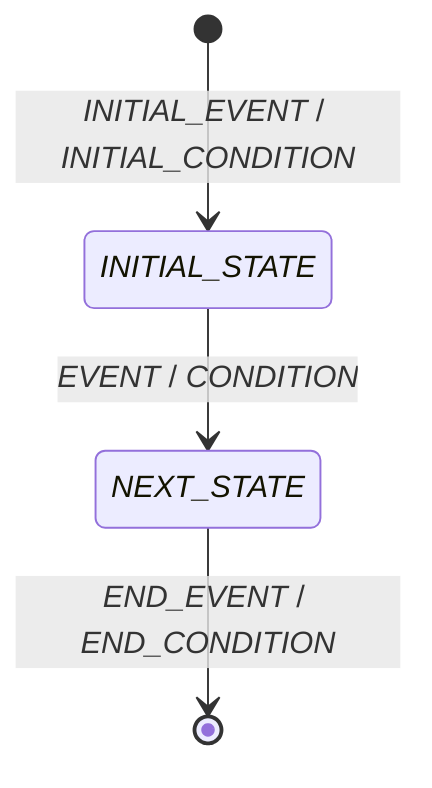

---
specdojo:
  id: specdojo:stsd-template
  type: template
  status: draft
  frontmatter_template:
    specdojo:
      id: _LOCAL_ID_
      type: data
      status: draft
      rulebook: specdojo:stsd-rulebook
      based_on: _BASED_ON_
      supersedes: []
  grade:
    rubric: grade-rubric-v1
    target: kata
    verdict: pass
    score: 91
    graded_at: "2026-09-18T10:38:20.912Z"
    graded_by: gemma-expert-executor
    content_hash: b7cb41fbc13a1b38ce399a06651fb8a41a3f35d41ad920d9cd9ef4ba505526d6
    categories:
      consistency: { score: 88 }
      usability: { score: 92 }
      architecture: { score: 100 }
      quality: { score: 88 }
    viewpoints:
      vp-arc-cross-document-consistency: { level: 4, score: 100 }
      vp-arc-conciseness: { level: 4, score: 100 }
      vp-arc-single-responsibility: { level: 4, score: 100 }
      vp-qe-verifiability: { level: 4, score: 100 }
      vp-qe-omissions-consistency: { level: 3, score: 75 }
      vp-qe-kata-conformance: { level: 3, score: 75 }
      vp-ux-readability: { level: 3, score: 75 }
      vp-ux-language-consistency: { level: 4, score: 100 }
      vp-arc-document-structure: { level: 4, score: 100 }
    findings: { blocker: 0, major: 0, minor: 3, note: 0 }
---

# _DELIVERABLE_NAME_

## 1. 概要

<!-- specdojo:finding id=F001 severity=minor rule=vp-qe-omissions-consistency line=5 概要の記述指示に、rulebook (6.1) で求められている「状態変更を起こす業務範囲」を含める必要がある。 -->
_TODO_: `_DELIVERABLE_OVERVIEW_` を基に、状態を持つ一つの対象、AS-IS / TO-BE のスコープ、状態管理の目的、利用者、状態の正本となる管理場所を 1〜3 文と箇条書きで記述する。

## 2. 状態一覧

| 値             | 状態名       | 通称          | 意味            | 成立条件          | 管理場所              |
| -------------- | ------------ | ------------- | --------------- | ----------------- | --------------------- |
| `_STATE_CODE_` | _STATE_NAME_ | _COMMON_NAME_ | _STATE_MEANING_ | _ENTRY_CONDITION_ | _MANAGEMENT_LOCATION_ |

<!-- 値は lower-kebab-case とする。コードを持たない場合、通称がない場合は `-` とする。状態名は状態遷移図・遷移の説明と完全一致させる。 -->

## 3. 状態遷移図

<!-- 状態一覧の全状態を図へ配置する。図にだけ存在する業務状態を残さず、全遷移にイベントと条件を記載する。 -->

<!-- specdojo:finding id=F003 severity=minor rule=vp-ux-readability line=25 状態遷移図の指示に、状態数が 15 を超える場合や複雑な場合に図を分割することを推奨する旨の記述を追加する必要がある。 -->

## 4. 遷移の説明

| 遷移 ID           | 遷移元         | 遷移先         | イベント | 条件        | 補足   |
| ----------------- | -------------- | -------------- | -------- | ----------- | ------ |
| `_TRANSITION_ID_` | _SOURCE_STATE_ | _TARGET_STATE_ | _EVENT_  | _CONDITION_ | _NOTE_ |

<!-- specdojo:finding id=F002 severity=minor rule=vp-qe-kata-conformance line=42 今後の検討メモのプレースホルダーを、rulebook (6.5) の定義に従い `_TODO_:`, `_UNDECIDED_:`, `_ASSUMPTION_:` のいずれかを選択して使用するよう具体的に指示する必要がある。 -->
<!-- 遷移 ID は T-01 形式とし、図の全遷移を一行ずつ記載する。初期点は `開始`、終了点は `終了` と記載する。 -->

<!-- 未決事項がある場合のみ、以下の章を追加する。ない場合は章ごと削除する。

## 5. 今後の検討メモ

| 論点                | 影響する状態・遷移 | 決定者          | 決定時期          |
| ------------------- | ------------------ | --------------- | ----------------- |
| _UNDECIDED_: _TODO_ | _STATE_OR_TRANSITION_ | _DECISION_ROLE_ | _DECISION_TIMING_ |

-->
