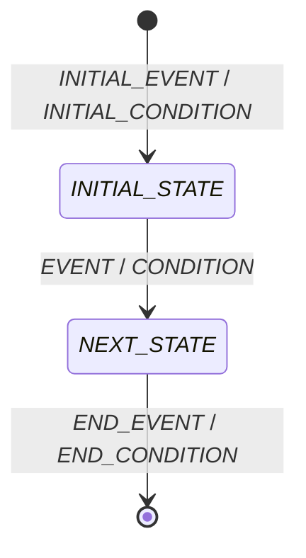

---
specdojo:
  id: specdojo:stsd-template
  type: template
  status: draft
  frontmatter_template:
    specdojo:
      id: _LOCAL_ID_
      type: data
      status: draft
      rulebook: specdojo:stsd-rulebook
      based_on: _BASED_ON_
      supersedes: []
---

# _DELIVERABLE_NAME_

## 1. 概要

_TODO_: `_DELIVERABLE_OVERVIEW_` を基に、状態を持つ一つの対象、AS-IS / TO-BE のスコープ、状態管理の目的、利用者、状態の正本となる管理場所、状態変更を起こす業務範囲を 1〜3 文と箇条書きで記述する。

## 2. 状態一覧

| 値             | 状態名       | 通称          | 意味            | 成立条件          | 管理場所              |
| -------------- | ------------ | ------------- | --------------- | ----------------- | --------------------- |
| `_STATE_CODE_` | _STATE_NAME_ | _COMMON_NAME_ | _STATE_MEANING_ | _ENTRY_CONDITION_ | _MANAGEMENT_LOCATION_ |

<!-- 値は lower-kebab-case とし、`-` を除いて文書内で一意にする。コードを持たない場合、通称がない場合は `-` とする。状態名は状態遷移図・遷移の説明と完全一致させる。 -->

## 3. 状態遷移図

<!-- 状態一覧の全状態を図へ配置する。図にだけ存在する業務状態や ＜＜choice＞＞ などの疑似状態を残さず、分岐は同じ遷移元からの複数矢印として、全遷移にイベントと条件を記載する。業務状態が 15、遷移が 20、または一状態の入出力遷移合計が 6 を超える場合は図を分割し、各図が扱う遷移 ID と共有状態を明記する。 -->

## 4. 遷移の説明

| 遷移 ID           | 遷移元         | 遷移先         | イベント | 条件        | 補足   |
| ----------------- | -------------- | -------------- | -------- | ----------- | ------ |
| `_TRANSITION_ID_` | _SOURCE_STATE_ | _TARGET_STATE_ | _EVENT_  | _CONDITION_ | _NOTE_ |

<!-- 遷移 ID は T-01 形式とし、図の全遷移を一行ずつ記載する。初期点は `開始`、終了点は `終了` と記載する。 -->

<!-- 未決事項がある場合のみ、以下の章を追加する。ない場合は章ごと削除する。

## 5. 今後の検討メモ

| 論点                | 影響する状態・遷移 | 決定者          | 決定時期          |
| ------------------- | ------------------ | --------------- | ----------------- |
| _TODO_: / _UNDECIDED_: / _ASSUMPTION_: _ISSUE_ | _STATE_OR_TRANSITION_ | _DECISION_ROLE_ | _DECISION_TIMING_ |

-->
